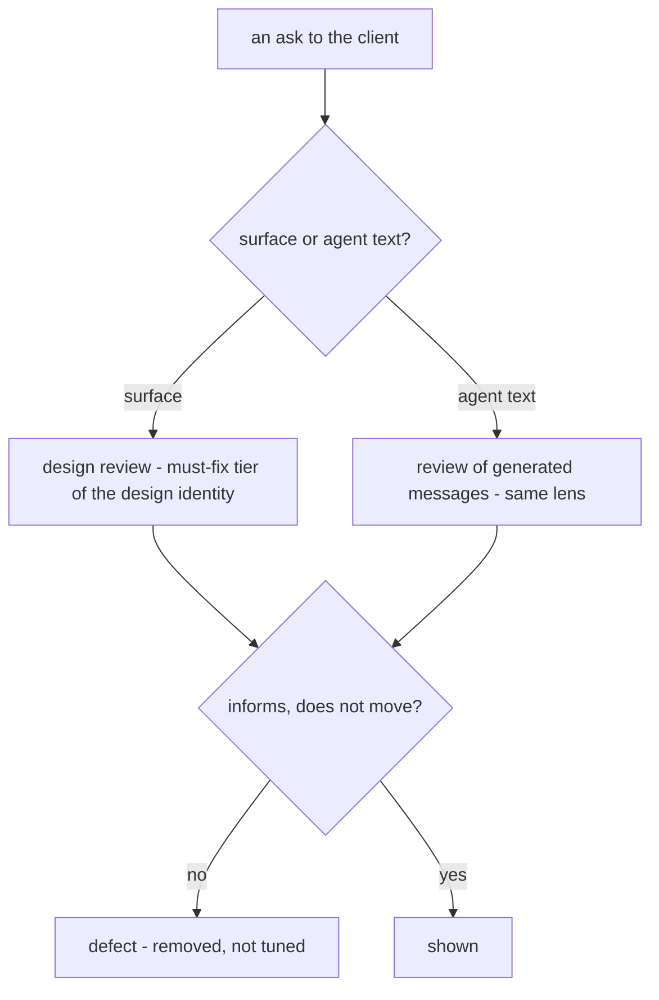

# Honest Solicitation

**Version:** 1.0.0
**Status:** Stable
**Layer:** concept

## Overview

The contract that whenever the product or its agents **ask the client for something** — a decision, an approval, spend, a permission, a feature switched on, continued engagement — the asking itself stays honest: free of manufactured pressure, symmetric between yes and no, and made of things that are real. It covers every surface (graphical, terminal, command line, notifications) and the office's own words (clarifications, approval requests, digests, summaries).

The corpus already protects what a grant *binds* (consent binding), how much friction an act *deserves* (action gating) and that a control is *real* (directability). None of them governs how the *ask* is made, so a countdown, a shaming label or a pre-ticked box satisfies every one of them while moving the client around the gate those specs built. This spec closes that gap with a short list of properties rather than a catalogue of tactics, because a catalogue rots and a property does not: the ask must **inform** the decision, never **move** it.

## Related Specifications

- [l1-office-model.md](l1-office-model.md) - OFF-5: the client is a client, not a specialist; the premise that makes a pressured approval harmful.
- [l1-consent-binding.md](l1-consent-binding.md) - CB-1/CB-3: what a grant binds and when it lapses. This spec governs how the grant is solicited; a grant obtained by pressure binds exactly what an honest one would, which is why the solicitation needs its own rule.
- [l1-action-gating.md](l1-action-gating.md) - AG-3: the closed ladder of friction tiers. A gate is only as protective as the ask in front of it is honest; HSO-2 and HSO-4 keep a tier from being re-routed around by wording or defaults.
- [l1-directability.md](l1-directability.md) - DIR-9: no dead controls, no faked agency. HSO-5 is the same honesty applied to what is *shown* (progress, results, support).
- [l1-intent-resolution.md](l1-intent-resolution.md) - IR-6/IR-9: when and how often the client is asked at all; this spec governs how each ask reads.
- [l1-security.md](l1-security.md) - SEC-9/SEC-10: a human decision is an explicit human act; HSO-8 keeps an agent from manufacturing one.
- [l1-deployment-neutrality.md](l1-deployment-neutrality.md) - DN-1: local-first, no egress by default; HSO-4 keeps that default from being undone by a pre-selected box.
- [l1-background-activation.md](l1-background-activation.md) - BA-5: activation consent discloses unattended autonomy and spend ceiling; HSO-3 is the wording discipline for that disclosure.
- [l1-usage-allowance.md](l1-usage-allowance.md), [l1-cost-rating.md](l1-cost-rating.md) - Spend and allowance are the asks most open to decoys and engineered urgency (HSO-1, HSO-7).
- [l1-design-identity.md](l1-design-identity.md) - Its must-fix tier is where a violation of this spec is caught in review; an identity package cannot add a pressure pattern.
- [l1-negative-specification.md](l1-negative-specification.md) - The sibling idea one level up: say what an output must *not* be. HSO is that discipline for the ask.

## 1. Motivation

A design input to the interface proposed, as illustrations of "psychological principles", a countdown laid over a list of the client's own files with the decline button relabelled "I'll risk losing my files", progress that motivates "even when it is not real", and a closing aim of a product people cannot stop using. Such tactics work, which is why they do not belong in a product whose whole premise is that a non-specialist client delegates and trusts.

Cronus asks the client for little (OFF-5), but each ask is consequential: an approval, a spend ceiling, a permission, enabling background activation, sending data off the device. A client pressured into one has been moved around the gate that exists to protect them. The risk is not confined to screens: the office's agents write to the client too, and a model that has learned that urgency raises acceptance will use it unless the spec says otherwise.

What is worth keeping from that input is not in dispute: sensible defaults, one clear next step, and showing the client's real work before asking them to commit all *inform* a decision. The line this spec draws is between influence that informs and influence that moves.

## 2. Constraints & Assumptions

- The invariants constrain **wording, defaults and presentation**, never capability: the office can ask whatever it needs to, in a form that does not manipulate.
- A real constraint may be stated forcefully. An expiring credential is urgent; the spec forbids urgency that is *not* real, not urgency.
- The properties apply to every surface and to agent-authored text equally; there is no surface where a pressure pattern is acceptable because it is "only a notification".
- The client's stated intent is the reference for what a default or a recommendation should serve; the product's own engagement is not.

## 3. Core Invariants

Rules every Layer 2 implementation MUST NOT violate:

- **HSO-1 (Urgency and scarcity are real or absent):** a deadline, countdown, expiry or "limited" framing shown to the client corresponds to a constraint that exists in the world — a credential that truly lapses, a window the office cannot extend, an external event on a calendar — and names the constraint and its source. Absent one, no time pressure is applied, and an urgency that was real and has passed is withdrawn rather than left on screen.
- **HSO-2 (Declining is at least as easy as accepting):** every choice offers decline or defer with the same prominence, no more steps than accepting needs and a neutral label ("Not now", "No"). A gate that makes accepting deliberately heavy (a typed confirmation, an out-of-band approval) does not make declining heavy with it. A label that shames, threatens or concedes a loss ("I'll risk it") is a violation. This covers approvals, spend, permissions, egress, feature enablement and telemetry alike.
- **HSO-3 (Consequences are stated, not engineered):** when a choice has a real downside it is stated plainly — what is at risk, how likely, what the client can do — in the same words whichever way the client appears to be leaning. A loss is never invented, enlarged or made vivid to move the choice, and a risk that does not exist for this client's data is not shown to them.
- **HSO-4 (Defaults are recommendations the client can see and revert):** a default serves the client's stated intent, is shown as a default and is resettable. Nothing consent-bearing — spend, egress, an irreversible effect, background activation — is pre-selected or on by default (consistent with DN-1 and BA-5).
- **HSO-5 (What is shown as progress, result or support is real):** a progress indicator, an estimate, a "your work so far" panel, a usage statistic or a testimonial reflects actual state; none is fabricated, inflated or rounded toward commitment. Showing the client's genuine work before asking for a decision is the legitimate form of influence: it informs.
- **HSO-6 (Leaving is first-class):** stopping, pausing, exporting and removing one's data are as discoverable and as cheap as starting. Nothing is optimized for time spent in the product or for the client's difficulty in stopping; the product is judged by the work it delivers.
- **HSO-7 (Compared options are real alternatives):** options offered for comparison — plans, model choices, spend levels — are genuine alternatives presented in the unit the client pays in; none is placed to make another look better (a decoy), and a price or limit is shown beside what it buys.
- **HSO-8 (The office's own words are held to the same standard):** the messages the office writes to the client — clarifications, approval requests, digests, summaries — obey HSO-1 to HSO-7 as written. An agent does not use pressure, flattery, invented consensus or guilt to obtain a decision, and a framing found to move the choice rather than inform it is a defect to remove, not a style to tune.

> L2 specs cannot reach RFC status until all invariants here are addressed in their "Invariant Compliance" section.

## 4. Detailed Design

### 4.1 Tactic verdicts

The table is illustrative of the properties, not exhaustive; a tactic not listed is judged by the invariant it would breach.

| Tactic | Verdict | Instead |
| --- | --- | --- |
| A countdown, or "last chance" banner, with no real expiry behind it | forbidden (HSO-1) | state the real constraint and its source, or show nothing |
| A decline labelled with a self-penalty ("I'll risk losing my files") | forbidden (HSO-2) | a neutral "Not now" with equal prominence |
| A pre-ticked consent, or an opt-out placed below the fold | forbidden (HSO-4) | unticked, or a clearly marked, resettable recommendation |
| Progress that advances by animation rather than state; "profile 80 % complete" nudges | forbidden (HSO-5) | real progress, or none |
| Vivid loss imagery for a risk that does not apply to this client | forbidden (HSO-3) | the risk as it is, or nothing |
| A decoy option priced to make another look cheap | forbidden (HSO-7) | the real alternatives with what each buys |
| An agent message that invents agreement ("most users choose this") | forbidden (HSO-8) | the facts of this client's situation |
| Showing the client's own work-in-progress before asking for a commitment | allowed (HSO-5) | — |
| A sensible default the client can see and change | allowed (HSO-4) | — |
| One clear next step, one decision at a time | allowed | — |
| Stating a genuine expiry strongly | allowed (HSO-1) | with its source |

### 4.2 Where it is checked

A skin, theme or imported identity package supplies look and feel only; it carries no vocabulary for urgency, scarcity or shaming, so it cannot add a pressure pattern. The rendering of an approval request is a function of the *action* and its real risk, never of the client's engagement history or of how likely they are to agree.

### 4.3 Relation to the gates

| Spec | Governs | This spec adds |
| --- | --- | --- |
| Action gating (AG) | how much friction an act deserves | that the friction is not undone by how the ask is worded or defaulted |
| Consent binding (CB) | what a grant binds and when it lapses | that the grant was not obtained by pressure |
| Directability (DIR-9) | that a control is real | that what is displayed around it (progress, results) is real |
| Human-only decisions (SEC-9/SEC-10) | that a decision is an explicit human act | that an agent does not manufacture that act's conditions |
| Intent resolution (IR-6, IR-9) | when, and how often, the client is asked | how each ask reads |

## 5. Drawbacks & Alternatives

- **It forgoes conversion tactics.** Some asks will be accepted less often than a pressured version would be. Accepted: the client is a delegator whose trust is the product, and an approval obtained by a lever is not the approval the gate was built to collect.
- **A real urgency may look like pressure.** Mitigated by HSO-1's own test: the constraint exists and is named with its source. A system that must say "this credential expires tomorrow" says so.
- **Alternative — allow persuasion with disclosure.** Rejected: a framing chosen to move a decision is still that framing after it is announced, and the client cannot weigh a lever they are told about and are still pulled by.
- **Alternative — a lint list of banned patterns.** Rejected as the contract: such lists lag the next tactic. The properties (real, symmetric, stated plainly, informing) are the contract; §4.1 is a worked illustration.
- **Alternative — leave it to the gate tiers.** Rejected: a tier fixes the friction of an act, not the integrity of the ask in front of it; both are needed.

## Canonical References

| Alias | Path | Purpose |
| --- | --- | --- |
| `[CONSENT]` | `.design/main/specifications/l1-consent-binding.md` | What a grant binds; this spec governs how it is solicited |
| `[GATING]` | `.design/main/specifications/l1-action-gating.md` | The friction ladder the ask must not route around |
| `[DESIGN]` | `.design/main/specifications/l1-design-identity.md` | The must-fix tier where a surface violation is caught |
| `[INTENT]` | `.design/main/specifications/l1-intent-resolution.md` | When and how often the client is asked |

## Document History

| Version | Date | Change |
| --- | --- | --- |
| 1.0.0 | 2026-10-03 | Initial concept — an ask to the client informs and never moves: urgency and scarcity real or absent (HSO-1), declining at least as easy as accepting with a neutral label (HSO-2), consequences stated not engineered (HSO-3), defaults visible/resettable and nothing consent-bearing pre-selected (HSO-4), progress/results/support real (HSO-5), leaving first-class (HSO-6), compared options real alternatives (HSO-7), the office's own words held to the same standard (HSO-8). Motivated by a UX-principles design input whose illustrations (a loss countdown with a self-penalizing decline label, motivation by non-real progress, a product users cannot stop using) satisfy every existing gate while moving the client around it. |
