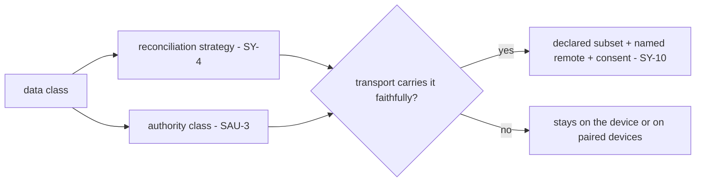

# Multi-Device State Synchronization

**Version:** 1.1.0
**Status:** Stable
**Layer:** concept

## Overview

The model for keeping one user's office state consistent across several of their own devices — a desktop, a laptop, an always-on phone acting as a personal server — without a central coordinator and without a third party ever holding the data. Each device is a full replica that keeps working offline and accepts writes locally; when devices reach each other, their states reconcile automatically to a single consistent result. The load-bearing decision is that *not all state reconciles the same way*: collaborative append-style state merges conflict-free (CRDT), structured artifacts that need human judgement use reviewable three-way merge, and single-authoritative facts supersede rather than merge. This concept ties those existing per-kind decisions into one coherent device-replication contract, on-device and end-to-end by construction.

## Related Specifications

- [l1-notes.md](l1-notes.md) - NOT-7 already uses a conflict-free (CRDT) structure for concurrent note edits; this concept generalizes that to cross-device replication and names notes a CRDT-merge data class.
- [l1-change-merge.md](l1-change-merge.md) - The reviewable three-way merge/rebase path for structured artifacts (where CRDT was deliberately rejected); this concept routes those classes to it (SY-4), never to auto-merge.
- [l1-operational-ledger.md](l1-operational-ledger.md) - OL-2 supersede-don't-mutate; authoritative facts reconcile by supersede, never by silent merge.
- [l1-storage-model.md](l1-storage-model.md) - The mutable state tier that is the unit of replication; the immutable program tier is not synced.
- [l1-security.md](l1-security.md) - No-exfiltration / on-device posture the sync channel must honor (SY-8).
- [l2-backup.md](l2-backup.md) - Point-in-time backup is distinct from live multi-master sync; the two compose (sync converges replicas, backup snapshots one).
- [l1-state-authority.md](l1-state-authority.md) - [ADDED v1.1.0] SY-4's reconciliation strategy and the authority class (text, store, record) are two properties of the same data class; sync reads both, and never regenerates an authority from a projection (SAU-4/SAU-5).
- [l1-consent-binding.md](l1-consent-binding.md) - [ADDED v1.1.0] CB-3: the egress consent SY-10 requires names its remote and subset and lapses when either changes.
- [l2-execution-workspace.md](l2-execution-workspace.md) - [ADDED v1.1.0] the no-remote-git contract: an execution workspace never pushes; SY-10's version-control transport is a different, user-consented act.

## 1. Motivation

The office is designed to live on the user's own hardware — locally, on a remote box, or on an always-on phone that doubles as a personal server. A user who owns more than one such device wants the same office: start a task on the desktop, check it from the phone, have memory and the board and notes all agree. The naive answer — a central server that everyone talks to — breaks two core promises: it introduces a third party that holds the user's data (violating the on-device, no-exfiltration posture), and it makes the system unusable when a device is offline (the phone on mobile data, the laptop on a plane).

The right model is **multi-master replication**: every device is a full replica, works offline, and converges with the others when they connect — no master, no cloud middleman. But replication has a hard sub-problem: when two devices edit the same thing while disconnected, what is the merged result? There is no single answer, because different kinds of state have different truth semantics:

- A **note** or a **memory entry** or a **kanban move** is collaborative and additive — concurrent edits should merge without losing either side, automatically. This is what conflict-free replicated data types (CRDTs) are for.
- A **spec, plan, or workflow definition** is a structured artifact where a blind merge can silently corrupt meaning; it needs the reviewable three-way merge the change-merge concept already defines — explicitly *not* auto-merged.
- An **operational fact** is single-authoritative; two divergent versions are resolved by precedence and supersede, never by union.

A device-sync concept that ignored this distinction would either corrupt structured artifacts (CRDT-merging a spec) or lose collaborative edits (last-writer-wins on notes). The invariants below make the data-class → strategy routing the center of the contract, so each kind reconciles by the rule that is correct for it.

## 2. Constraints & Assumptions

- The replica set is the **user's own devices**, paired explicitly; this is personal multi-device sync, not multi-tenant or multi-user collaboration.
- Only the mutable state tier replicates; the immutable program tier is installed per device and never synced (consistent with the two-tier storage model).
- "CRDT", "version vector", and "tombstone" name required *effects* (convergence, causal ordering, convergent delete), not a specific library or wire format.
- Sync is opt-in. A single-device user is unaffected and pays no synchronization cost.
- Devices may be intermittently connected; the design assumes partitions are normal, not exceptional.

## 3. Core Invariants

Rules every Layer 2 implementation MUST NOT violate:

- **SY-1 (Strong eventual convergence):** replicas that have observed the same set of updates reach the same state, independent of delivery order or timing, with no central coordinator. Concurrent updates to a sync-eligible class merge deterministically — the merged result is a function of the updates, not of who synced first.
- **SY-2 (No master, any-replica writes):** there is no designated primary replica. Any device may accept writes locally and offline (the always-on-phone-as-server case); convergence never depends on routing writes through one authoritative node.
- **SY-3 (Offline-first, partition-tolerant):** a replica is fully usable while disconnected. On reconnect, sync-eligible state reconciles automatically with no manual conflict resolution for CRDT-class data; a partition degrades reachability, never local function.
- **SY-4 (Data-class reconciliation routing):** every synced data class declares its reconciliation strategy from a closed set — **CRDT-merge** (collaborative/append + observed-remove: notes, memory entries, board moves, logs, chat), **reviewable three-way merge** (structured artifacts needing judgement: specs, plans, workflow definitions — the change-merge path, never auto-merged), or **supersede** (single-authoritative facts: the operational ledger — resolved by precedence, never unioned). The strategy is a property of the class, declared up front, never guessed per write.
- **SY-5 (Causal metadata, not wall-clock):** updates carry causal-ordering metadata (version vectors / logical clocks) so happens-before is preserved and concurrent edits are distinguishable from sequential ones. Wall-clock time is never the sole arbiter of order (clocks skew across devices).
- **SY-6 (Convergent deletion):** a deletion propagates without resurrection — a delete observed by one replica is not undone by a stale concurrent update (tombstone / observed-remove semantics). Removing an item on one device removes it everywhere it has been seen.
- **SY-7 (Bounded sync metadata):** replication bookkeeping (tombstones, version vectors, operation logs) is compacted/garbage-collected under a causal-stability rule once all replicas have observed an update, so metadata does not grow without bound. Compaction MUST NOT violate SY-1 convergence.
- **SY-8 (On-device, end-to-end, no third party):** synchronization travels directly between the user's authenticated devices, or through a relay the user themselves controls, encrypted in transit and at rest. State MUST NOT be egressed to any third-party service as a condition of syncing (consistent with the no-exfiltration, on-device-first posture). Sync is opt-in and the participating device set is explicit and inspectable.
- **SY-9 (Explicit authenticated membership):** a device joins the replica set through an explicit, authenticated pairing; a removed or revoked device loses the ability to read state or inject updates. The replica set is the user's own devices — never an open peer network.
- **SY-10 (A transport carries only the classes it can reconcile faithfully, and leaving the device is a recorded, scoped consent):** [ADDED v1.1.0] SY-8 says state travels only through channels the user controls; this says which class may ride which channel and what moving state off the device requires. A transport is **eligible for a class** only if it delivers that class's operations without altering their reconciliation semantics. A paired-device channel can carry every class (SY-4). A **text-merging transport** — a version-control remote the user names — carries the reviewable-merge classes natively, and carries a CRDT or supersede class only as per-replica append-only operation files that the replicas fold themselves, never as one shared mutable file the transport's text merge would reconcile (which would silently turn a convergent class into a last-merge-wins one). Sending any subset of state to a remote is an **egress the user opted into per remote and per declared subset**: the consent names both, is visible and revocable, and lapses when either changes (composing CB-3); the office never starts it on its own initiative, and an execution workspace never pushes. Secrets, live sessions and every class without a declared strategy are in no subset (STO-6, SY-4 fail-closed).

> L2 specs cannot reach RFC status until all invariants here are addressed in their "Invariant Compliance" section.

## 4. Detailed Design

### 4.1 Data-class → strategy routing (SY-4)

| Data class | Reconciliation | Why | Owner |
| --- | --- | --- | --- |
| Notes, memory entries, board moves, chat, logs | **CRDT-merge** | collaborative/append; concurrent edits should both survive, automatically | l1-notes (NOT-7), l1-memory-model |
| Specs, plans, workflow definitions | **Reviewable 3-way merge** | structured; a blind merge can corrupt meaning — needs human judgement | l1-change-merge (CM) |
| Operational facts | **Supersede by precedence** | single-authoritative; union would let soft facts masquerade as truth | l1-operational-ledger (OL-2) |

Routing is the heart of the concept: the same sync engine moves all classes, but applies the *correct* reconciliation per class. A class with no declared strategy is not synced (fail-closed), never default-merged.

### 4.2 Replication flow

```text
[REFERENCE]
local_write(item):
    apply locally immediately                 // SY-3 offline-first
    stamp with causal metadata (SY-5)
    enqueue op for gossip

on_connect(peer in paired_set):               // SY-9 authenticated
    exchange ops since last causal frontier    // encrypted, direct (SY-8)
    for each incoming op:
        strategy := class_of(op.item).strategy // SY-4
        reconcile(local, op, strategy)         // CRDT-merge | 3-way | supersede
    advance causal frontier; compact stable metadata (SY-7)
```

No step routes through a central authority (SY-2); any pair of devices can reconcile directly, and the result is order-independent for CRDT classes (SY-1).

### 4.3 Membership & pairing

A device joins by an explicit authenticated pairing (the same trust-establishing step the messaging-gateway uses for principals), producing a shared credential the encrypted channel uses. Revoking a device removes it from the set and rotates the credential so a lost/stolen device cannot continue to sync (SY-9). The set is always inspectable — the user can see exactly which devices hold a replica (SY-8).

### 4.4 Relationship to backup

Backup (l2-backup) snapshots one replica at a point in time for recovery; sync converges many replicas continuously. They are complementary: sync is not a backup (a propagated bad delete is gone everywhere), and backup is not sync (it does not converge concurrent edits). A complete setup runs both.

### 4.5 Where state may live and travel (SY-10)

SY-8 fixes *who* may carry state; SY-10 fixes *which classes ride which channel* and what leaving the device requires. Residency is a property of the data class, declared beside its reconciliation strategy:

| Residency | Controlled by | Eligible data | Default |
| --- | --- | --- | --- |
| Device state tier | the runtime | every class | yes — everything starts and stays here |
| Project-local state root, untracked | initialization and the user | the office state of that project | untracked (excluded from the project's version control) |
| Project-tracked subset | the user, per remote and per declared subset | classes a text-merging transport can carry faithfully; never secrets or live sessions | none — opt-in |
| Paired devices | the user (SY-9) | any class with a declared strategy | off until paired |
| Backup archive | the user | every authority, minus secrets (`l1-state-authority` SAU-5) | on demand or scheduled |

A text-merging transport reconciles by line-oriented three-way merge, which suits the reviewable-merge classes (specs, plans, workflow definitions) directly. A CRDT or supersede class can use it only in a form where each replica appends its own operation files and folds the others' itself, so the transport never has to merge one shared mutable file; otherwise a convergent class quietly becomes a last-merge-wins one — the failure SY-4 exists to prevent. Self-hosted and vendor-hosted remotes are the same case to this contract: the remote is whatever the user names, the consent and the subset are what bound it, and the content leaving the device is encrypted in transit and at rest where the transport allows (SY-8). Which concrete subset a realization offers is a realization decision, not this model's.



## 5. Drawbacks & Alternatives

- **CRDT metadata overhead.** Conflict-free types carry per-item causal metadata and tombstones. Mitigated by SY-7 causal-stability compaction; reserved for the classes that need automatic merge (SY-4), not applied blanket.
- **Devices must reach each other.** With no cloud, two devices that are never online together never converge. Mitigated by SY-8's user-controlled relay option (still no third-party data custody) and by the always-on phone-as-server pattern acting as a convergence point.
- **Not everything can auto-merge.** Structured artifacts can still produce a conflict the user must resolve. This is intentional (SY-4 routes them to reviewable three-way merge) — silent CRDT-union of a spec is the failure being avoided.
- **Alternative — central sync server.** Rejected: introduces a third party holding the user's data (violates SY-8 / the on-device posture) and a single point of failure that breaks offline use.
- **Alternative — treat a version-control remote as one more device (SY-10).** Rejected: a remote is not a replica that folds operations; it merges text. Handing it a CRDT class as a shared file trades convergence for whatever the text merge happens to produce, and handing it everything makes the project's history carry sessions and memory it must not (STO-6, `l2-filesystem-layout` §4.3).
- **Alternative — last-writer-wins everywhere.** Rejected: trivially convergent but silently loses concurrent collaborative edits (a note typed on the phone overwrites one typed on the desktop) — the exact data loss CRDT-merge prevents.

## nodus-relevance mapping

A portable workflow runtime that persists run state can be a replicated participant.

| Element | nodus seam | Note |
| --- | --- | --- |
| Data-class routing (SY-4) | `StorageProvider` state tagged with a reconciliation class | Append-y run logs → CRDT-merge; authoritative run status → supersede; workflow definitions → 3-way. |
| Causal metadata (SY-5) | per-op version vector keyed by `run_id` + replica id | Distinguishes concurrent step writes from sequential ones across devices. |
| Convergence (SY-1) | deterministic merge in the storage layer | A workflow paused on one device resumes coherently on another after convergence. |
| On-device channel (SY-8) | sync transport behind the provider boundary | No run state egresses; the provider abstraction keeps the runtime transport-agnostic. |

## Canonical References

| Alias | Path | Purpose |
| --- | --- | --- |
| `[NOTES]` | `.design/main/specifications/l1-notes.md` | NOT-7 CRDT collaborative editing this concept generalizes to devices. |
| `[CHANGE-MERGE]` | `.design/main/specifications/l1-change-merge.md` | The reviewable 3-way path structured classes route to (SY-4). |
| `[LEDGER]` | `.design/main/specifications/l1-operational-ledger.md` | Supersede-don't-mutate reconciliation for authoritative facts. |
| `[STORAGE]` | `.design/main/specifications/l1-storage-model.md` | The mutable state tier that is the unit of replication. |
| `[SECURITY]` | `.design/main/specifications/l1-security.md` | No-exfiltration / on-device posture the sync channel honors (SY-8). |

## Document History

| Version | Date | Author | Notes |
| --- | --- | --- | --- |
| 1.0.0 | 2026-06-26 | Core Team | Initial spec — personal multi-device state synchronization: strong eventual convergence with no master (SY-1/SY-2), offline-first partition tolerance (SY-3), data-class reconciliation routing CRDT-merge/3-way/supersede (SY-4), causal metadata not wall-clock (SY-5), convergent deletion (SY-6), bounded compacted metadata (SY-7), on-device end-to-end no-third-party (SY-8), explicit authenticated membership (SY-9); ties together l1-notes (CRDT), l1-change-merge (3-way), l1-operational-ledger (supersede); distinct from and complementary to l2-backup; nodus-relevance mapping. |
| 1.1.0 | 2026-10-03 | Core Team | Added SY-10 + §4.5 — a transport carries only the classes it can reconcile faithfully, and leaving the device is a recorded, scoped consent. SY-8 said state travels only through channels the user controls and was silent on which class may ride which channel; the open question was a user-owned version-control remote used for syncing a project's office state, which the model neither forbade nor described. Answer: a paired-device channel carries every class; a text-merging transport carries the reviewable-merge classes natively and a CRDT or supersede class only as per-replica append-only operation files (otherwise a convergent class becomes last-merge-wins); any subset sent to a remote is an egress opted into **per remote and per declared subset**, visible, revocable and lapsing when either changes (CB-3); the office never starts it itself and an execution workspace never pushes; secrets, live sessions and strategy-less classes are in no subset. §4.5 adds the residency table and one rejected alternative (a remote as "one more device"). Related Specifications extended with `l1-state-authority`, `l1-consent-binding`, `l2-execution-workspace`. L1 stays Stable (C9, additive). |
