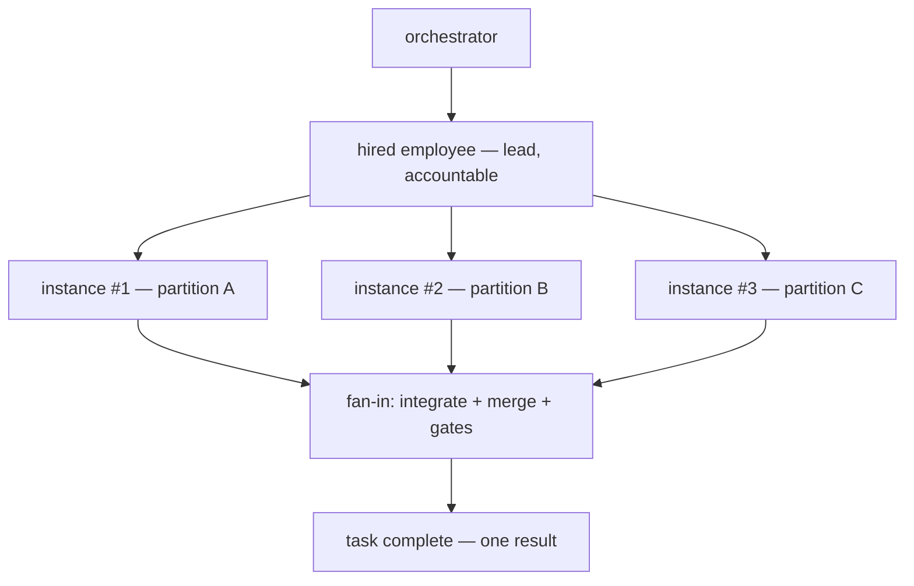
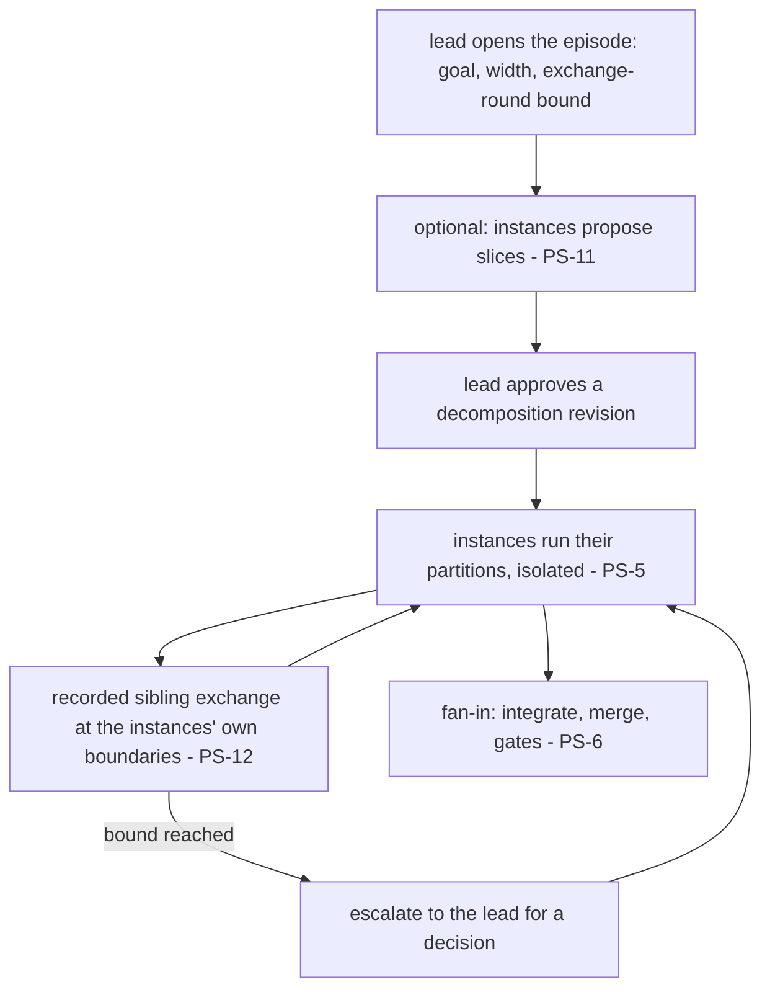

# Parallel Staffing

**Version:** 1.2.0
**Status:** Stable
**Layer:** concept

## Overview

Parallel staffing is the **same-specialty scale-out** contract: when a single task is large enough, the office may put **several workers of the same specialty** on it in parallel — subagent instances of one role splitting the task's decomposed partitions — instead of one specialist grinding through it serially. The hired employee for that specialty remains the single accountable **lead**; the extra capacity comes from **ephemeral instances** of the same role definition that exist for the task's duration, each exclusively owning a disjoint sub-unit, and dissolve when their partition completes.

The contract is deliberately narrow about *how* parallelism is allowed to happen: never two workers on one work unit (WL-1), only decomposition into disjoint sub-units (the task-graph algebra) fanned out exactly once (WL-9); width bounded by budget and policy; sibling contexts isolated with coordination through the observable medium (ORC-5/ORC-12); outputs integrated through the concurrent-change-merge discipline (CM) and gated as one whole; learning consolidated back into the one hired employee's memory scope so scale-out never fragments knowledge.

This is the horizontal complement to the existing coordination stack: adaptive topology (ORC-2) grows the hierarchy *vertically* (managers, departments); deliberation fans out *perspectives* on one question; parallel staffing widens *throughput* on one task with more hands of the same trade.

## Related Specifications

- [l1-orchestration.md](l1-orchestration.md) - Delegation, context isolation (ORC-5), budget circuit-breaker (ORC-7), synchronization without duplication (ORC-8), error containment (ORC-11), transparent coordination (ORC-12); the scaling decision is a delegation decision.
- [l1-office-model.md](l1-office-model.md) - Adaptive staffing (OFF-4) and manager-driven operation (OFF-5); scale-out is the task-scoped, ephemeral form of adapting capacity to need.
- [l1-roles.md](l1-roles.md) - Roles as specialties, working agents as role instances (ROL-1), hire = instantiate (ROL-3), anti-sprawl (ROL-9); parallel instances share one role definition and one hired employee identity.
- [l1-task-graph-model.md](l1-task-graph-model.md) - The decomposition algebra that produces the disjoint sub-units parallel workers claim; complexity scoring informs the scale-out decision.
- [l1-work-liveness.md](l1-work-liveness.md) - Exclusive atomic claim (WL-1), single active run (WL-4), stranded-work reconciliation (WL-5), exact-once fan-out (WL-9); the unit-level mechanics parallel staffing rides on.
- [l1-change-merge.md](l1-change-merge.md) - Reviewable typed-delta merge for shared artifacts; the fan-in discipline when partitions touch the same document.
- [l1-deliberation.md](l1-deliberation.md) - The sibling fan-out: multiple perspectives on the *same* question synthesized into one answer; demarcated from volume partitioning in §4.5.
- [l1-quality-standards.md](l1-quality-standards.md) - The integrated whole — not each partition — is what passes the definition-of-done gates.
- [l1-order-independent-production.md](l1-order-independent-production.md) - [ADDED v1.0.1] the **production-side** property that makes this spec's fan-in lossless rather than merely orderly: PS-5 isolation prevents siblings from *interfering*, but not from depending on **when** they ran. OIP-1 (a unit is a pure function of its position and the frozen inputs) is what PS-2 decomposition and PS-6 integration silently assume; OIP-4/OIP-5 add the global offset and uniform partitioning the fan-in needs.
- [l2-agent-session.md](l2-agent-session.md) - Concrete subagent spawn semantics and independent per-instance iteration budgets the width policy composes with.
- [l1-fanout-attestation.md](l1-fanout-attestation.md) - [ADDED v1.0.2] the launch act of a scale-out: PS-2 disjoint partitions are the ownership precondition of a launch episode, and the barrier is what makes "the partitions ran in parallel" an attested fact rather than a coordinator's belief (FAN-1/FAN-2).
- [l1-event-mesh.md](l1-event-mesh.md) - [ADDED v1.2.0] EM-1 typed event envelope and EM-8 observability: the substrate the recorded, typed sibling exchange of PS-12 rides.
- [l1-agent-framework-skeleton.md](l1-agent-framework-skeleton.md) - [ADDED v1.2.0] AFS-5 bounded coordination (the round ceiling PS-12 declares) and the mesh/peer row of its pattern catalog ("rarely correct for production; require a moderator and termination"), which PS-12 honors by keeping the exchange under the lead.
- [l1-quality-standards.md](l1-quality-standards.md) - [ADDED v1.2.0] QLY-11: a speed or quality claim for any coordination style is measured on the same task, at equal budget, before it calibrates the width policy.

## 1. Motivation

An office with one backend engineer processes a fifty-endpoint migration one endpoint at a time, even though forty of them are independent. Nothing in the existing stack forbids parallelism — the task graph can decompose the work, work liveness can hand out exclusive claims, subagents exist at the session layer — but nothing *owns* it either: there is no contract saying when one task justifies several same-specialty workers, what those extra workers *are* (new hires? clones? anonymous threads?), how wide the office may scale, who integrates the pieces, and where the learning lands afterward.

Left unowned, each implementation would improvise — hiring permanent duplicate employees (staff bloat), letting two workers race one card (double work WL-1 exists to prevent), or fanning out with no width bound until the budget circuit-breaker trips mid-task. Naming the contract once keeps scale-out safe, bounded, and observable: **volume, not habit, justifies width; decomposition, not co-ownership, provides it; the employee, not the ephemeral instances, keeps the knowledge.**

## 2. Constraints & Assumptions

- **Parallelism has overhead.** Every extra instance costs coordination, integration, and money; the decision model assumes diminishing returns and a serial residue (the non-decomposable part of any task stays serial).
- **Sub-units must be genuinely disjoint.** Scale-out quality is bounded by decomposition quality; heavily entangled partitions degrade into merge conflicts and rework.
- **Instances are cheap, hires are not.** Spawning an ephemeral same-role instance is a lightweight runtime act; hiring is an organizational act with memory, hierarchy, and lifecycle weight (ROL-3/ROL-4). Scale-out uses the former.
- **The client sees a team, not threads.** Scale-out is part of the office metaphor: extra workers of a specialty are visible, named, and attributable while they exist (ORC-12), not invisible concurrency.

## 3. Core Invariants

Rules every Layer 2 implementation MUST NOT violate. They are technology-neutral.

- **PS-1 (Volume-justified, recorded scale-out):** one worker per task is the default. Assigning parallel same-specialty workers is an explicit scaling decision made by the coordinating side (orchestrator or lead), justified by task volume signals — decomposition width, estimated size, deadline pressure — and recorded with its rationale. Scale-out is never an unconditional default and never silent.

- **PS-2 (Parallelism only through decomposition):** parallel workers NEVER co-own a work unit. Scale-out is realized exclusively by decomposing the task into **disjoint sub-units** (per the task-graph decomposition algebra), each claimed atomically and exclusively (WL-1) and dispatched exactly once (WL-9). A task (or task part) that does not decompose does not scale out — the serial residue runs serially, and the contract never promises speed-up it cannot deliver.

- **PS-3 (Ephemeral instances under one accountable lead):** scale-out spawns **ephemeral worker instances from the same role definition** as the responsible hired employee, who remains the single accountable lead for the whole task. Instances live for their partition's duration and dissolve at completion. Scale-out MUST NOT hire permanent staff as a side effect (staffing stays manager-owned, ROL-5; the workforce does not bloat, ROL-9) and MUST NOT reassign the task's accountability away from the lead.

- **PS-4 (Bounded width):** parallel width is bounded by explicit policy: configured maximum width, budget headroom (each instance carries its own bounded budget, and the aggregate fits the task/run budget per ORC-7), and a coordination-cost guard (width that decomposition or integration cannot sustain is not granted). When the bound is lower than the partition count, remaining partitions queue — never an unbounded spawn. Width decisions are made only at the lead/orchestrator level: an ephemeral instance MUST NOT itself initiate further scale-out — nested width would silently defeat the bound.

- **PS-5 (Isolated siblings, recorded coordination):** each parallel instance runs in an isolated context (ORC-5); siblings share no mutable working state and have no hidden back-channels — [MODIFIED v1.2.0] every coordination exchange is on the observable record the lead and the human can see and interject into (ORC-12, ORC-8), whether it is mediated by the lead or a direct sibling exchange under PS-12. Where partitions touch a shared artifact, changes integrate through the concurrent-change-merge discipline, never blind co-editing.

- **PS-6 (Integration is first-class):** the fan-in is a distinct, owned step: the lead (or orchestrator) integrates partition outputs into one coherent result, resolving merges reviewably (CM), and the task completes only when the **integrated whole** passes its quality gates — never merely because the last partition finished.

- **PS-7 (Learning consolidates to the employee):** durable learning produced by ephemeral instances lands in the **one hired employee's** memory scope (the employee level of the storage model), attributed per instance in the record. Ephemeral instances own no durable memory scope of their own; scale-out MUST NOT fragment a specialty's knowledge across throwaway identities.

- **PS-8 (Failure containment and honest salvage):** a failed or stalled instance is contained at its delegation boundary (ORC-11): its partition re-enters the pool through the explicit stranded-work path (reap, then reassign — consistent with WL-5, never a silent second execution), other partitions continue undisturbed, and partial output from the failed instance is salvaged only through the merge discipline — never silently absorbed.

- **PS-9 (Observable, attributed width):** the scaling decision, each live instance, its partition, and its per-instance cost are observable in the office's live projection and event record (ORC-12) and attributed in the work's history — the client can always see that N workers exist, why, and what each contributed.

- **PS-10 (The execution tier is assigned per instance by partition class, never inherited from the coordinator):** [ADDED v1.1.0] each ephemeral instance's **execution tier** — model class, reasoning depth, effort setting — is chosen from **what its own partition actually demands**, and is stated in the scaling decision alongside the width. Inheriting the coordinator's tier is the default that fan-out makes expensive: the coordinator's tier is chosen for the hardest thing *it* does, inheritance multiplies that per-unit rate by the width, and the widest fans are characteristically the **shallowest** work — gathering, scanning, summarizing, extracting — where the coordinator's tier buys nothing. The rule is symmetric and neither direction is a saving: a partition that genuinely needs the higher tier gets it, and dropping the whole fan to the cheapest tier to make the bill look better is a quality decision disguised as an economy. What is forbidden is the tier being decided by **where the instance was spawned from** rather than by what it was spawned to do. (The related but distinct move — running rival attempts at a reduced fidelity to *select* cheaply and then produce once at full fidelity — is CE-10 and belongs to the contest, not to this fan-out.)

- **PS-11 (Slice proposals are inputs to a decomposition revision, never partitions):** [ADDED v1.2.0] before the fan-out the lead MAY invite its instances — or the hired employee's colleagues of the same specialty — to propose which part of the task each would take. A proposal is an *input*: the lead folds the proposals into a decomposition revision and approves it, and only the approved revision is fanned out, exactly once (WL-9, keyed by the revision) and claimed atomically per partition (WL-1). Overlap between proposals is settled by the lead **before any instance writes**, not found at integration (CM-7); a proposal binds nobody, and whatever no one proposed stays the lead's to assign. Proposing is optional — the task-graph decomposition remains the default source of partitions (PS-2) — so a task is never stalled waiting for proposals, and the lead's finality over the partitioning is the finality the orchestrator holds over any decision (DL-3).

- **PS-12 (Sibling exchange is recorded, typed, bounded and ack-free, and it binds only by ratification):** [ADDED v1.2.0] siblings of one episode MAY address each other directly, one or all, provided every exchange is on the office's event record (ORC-12) and typed from a closed set that at least separates information, question, proposal, decision-request, decision and result. Four rules keep the exchange from becoming a back-channel or a loop. A **decision** a sibling issues binds the episode's siblings only when the lead has ratified it, or when it falls inside a scope the lead explicitly delegated to its author (ownership of an interface, say); the lead can override any sibling decision and the override is final. The exchange is **bounded**: an episode declares a maximum number of exchange rounds, and a thread still open at the bound is escalated to the lead for a decision rather than continued (AFS-5). **Acknowledgements are not messages**: delivery is attested by the record, not by a reply, so a receiver with nothing to add simply continues — silence means "nothing to add" — and a message exists only to change what another instance will do. And the exchange stays **inside the episode**: the independence of deliberation (DL-1) and the isolation of competing attempts (CE-3) are untouched, because neither is a parallel-staffing episode.

> L2 specs cannot reach RFC status until all invariants here are addressed in their "Invariant Compliance" section.

## 4. Detailed Design

### 4.1 The scale-out decision

```text
[REFERENCE]
consider_scale_out(task):
    partitions := decompose(task)                    // task-graph algebra; PS-2
    if count(independent(partitions)) < 2:  return serial   // no width without disjoint units
    width := min(count(independent(partitions)),
                 policy.max_width,                    // PS-4 config
                 budget_headroom / per_instance_budget,
                 coordination_guard(partitions))      // integration cost vs gain
    if width < 2:  return serial
    record_decision(task, width, rationale)           // PS-1 — surfaced, ORC-12
    return fan_out(task, width)
```

The decision inputs are the same signals the office already computes: complexity/decomposition from the task graph, budget headroom from the run budget, deadline pressure from the schedule. The output is a recorded decision, not an invisible runtime mood.

### 4.2 Fan-out anatomy



The lead is the hired employee (ROL-3 instance with memory and hierarchy placement). Instances are spawned from the same role definition — same persona, capabilities, and configuration — differing only in identity suffix and partition assignment. They appear in the office projection as distinct, temporary workers at the lead's desk-group (PS-9).

### 4.3 Partition lifecycle

Each partition is an ordinary work unit under the existing contracts: exclusively claimed by its instance (WL-1), single active run (WL-4), liveness-tracked (WL-3), fanned out exactly once per approved decomposition revision (WL-9). Instance death without a terminal state is stranded work: the reconciliation sweep reaps it and the lead reassigns the partition — to a fresh instance or into the serial queue (PS-8).

### 4.4 Fan-in and completion

The lead integrates: disjoint-file outputs assemble directly; shared-artifact changes go through typed-delta merge with conflicts surfaced reviewably (CM); the assembled whole then passes the task's quality gates. Only the integrated, gated result flows upward (ORC-5 — partition detail stays out of the orchestrator's context; a summary plus the attributed record remains reachable per ORC-12).

### 4.5 Demarcation within the coordination family

| Concept | Fans out | Over | Purpose |
| --- | --- | --- | --- |
| **This spec — parallel staffing** | Same-role instances | Disjoint partitions of one task | Throughput on volume |
| l1-deliberation | Perspectives/agents | The *same* question | Answer quality via diversity |
| ORC-2 adaptive topology | Managers/departments | The org hierarchy | Coordination span at scale |
| ROL hire (OFF-4/ROL-5) | Permanent employees | The office's standing needs | Durable capability |
| l1-task-graph-model | Sub-units | A requirement/plan | Decomposition algebra (produces the partitions) |
| l1-work-liveness | Claims/runs | Individual work units | Ownership + liveness mechanics |

None substitutes for another: parallel staffing *consumes* the task graph's partitions, *rides on* work-liveness claims, *merges via* change-merge, and reports through the same observability the office already has.

### 4.6 The episode in three beats (PS-11, PS-12)



*Coordination* happens before any write, while settling an overlap is cheap. *Implementation* is isolated. *Exchange* happens at an instance's own boundaries — a partition finished, a blocker found, an interface decided — and is drained at the start of its next turn like any other inbox traffic, so an instance is never interrupted mid-thought. Nothing in the episode weakens PS-2 (disjoint partitions), PS-6 (the lead owns the integrated whole) or DL-3 (finality stays with the coordinating side).

## 5. Implementation Notes

1. **Width policy first** — configuration surface (max width, per-instance budget share, coordination guard) with sensible defaults; the decision record shape.
2. **Instance spawn path** — reuse the existing subagent spawn semantics and independent per-instance budgets at the session layer; add same-role identity attribution.
3. **Partition claim wiring** — nothing new: task-graph decomposition + existing exclusive claims; verify exact-once dispatch under the approved decomposition revision.
4. **Fan-in step** — lead-owned integration with merge discipline and gate invocation.
5. **Projection & record** — instances visible in office visualization; per-instance cost attribution in the dashboard/budget records; memory consolidation into the employee scope on dissolve.

## 6. Drawbacks & Alternatives

- **Coordination overhead can eat the gain:** integration and merge cost grows with width and entanglement. Mitigated by PS-4's coordination guard and PS-2's serial-residue honesty; width defaults are conservative. The data that tunes them is a measured comparison — the same task run solo and fanned out at equal budget, graded by an independent grader (QLY-11) — not an estimate, because the gain is bounded by how decomposable the task really is and a coordination style's reported speed-up is a hypothesis until measured. <!-- TBD: default max width and the coordination-guard heuristic (e.g. width ≤ ceil(independent_partitions / 2), cap 4) — tune with field data -->
- **Alternative — hire N permanent same-role employees:** rejected as the scale-out mechanism; it bloats standing staff for a transient need, fragments memory across hires, and staffing remains a manager-level organizational act (ROL-5/ROL-9). A manager MAY still hire a second permanent specialist when *standing* demand justifies it — that is OFF-4 staffing, not task-scoped scale-out.
- **Alternative — one worker with a bigger budget:** serial execution avoids merge cost but leaves wall-clock time linear in volume and forfeits the independence the task graph already proved; for genuinely large decomposable tasks the client-visible latency difference is the point of this contract.
- **Alternative — leaderless peer swarm (a shared working surface, decisions by dispute or vote):** rejected. It removes the one actor who owns the integrated whole (PS-6), puts several writers on one mutable surface (PS-5), and replaces the coordinating side's finality with a mechanism that discards argument quality (DL-3 rejects the vote). What the style gets right — peers who can tell each other what they decided without routing every word through one desk — is PS-12, kept inside the lead's authority. A multi-agent run also spends more tokens than one agent doing the same work, so it earns its width only where decomposition is real (PS-1, PS-2, PS-4).
- **Alternative — anonymous concurrency (threads, no worker identity):** rejected; it breaks the office metaphor, the attribution record (PS-9), and the human's ability to observe and steer (ORC-12).
- **Memory contention on the employee scope:** N instances consolidating into one scope can conflict; mitigated by attributed, append-style consolidation at dissolve time (PS-7) and the merge discipline for anything richer.

## Document History

| Version | Date | Change |
| --- | --- | --- |
| 1.2.0 | 2026-10-03 | Amended — PS-11, PS-12; PS-5 modified; §4.6 and one rejected alternative. A study of a leaderless "swarm" coordination style (no coordinator, decisions by dispute or vote, one shared branch, a typed message that binds the whole team, a coordination → implementation → catch-up protocol with bounded rounds, "reply only when it matters", mixed models) was set against this contract. The leaderless core is rejected — it contradicts PS-5/PS-6, ORC-1 and DL-3 — and the mesh/peer pattern is already rated "rarely correct for production" by the agent-framework catalog. Three mechanics survive under the lead's authority. **PS-11:** instances may *propose* slices before the fan-out, as inputs to a decomposition revision the lead approves (WL-9 keys the revision), so overlap is settled before anyone writes (CM-7); optional, never a stall. **PS-12:** direct sibling exchange is allowed when recorded (ORC-12), typed from a closed set, bounded by a declared round count that escalates to the lead (AFS-5), ack-free (delivery is attested by the record), and a sibling "decision" binds only by the lead's ratification or inside an explicitly delegated scope. **PS-5** said coordination "flows through the lead"; it now says every exchange is on the record the lead and the human can see, which is the property ORC-12 actually requires. Mixed-model instances were already covered (PS-10; DL-2). The study's speed and quality figures are not adopted: the one measured run was a single data point, and the width policy's TBD is now tied to a measured solo-versus-fan-out comparison (QLY-11). Related Specifications extended with `l1-event-mesh`, `l1-agent-framework-skeleton`, `l1-quality-standards`. Additive — L1 stays Stable (C9). |
| 1.1.0 | 2026-09-01 | Amended — PS-10: an ephemeral instance's **execution tier** (model class, reasoning depth, effort) is assigned from what its own partition demands and stated with the width, never inherited from the coordinator. Inheritance is the expensive default fan-out creates: the coordinator's tier is set for the hardest thing it does, fan-out multiplies that per-unit rate by the width, and the widest fans are characteristically the shallowest work. Symmetric — a partition needing the higher tier gets it, and flattening the whole fan to the cheapest tier is a quality decision disguised as an economy; what is forbidden is the tier following **where an instance was spawned from** instead of what it was spawned to do. Demarcated against CE-10 proxy-fidelity selection. Mined from an external cross-model plan-hardening skill collection. |
| 1.0.2 | 2026-08-25 | Related Specifications extended with `l1-fanout-attestation` — the orthogonal contract governing the **launch act** of a scale-out. PS decides *what* is split and that every partition is integrated; it is silent on whether the partitions were actually launched together, and a coordinator that launches one instance, waits, then launches the next produces an identical record. PS-2's disjointness is the ownership precondition of a launch episode. Link-only; no invariant changed. |
| 1.0.1 | 2026-08-05 | Related Specifications extended with `l1-order-independent-production` — the production-side property PS-2/PS-6 assume without stating: isolation stops siblings interfering but not depending on when they ran, and a perfectly staffed set of isolated workers still yields an incoherent artifact if each reads the clock. Link-only; no invariant changed. |
| 1.0.0 | 2026-07-02 | Initial concept: volume-justified same-specialty scale-out — ephemeral same-role instances under one accountable hired lead, parallelism only via disjoint decomposition (WL-1/WL-9), bounded width (budget + coordination guard), isolated siblings with mediated observable coordination, first-class fan-in with merge + gates, learning consolidated to the employee scope, contained failure with honest salvage, fully attributed (PS-1…PS-9). |

## Canonical References

| Alias | Path | Purpose |
| --- | --- | --- |
| `[ORCH]` | `.design/main/specifications/l1-orchestration.md` | Delegation, isolation, budget, containment, transparency contracts scale-out composes |
| `[TASKGRAPH]` | `.design/main/specifications/l1-task-graph-model.md` | Decomposition algebra producing the disjoint partitions |
| `[LIVENESS]` | `.design/main/specifications/l1-work-liveness.md` | Exclusive claim / exact-once fan-out / stranded-work mechanics |
| `[MERGE]` | `.design/main/specifications/l1-change-merge.md` | Fan-in merge discipline for shared artifacts |
| `[ROLES]` | `.design/main/specifications/l1-roles.md` | Role definition, hire semantics, anti-sprawl the instance model respects |
