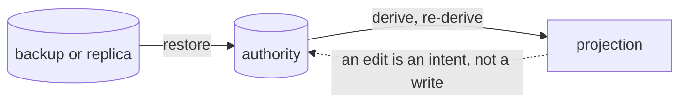

# State Authority

**Version:** 1.0.0
**Status:** Stable
**Layer:** concept

## Overview

The contract that every kind of durable state in the office has **exactly one authority** — the one store or artifact whose content is the truth for that kind — and that every other representation of it is a **projection** (derived, regenerable, never the truth) or describes a **different object**. The corpus already says "projection, not source" many times, one subsystem at a time: the board, the wiki, the office view, generated surfaces, the derived-artifact handoff. What none of those states is the part this spec owns: a closed set of **authority classes**, the **direction recovery runs in**, and the rule that backup, restore, export, sync and self-repair decide by the declared class rather than by file type, location or storage engine.

The failure it closes is quiet. Two representations that both claim to know the same fact agree for exactly as long as nothing is interrupted, and diverge at the first crash between the two writes. A blanket statement — "databases are derived indices", "text is always the source" — is true for most kinds and false for the one kind a repair then destroys. Neither failure throws; both look like a working system until the day a tool rebuilds a truth from its own cache.

## Related Specifications

- [l1-storage-model.md](l1-storage-model.md) - Where state lives (tiers, scopes). STO-7 restore-by-copy and STO-8 inspectability are applications of this contract; STO-8's text-first rule is one of three authority classes, not the only one.
- [l1-memory-model.md](l1-memory-model.md) - MEM-4 source of truth by kind: the first declaration of this shape (authored memory is text-authoritative, the learned corpus store-authoritative, its text a projection).
- [l1-work-convergence.md](l1-work-convergence.md) - CONV-8 (aggregate views project from boards) and CONV-10 (execution state has one owner, the card) are the two work-side cases of SAU-1/SAU-2.
- [l1-kanban-model.md](l1-kanban-model.md) - KAN-1: the board of record, the authority CONV-10 names.
- [l1-task-graph-model.md](l1-task-graph-model.md) - TG-11: plan-unit statuses read the card; they are a projection.
- [l1-derived-artifact-handoff.md](l1-derived-artifact-handoff.md) - DAH-1 derived-only-never-authority: the same discipline for a rebuildable artifact shared between devices; this spec is the general rule it instantiates.
- [l1-multi-device-sync.md](l1-multi-device-sync.md) - SY-4 routes each data class to a reconciliation strategy; the authority class is the other property of the same class, and sync reads both.
- [l1-office-visualization.md](l1-office-visualization.md), [l1-project-wiki.md](l1-project-wiki.md), [l1-generative-surface.md](l1-generative-surface.md), [l1-directability.md](l1-directability.md) - OVZ-1, PW-3, GS-6 and DIR-2 (edit-as-intent) are SAU-2 stated per lens.
- [l1-code-intelligence.md](l1-code-intelligence.md) - CI-3: the code index is a cache of source, never the source of truth for a code location.
- [l1-operational-ledger.md](l1-operational-ledger.md) - OL-3 canonical-source precedence ranks the sources of one fact; authority names the one store of a kind. Complementary, not overlapping (§4.5).
- [l1-doctor.md](l1-doctor.md) - Self-repair is the tool most able to run recovery in the wrong direction; SAU-4/SAU-5 bind it.
- [l1-deliberation.md](l1-deliberation.md) - DL-4: the append-only log is the record-authoritative class.
- [l2-filesystem-layout.md](l2-filesystem-layout.md) - The realization: the path-level authority map (§4.6).

## 1. Motivation

Three occurrences in this corpus, found by reading it against itself:

- **Two statuses, one fact.** The plan model called a unit's status "the single source of execution truth" while the board model made the card the board of record. Each claim was reasonable alone; together the corpus held two authorities for whether a piece of work was finished, and a progress ledger, a sprint file and an artifact registry each added a third, fourth and fifth word for it.
- **A rule that outlived a move.** The storage model said databases are derived indices over human-readable text. Later the learned memory corpus was deliberately made database-authoritative (volume, ranking, supersede), and its text became an export. The new declaration was correct and local; the old blanket sentence stayed in the storage model and the filesystem layout, and the doctor's check suite still says "rebuild the index from source text" — read literally, an instruction to rebuild a truth from its own export.
- **Projection rules without a repair direction.** The board, wiki, office view and generated surfaces each forbid becoming a second source. None says what happens when a projection and its authority disagree, which one a repair may overwrite, or whether a backup may skip a "derived" store.

The contract here is deliberately small: it adds no store, only the vocabulary and the direction rule that make the existing per-subsystem statements compose.

## 2. Constraints & Assumptions

- Authority belongs to a **kind** of state, not to a file or a table. One table may hold rows of two kinds (a delivery queue is not the audit record of what was decided).
- The classes are closed. A kind that fits none is a design question to settle, not a fourth class to invent.
- This contract adds no new store; it constrains what existing stores may claim and what tools may do to them.
- A projection may be persisted, indexed or expensive to rebuild. Its defining property is that it is *derivable*, not that it is cheap or transient.

## 3. Core Invariants

Rules every Layer 2 implementation MUST NOT violate:

- **SAU-1 (One authority per kind of state):** every kind of durable state names exactly one authority — the single store or artifact whose content is the truth for that kind. A kind may have many representations; it never has two authorities. The declaration lives in the specification that owns the kind (SAU-6).
- **SAU-2 (Every other representation is a projection or describes a different object):** a representation that is not the authority is exactly one of two things, and says which. A **projection** is derived from the authority and regenerable from it; it is never edited as if it were the truth (a change made on a projection is an *intent* applied to the authority, after which the projection re-derives — DIR-2), and it never wins a disagreement. A representation of **another object** uses a vocabulary that cannot be mistaken for a claim about the first kind (a status about whether an artifact exists, or whether a change record has merged, does not say "done" about the work). A representation that is neither is a second truth.
- **SAU-3 (Authority has a declared class):** a kind declares its class from a closed set. **Text-authoritative**: a human-readable file is the truth; databases, indices and caches over it are derived. **Store-authoritative**: a database is the truth, because volume or concurrency is more than a file carries; any text rendering is an export, a projection. **Record-authoritative**: an append-only record is the truth (an audit log, a transition history, a supersede chain); every current-state view is a fold over it. The class decides recovery (SAU-4), backup inclusion and sync reconciliation (SAU-5). A rule stated once for all state is wrong for at least one kind, and that kind is the one a repair destroys.
- **SAU-4 (Recovery runs from authority to projection, never back):** a lost or stale projection is rebuilt from its authority, and doing so is always safe. A damaged or lost authority is restored from a backup or a replica; it is **never repaired by regenerating it from a projection**, however complete the projection looks, because the projection is only as trustworthy as the authority it came from and a regeneration in the wrong direction launders a loss into a plausible-looking state. A disagreement found between an authority and a projection is settled in the authority's favour and **reported**, never settled silently. Evidence is not a projection: a record of a completed act (an approval, a commit) that an authority's state has not yet caught up with is a **stranded transition**, completed on recovery through the authority's own operation — neither side "wins" — and the authority never records a transition that has no evidence behind it (CONV-10).
- **SAU-5 (Backup, restore, export, sync and repair decide by the declared class):** a backup includes every authority; excluding a projection is a declaration, so excluding a "derived" store can never exclude a truth, and including an expensive-to-rebuild projection is a convenience the declaration records, never a substitute for the authority. A restore brings back authorities and re-derives projections. An export of a projection is labelled as one. Sync reconciles by the kind's class (SY-4). A repair tool rebuilds projections only (SAU-4). A tool that decides by file extension, directory or storage engine instead of by the declared class will, sooner or later, treat a truth as a cache.
- **SAU-6 (The owning specification declares; the map only indexes):** the declaration of a kind's authority lives in the specification that owns the kind, beside its other invariants. The authority map kept in the realization is an index of those declarations — each row cites the invariant that makes it — and is never a second definition (SAU-1 applies to the map itself). A kind whose owner is silent is shown as *proposed*, which is a finding against the owner, not a class by default.
- **SAU-7 (A move of authority is explicit and swept):** when a kind's authority moves (text to database, database to a log, a cache promoted to a source), the move is one revision that declares the new authority, demotes the old to a projection (regenerated export) or retires it, and updates every place that claimed the old one — the owning spec, the map, the repair list, the backup set, and any blanket statement that quoted the old rule. A kind never has two authorities "for a while": the window between old and new is closed by a versioned migration (STO-9), not left open.

> L2 specs cannot reach RFC status until all invariants here are addressed in their "Invariant Compliance" section.

## 4. Detailed Design

### 4.1 Authority classes

| Class | The truth is | Derived from it | A derived copy is lost | The authority is lost | Backup |
| --- | --- | --- | --- | --- | --- |
| Text-authoritative | a human-readable file (a configuration, a card record, a plan, authored memory) | search and vector indices, caches, rendered views | rebuild from the file | restore the file from backup or a replica; never regenerate it from an index | included |
| Store-authoritative | a database (the learned memory corpus) | indices over it; a human-readable export | rebuild the index from the store; regenerate the export | restore the store; the export is not an input | included |
| Record-authoritative | an append-only record (an audit log, a transition history) | every current-state view, fold or summary | re-fold from the record | restore the record; a fold is never written back as the record | included |
| Not an authority (projection) | nothing; it is derived | — | rebuild from the authority of its kind | not applicable | excluded by declaration, or included only for rebuild cost |

### 4.2 Declaring a kind

A declaration states, in the owning specification: the kind; its authority and class; its projections and the direction they are derived; any representation that describes a *different* object and the vocabulary it uses; and what recovery looks like. Illustrative declarations already present in the corpus, restated at the kind level:

| Kind | Class | Projections, other objects | Declared by |
| --- | --- | --- | --- |
| Work state of a unit (the card and its history) | text-authoritative | plan-unit status, tracking files, views, dashboards | KAN-1, CONV-10 |
| Learned memory | store-authoritative | search and vector indices, text export | MEM-4 |
| Authored quick memory | text-authoritative | search index | MEM-4 |
| Deliberation log | record-authoritative | the Channels view | DL-4 |
| Project wiki | not an authority | derived from project artifacts | PW-3 |
| Office view | not an authority (its cosmetic layout is the one thing it owns) | the rendered graph | OVZ-1, OVZ-7 |
| Code-intelligence index | not an authority | a cache of source | CI-3 |
| Secrets | held in the secret store, never in a projection, export or backup | — | STO-6 |

The maintained, path-level version of this table is the realization's authority map; it indexes the owners' declarations and adds none.

### 4.3 The direction of recovery



The only arrows into an authority are an intent from a projection (applied through the authority's own operation, then re-derived) and a restore. There is no arrow from a projection that regenerates an authority.

### 4.4 Moving an authority (SAU-7)

```text
[REFERENCE]
move_authority(kind, from, to):
    declare(kind, authority=to, class=class_of(to))        // the owning spec, one revision
    demote(from)  -> projection (regenerated export) | retire
    sweep claims of `from` in: owning spec, authority map, repair list, backup set,
                               blanket statements that quote the old rule
    migrate(data, versioned, backed up first)               // STO-9: no open window
    verify: exactly one authority(kind) remains; every projection names it
```

### 4.5 Demarcation from neighbours

| Neighbour | What it owns | What this adds |
| --- | --- | --- |
| STO-7/STO-8 (storage model) | restore-by-copy and inspectability of the state tier | the class that decides what "inspectable" and "restorable" mean for each kind |
| SY-4 (multi-device sync) | which reconciliation strategy a data class gets | the authority class that tells a sync which side may be regenerated |
| DAH-1 (derived-artifact handoff) | a rebuildable artifact may be shared but never merged | the general statement DAH-1 instantiates |
| CONV-8, OVZ-1, PW-3, generative-surface GS-6, DIR-2 | one lens or view is a projection | the repair direction and the closed class vocabulary all of them share |
| OL-3 (canonical-source precedence) | which source wins when sources disagree about a fact | not a replacement: precedence ranks sources of one fact, authority names the one store for one kind |

## 5. Drawbacks & Alternatives

- **Declaration overhead.** Every owning specification states a class. Mitigated: it is one sentence per kind, usually already present (MEM-4, DL-4, PW-3), and the map is generated from them by reading rather than written twice.
- **Alternative — one global rule (all text, or all database).** Rejected: it is precisely the sentence that was wrong for learned memory and right for configuration. The class vocabulary exists to retire blanket rules.
- **Alternative — fold this into the storage model.** Rejected: the storage model owns *where* state lives (tiers, scopes, versioning). The work board, the wiki and the office view are not storage questions, and putting their rules there would give the storage spec the work-state vocabulary it deliberately does not hold.
- **Alternative — authority by location (state tier is truth, cache tier is projection).** Rejected: the memory database and the wiki index sit in the same tier with opposite classes; location says how regenerable a file is expected to be, not which copy is true.
- **Cost: a repair tool may refuse.** A doctor that finds a damaged authority and no backup reports and stops instead of rebuilding. That is the intended cost of SAU-4: a refusal is recoverable, a laundered loss is not.

## Canonical References

| Alias | Path | Purpose |
| --- | --- | --- |
| `[STORAGE]` | `.design/main/specifications/l1-storage-model.md` | Tiers, restore-by-copy, inspectability this contract classifies |
| `[MEMORY]` | `.design/main/specifications/l1-memory-model.md` | MEM-4, the first by-kind declaration |
| `[CONVERGENCE]` | `.design/main/specifications/l1-work-convergence.md` | CONV-10, the work-state case |
| `[DERIVED]` | `.design/main/specifications/l1-derived-artifact-handoff.md` | DAH-1, the shareable-cache instance |
| `[LAYOUT]` | `.design/main/specifications/l2-filesystem-layout.md` | Path-level authority map (§4.6) |

## Document History

| Version | Date | Change |
| --- | --- | --- |
| 1.0.0 | 2026-10-03 | Initial concept — one authority per kind of state (SAU-1), every other representation a projection or a description of a different object (SAU-2), a closed authority-class vocabulary — text, store, record (SAU-3), recovery from authority to projection and never back (SAU-4), backup/restore/export/sync/repair deciding by declared class (SAU-5), the owning specification declares and the map only indexes (SAU-6), a move of authority explicit and swept (SAU-7). Motivated by two contradictions found reading the corpus against itself (a plan status and a board state each called the single source of execution truth; a blanket "databases are derived indices" surviving the move of learned memory to a database). |
