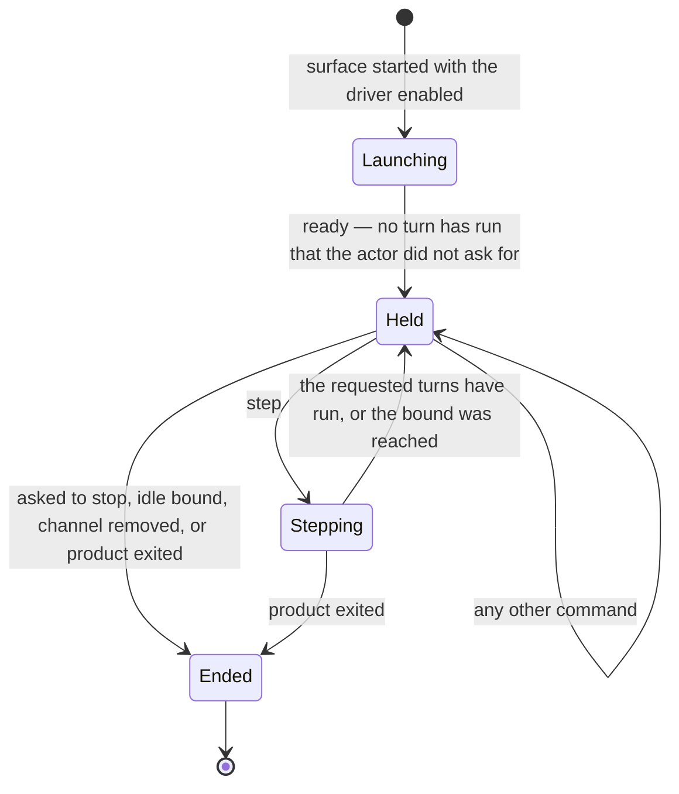
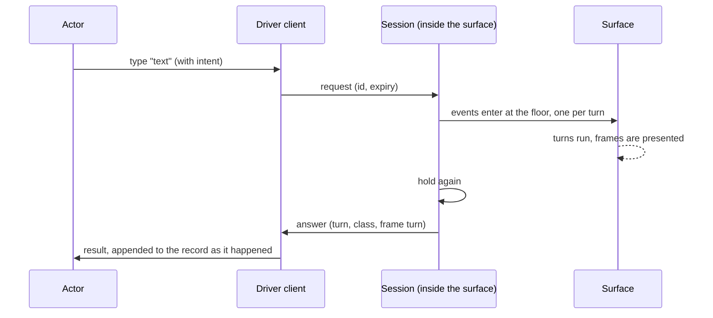

# Surface Driver

**Version:** 1.0.0
**Status:** Stable
**Layer:** concept

## Overview

A surface driver is a **development-time facility that does to a running surface what a
person does, and reports what the surface showed**. Started together with the surface and held
still between its commands, it presses keys, types text and resizes the window as a person's
devices would, advances the surface by an exact number of its own turns, and returns what was
presented: the frame a screen drew, the text a terminal printed, the status a process ended
with. It is the hands and the eyes that a human tester has and an agent working from a shell
does not.

It is an instrument, not a discipline and not a test. It judges nothing and asserts nothing.
[l1-usage-simulation.md](l1-usage-simulation.md) decides what an actor wants, what it may know
and what a run must show; the driver is what that actor works *through* on the surfaces a person
meets one turn at a time — a terminal interface and a graphical shell — and the one place where
the evidence of that work is recorded as it happens. The same instrument serves a developer
debugging the product itself, from a different vantage. It therefore offers two **tiers**,
chosen when a session opens and fixed for its life: an *operator* tier (what a person at the
surface can perceive and do) and an *inspector* tier (what the product publishes about itself).
An actor playing a stranger is *equipped* as one, rather than asked to behave like one.

The contract below is what keeps such a facility trustworthy. It is absent from everything
users receive and private to the user who launched it. It presents input exactly as devices do
and says how far down that goes. It holds the surface still and states, from measurement, which
time it holds. It separates what a person could see from what only the product knows. It labels
every shortcut as one. It is calibrated before it is believed.

## Related Specifications

- [l1-usage-simulation.md](l1-usage-simulation.md) — The discipline that uses this instrument. USM-2's "real surface" is read down to the floor declared here (DRV-3); USM-5's observed output is, on an interactive surface, what was *presented* (DRV-6); USM-7's replay of timing-relevant choices is made possible by held, counted turns (DRV-4, DRV-14).
- [l1-uninformed-actor.md](l1-uninformed-actor.md) — UIA-2 says denial is enforced by how the actor is staffed, never by instruction; the operator tier is the mechanism that equips such an actor at the surface. UIA-8 distrusts the actor's own account; this driver's record is the independent observation (DRV-14).
- [l1-surface-parity.md](l1-surface-parity.md) — The vocabulary of surfaces and the action catalog coverage is claimed against (SP-11); SP-13's three resolution outcomes and its refusal to fold *unavailable* into *empty* are what DRV-6 applies to observations; SP-6's conformance corpus is the deterministic, presentation-free sibling.
- [l1-live-diagnostics.md](l1-live-diagnostics.md) — The inspector tier invokes the published introspection routines of LD-10 on a held product. LD-2 (a non-suspending observer, in production) is the deliberate opposite of this driver's hold (§4.8): the two must not be unified.
- [l1-agent-tool-ergonomics.md](l1-agent-tool-ergonomics.md) — The driver's command surface is an agent-facing tool, and ATE-2, ATE-3, ATE-6, ATE-10, ATE-13 and ATE-14 bind it (DRV-9).
- [l1-acceptance-oracle.md](l1-acceptance-oracle.md) — AO-5 (an absence claim needs a positive control) is the rule DRV-12's calibration checks are held to; AO-4 governs how a check signals that it passed.
- [l1-invariant-tripwires.md](l1-invariant-tripwires.md) — The structural half of DRV-12: narrow, named, one-rule checks (TW-1…TW-6) that keep DRV-1, DRV-2 and DRV-9 true as the code changes.
- [l1-browser-control.md](l1-browser-control.md) — A *product capability* by which agents drive a web browser for the user; it ships. Demarcated in §4.8. Its accessibility-tree addressing and fail-loud handle invalidation (BC-2, BC-3) are the model the graphical shell's structural observation follows.
- [l1-execution-sandbox.md](l1-execution-sandbox.md) — The isolation substrate a disposable world, and therefore a session used for simulation, is built on (USM-2).
- [l1-process-integrity.md](l1-process-integrity.md) — PI-5 and PI-8: a child the product starts inherits an explicit allowlist of its environment, never the whole of it, which is what keeps an enabling signal from spreading (DRV-1).
- [l1-reproduction-recipe.md](l1-reproduction-recipe.md) — The session record is a recipe in that sense; the determinism class it states is RR-8 applied to a driven run.
- [l1-system-readout.md](l1-system-readout.md) — SR-5's explicit freshness and honest staleness is the discipline DRV-6 applies to a presented frame.
- [l1-fault-ownership.md](l1-fault-ownership.md) — A failed session is attributed before it is filed; a disagreement between the driver and its calibration fixture is the driver's fault, never the product's (DRV-12).
- [l1-application-shell.md](l1-application-shell.md) — The graphical surface, its named actions (AS-6) and the single dispatch entry its external triggers funnel into, which is where an operating-system-level trigger can only be reached as a shortcut (DRV-8).

## 1. Motivation

**Tests assert values, not pictures, and an agent has no eyes or hands unless it is given
them.** A studied external interactive project passed every automated gate for a whole phase
while its main view faced the wrong way; the first pass over a real window found it within
minutes. The same class is already on record in this product: a defect in its terminal
interface — typed characters silently swallowed before the command bar was reached — was found
by manual use, because no test had pressed a key. The instrument built to replace manual use
cannot reproduce it either: it spawns the product as a process and records its streams, and a
keystroke is not an argument. The terminal interface and the graphical shell therefore have no
instrument at all.

**Real time defeats turn-by-turn driving.** An actor thinks for seconds between commands. A
surface that keeps running moves under it: a polling loop redraws, a snapshot arrives, a
spinner advances, a relative time label changes. A driver that cannot hold the surface still
turns every observation into a race and every replay into a coincidence.

**The obvious ways of stopping time leave things running.** The studied project measured it:
scaling time to zero left frame-counted logic and awaited work running, and a pause facility
left awaited work running and fought the product's own pause. This product adds a stricter
case: its core runs worker threads and reads the host clock directly in some twenty places,
with no single clock it can be handed, so *holding a surface* and *holding the product* are
different claims, and a driver that does not say which one it makes is claiming the wrong one.

**A facility that can press any key as the user is a vulnerability if it ships or can be
reached.** It acts with the user's whole authority. It has to be off by default, absent from
every release, closed to everyone but the user who started it — and *verified* closed, because
a directory's location is not a permission.

**An actor that sees everything makes the wrong tester.** `l1-usage-simulation.md` §1 already
states the failure: an agent that knows the implementation takes the route the implementation
supports and understands the error a stranger could not. A driver that offers introspection
and arbitrary evaluation to every session builds that failure into the instrument. Equipping
the actor with the right *reach* is mechanical; instructing it to forget is not.

**Shortcuts are indispensable and corrupt coverage.** The studied project's adapter could start
a run or clear a level without touching a menu. That is exactly what setup and debugging need,
and any path reached that way has not exercised the screens that were skipped. Unlabeled, the
shortcut turns a coverage claim into a statement about the shortcut.

**Instruments lie quietly.** A screenshot of the last *completed* frame is one frame behind. A
request the driver abandoned can still be executed when the surface next becomes idle: in the
studied implementation the documentation said the session would discard it and the code served
it. A provider that reports an empty value for something it could not read looks like a surface
with nothing on it — the *unavailable-as-empty* defect SP-13 exists to prevent. An instrument
that fails like this is worse than no instrument, because its output looks like evidence.

## 2. Constraints & Assumptions

- **A development tool.** Never user-facing, no user-visible text, no change to what the
  product does.
- **One machine, one user.** The actor and the surface run on the same machine under the same
  account.
- **Surfaces differ in what a turn is** (§4.3). Exact turn control needs the surface to expose
  its loop; where it does not, the driver says so and degrades to a lower determinism class
  (DRV-4). It never pretends.
- **The product has parts a surface does not own** — worker threads, storage, model inference,
  other processes and the host clock. Holding the surface does not hold them.
- **The command surface is an agent-facing tool.** It is designed for an actor that reads its
  answers, and the corpus's tool-ergonomics rules apply to it.
- **A session acts with the user's authority.** Whatever protects that authority protects the
  driver, and nothing else does.
- **Presentation needs a presenter.** A graphical frame needs a window and a compositor; a
  terminal interface's cell grid needs neither, and in exchange does not exercise the bytes a
  terminal would have received.
- **The driver records; it does not judge.** Verdicts belong to a scenario's obligations
  (`l1-usage-simulation.md` USM-3, USM-11) and to pinned deterministic tests (USM-7).

## 3. Core Invariants

Rules every Layer 2 implementation MUST NOT violate:

- **DRV-1 (Development-only, and absent from what ships):** the driver is inactive unless it
  is explicitly enabled when the surface is launched, and no artifact released to users
  contains the capability — it is not built into them, or what remains is inert, and which of
  the two holds is shown by running the **release-shaped artifact** with the enabling signal
  present, never by reading the code. Asked to drive, a release enables nothing: it reads no
  session channel, writes none and opens no endpoint. The enabling signal is consumed when the
  surface starts and is not inherited by anything the product itself launches.

- **DRV-2 (Private to the launching user; no network endpoint):** a session is reachable only
  by processes of the user who launched it, on the machine it runs on. It opens no network
  endpoint — not even one bound to the loopback address. The channel is private **by
  verification**: its owner and access rights are checked before every use and refused when
  wrong, never inferred from where the channel lives, because a shared temporary area is a
  location and not a permission.

- **DRV-3 (Input parity, at a declared floor):** input reaches the surface as the events a
  person's devices produce — key presses, text, paste, pointer movement and buttons, resizes —
  entering at the same boundary, and at the same point in the surface's turn, as device events,
  so the surface reads the same intents and cannot tell the difference. The driver never sets
  product state in place of input. The lowest layer input enters is the **floor**. It is
  declared per surface, reported with every session and recorded with every run, and nothing
  below it is exercised: a verdict that depends on what lies below the floor lies outside the
  session's reach and is decided in a lane that covers it (§4.3). Text arrives exactly as the
  actor gave it — no shell, encoding or line-ending conversion between the actor's words and
  the surface.

- **DRV-4 (Held time, honest domains, measured determinism):** (a) between commands the
  surface is **held**: it advances no turn, fires no timer and resumes no scheduled
  continuation of its own. (b) A **step** advances it by exactly the requested number of its
  own turns, each with its presented frame, and its result reflects the state after those turns
  and no more; or it runs *until a condition holds* on what the tier can observe, with a
  mandatory bound, and a condition that cannot be evaluated ends the step with that error and
  never counts as *not yet*. (c) Holding is stated **by domain** (§4.4): the surface's own
  loop, the product's logical clock where it can be supplied, and everything else — worker
  threads, storage, inference, other processes, the host clock — which keeps running in real
  time and is never claimed held. The session reports which domains it holds and the
  **determinism class** that buys. (d) The class is a claim the driver **verifies by
  measurement on every step**; it only ever moves down within a session, and names the measured
  difference when it does. (e) An actor that must wait for work the driver does not hold steps
  until a condition on what is presented, never for a guessed count.

- **DRV-5 (Two tiers of observation, fixed when the session opens):** a session is opened at
  one of two tiers and cannot change tier. The **operator** tier offers what a person at the
  surface can perceive and do: what was presented (DRV-6), the surface's accessible structure
  where it has one, the geometry of its window or terminal, and what a process printed and how
  it ended. The **inspector** tier adds what the product *publishes* about itself — the
  read-only introspection routines of `l1-live-diagnostics.md` LD-10, the view-state the
  surface renders from, and the product's registered shortcuts (DRV-8) — and nothing the
  product did not publish: there is no arbitrary evaluation inside the running program. A
  command beyond the session's tier does not exist for that session; it is absent from its
  listing rather than offered and then refused (ATE-3), and a step's `until` condition may use
  only what the tier observes. A simulation's actor is a user, whatever it may consult
  (USM-4), so a simulation opens operator-tier sessions only, and a verdict that cites an
  inspector-tier observation is void as simulation evidence (USM-5); the inspector tier
  belongs to debugging by someone who may know the implementation.

- **DRV-6 (Observation is of what was presented, and says when):** what the driver reports about
  a surface's output is what the surface **presented** — the cells or pixels it drew, the text a
  process printed — not what it meant to present. Every observation carries the turn it
  reflects beside the session's current turn; one older than the current turn is marked
  **stale** and is never offered as current. An observation the session cannot give — no
  window to capture, no terminal, a capability this surface lacks — is an explicit
  **unavailable** with its reason, which is a different answer from an empty one (SP-13); a
  truncated observation says how much was cut.

- **DRV-7 (Non-interference):** inactive, the driver costs nothing and changes nothing. Active,
  its only effects on the product are the commanded ones. It never captures or takes what a
  co-present person is using — their pointer, keyboard, window focus or terminal — and its own
  files live outside the product's durable state. The driver itself never writes that state:
  the product writes it in answer to input, and a shortcut (DRV-8) asks the product's own
  decision point to.

- **DRV-8 (A shortcut is labeled, passes the product's own guards, and never counts as use):**
  a command that acts on product state in place of the surface — starting work without the
  screens that start it, dispatching an action directly, reaching an operating-system-level
  trigger that real input could not be injected for without taking the co-present person's
  devices — is a **shortcut**. It is permitted for setup and for debugging, and only in an
  inspector-tier session. It enters through the product's own decision point and transition
  rules, so it can reach no state the surface cannot; it is labeled `shortcut` in the record;
  and a path reached through it is **not** coverage of the surface it bypassed
  (`l1-usage-simulation.md` USM-8): on that path the bypassed surface remains unexercised.

- **DRV-9 (One command table; a generic core; thin bindings; honest status):** the driver's
  capabilities are one **command table**. Each command has a name, a typed argument, a
  machine-readable result, a typed error and a tier. The core commands — lifecycle, time,
  input, observation — know nothing of any product; product-specific probes and shortcuts
  enter only by registration from the product's side, and none may take a core name. Every way
  of invoking the driver — a shell client, a tool-protocol server, a library call — is a
  **projection** of that table and adds no behavior, its command list derived from the table
  and never maintained beside it (SP-11). An invocation ends in exactly one of four outcomes
  that are never merged, and every answer says which: it **ran**; it was **guided** — the call
  could not be run as given, nothing ran, and the answer is success-shaped and carries its
  repairs; the product answered with an **error**; or the driver could not **reach**, start or
  understand the session. The surface follows `l1-agent-tool-ergonomics.md`: an unknown
  command and a known command misused are different guidance, the second listing what the
  command offers (ATE-2, ATE-13); a diagnostic names its subject and its admissible repairs
  (ATE-14); a command that mutates carries its intent (ATE-10).

- **DRV-10 (Safe failure, no late effects, bounded life):** a malformed, unknown or failing
  command is always answered — with guidance or an error, never with silence — and the driver
  changes nothing by it: not the inputs held, not the turn counter, not the session's state.
  What a failing shortcut leaves behind is exactly what the product's own decision point left.
  A fault inside the driver, or in anything registered with it, never ends or corrupts the
  product it drives. A command never takes effect after the actor has stopped
  waiting for it: every request carries the moment after which it is void, and a void request is
  discarded unexecuted, recorded as discarded and answered as expired. A command already running
  is bounded (DRV-4) and completes, and its outcome is read from the record. A session whose
  actor has gone ends itself after a bounded idle interval, says why it ended (asked, idle, its
  channel was removed, or the product exited), and releases every input it still held, so a
  forgotten session never holds a surface or a world indefinitely.

- **DRV-11 (The hold is not an oracle for the product's own suspension):** the driver holds a
  surface from below the product's own semantics. It never uses the product's pause, suspend,
  focus-loss or background mechanisms to do so, so the two cannot conflict. Because it freezes
  more than a product's own suspension does, an observation made under the hold proves nothing
  about whether the product's suspension, idling or backgrounding is complete. That behavior is
  checked with the product's own mechanism engaged and the surface *stepping*, and is never
  inferred from a held observation.

- **DRV-12 (Calibrated before it is trusted):** the driver's own guarantees — exact stepping,
  hold, frame fidelity, input delivery, error containment, absence from a release, privacy, and
  the absence of any network or process-spawning path in the part a host links — are
  established against a **calibration fixture**: a minimal surface whose observable output is
  a known function of the commands it receives. The fixture is driven through the real artifact
  shape and checked by structural scans of the driver's own sources, with every check shown
  able to fail (AO-5). A disagreement between the calibrated fixture and the driver is a driver
  defect, attributed as such (`l1-usage-simulation.md` §4.6), never a product finding.

- **DRV-13 (Reach: every presentable state and condition can be driven to):** every state a
  surface can present, under every presentation condition a person would meet — size and
  resize, locale, color capability or theme, input device profile (a terminal or a pipe, a
  pointer or a touch screen) — is reachable by the driver:
  through play, through a world the harness constructs (USM-2), or through a **presentation
  fixture** that shows the real screen with injected state where neither play nor a world can
  produce it (a failure screen, a blocking notice). Presentation conditions are session
  parameters recorded with the session, and resizing mid-session is a command. A state or
  condition reachable by none is a recorded coverage gap (USM-8), never an assumed pass.
  Fixtures belong to test support and never to the shipped surface.

- **DRV-14 (Everything driven is recorded as it happens, and a held session replays):** every
  command and its answer is appended to the session record at the moment it happens, by the
  driver and not afterwards from the actor's account (USM-5). The record states the surface, its
  floor, the lane, the tier, the presentation conditions, the held domains and determinism
  class (DRV-4), the product version and the world — enough for the same commands, in the same
  turns, to be replayed without the actor and to produce the same presented frames wherever the
  held domains cover what the product's behavior depended on, with the residual stated and not
  hidden (RR-8).

> L2 specs cannot reach RFC status until all invariants here are addressed in their
> "Invariant Compliance" section.

## 4. Detailed Design

### 4.1 Vocabulary

| Term | Meaning |
| --- | --- |
| **Surface** | A shipped interface through which a person uses the product: a command line, a terminal interface, a graphical shell (`l1-surface-parity.md`). |
| **Actor** | Whoever issues commands: an agent, a script, a developer. The driver does not care which. |
| **Session** | One driven run of one surface, from launch to end, with its record. |
| **Turn** | The surface's own unit of progress (§4.3). Counted by the driver where the surface exposes it. |
| **Held** | No turn runs, no timer fires and no scheduled continuation of the surface advances. |
| **Floor** | The lowest layer input enters and output is read from. Layers below it are not exercised. |
| **Lane** | A way of driving a surface that trades control for fidelity (§4.3): *held* or *free*. |
| **Tier** | What a session may observe and do: *operator* or *inspector* (§4.5). |
| **Probe** | A read-only introspection routine the product publishes (`l1-live-diagnostics.md` LD-10). |
| **Shortcut** | A command that acts on product state in place of the surface (§4.6). |
| **Presentation fixture** | Test support that shows the real screen with injected state (DRV-13). |

### 4.2 Session lifecycle



A session begins held: the surface is fully started but has advanced no turn the actor did not
ask for. Everything the actor does between steps — reading a frame, giving input, running a
probe — happens on a still surface, which is what makes a conversation with it possible.



### 4.3 Surfaces, turns, floors and the two lanes

| Surface | A turn is | The floor sits | Held lane |
| --- | --- | --- | --- |
| **Command line** | One run of the product to its end — or one prompt-and-answer exchange when it waits for input. | At the process boundary: arguments, streams, status. Nothing above or below it is hidden — but whether standard input is a terminal or a pipe is part of what crosses it (DRV-13). | Not needed: a one-shot run is its own turn. A conversation with a process is the free lane, where a turn boundary is detected, not counted (§4.4). |
| **Terminal interface** | One pass of its event loop. | At the decoded native event: the terminal's byte stream and mode switching lie below it. Output is read as the cell grid the renderer produced, before it becomes bytes. | Yes. |
| **Graphical shell** | One presented frame of its embedded view. | Above the operating system's input and compositor, at the embedded view's own input and paint. | Where the platform allows exact frame control; otherwise a lower class, declared. |

A surface can be driven in two **lanes** that share one command table and one observation
shape and differ in exactly the two things DRV-3 and DRV-4 make the driver declare:

- **Held lane** — through a development seam in the surface: the actor controls turns, and the
  floor sits above the terminal or window system. Deterministic, cheap, and the only lane in
  which a route can be replayed without an actor.
- **Free lane** — the shipped artifact under the operating system's own terminal or window
  system: nothing is held, the floor is the operating system, and a turn is whatever the driver
  can detect. Strictly the real thing, and strictly not repeatable.

A record names its lane. This is how `l1-usage-simulation.md` USM-2 and a development seam
coexist: a held-lane session is real *down to its declared floor*, and what lies below the floor
is decided in the free lane or by the surface's own lifecycle tests.

### 4.4 Time: domains and determinism classes

| Domain | Held? | What the actor does about it |
| --- | --- | --- |
| The surface's own loop: turns, its timers, its scheduled continuations | Yes | Steps by count. |
| The product's logical clock | Only where the product lets the driver supply the time | Otherwise ages, deadlines and schedules move with the host clock; step until the condition. |
| Work the surface does not own: worker threads, storage, model inference, other processes | No | Steps *until* a condition on what is presented, with a bound. |
| The host clock | No | As above. |

| Class | Means | Reached by |
| --- | --- | --- |
| **exact** | Every domain the session's observations depend on is held. | A product whose time and workers can all be supplied. Rare, and never assumed. |
| **surface-held** | Turns are held, counted exactly and paired with the frames they drew; other domains run free. | A held-lane session on a surface that exposes its loop. |
| **turn-counted** | Turns are counted exactly; pairing with frames is not guaranteed. | The downgrade of *surface-held* when a step's measurement shows frames did not advance with turns. |
| **free** | Nothing is held. | The free lane, and any conversation with a process. |

A class moves only down within a session. A session that has been downgraded stays downgraded
and keeps the measured difference that caused it; nothing quietly promotes it back. The class
is part of every record (DRV-14), so a replay knows what it is entitled to promise.

### 4.5 The two tiers

| | Operator | Inspector |
| --- | --- | --- |
| **Input** | key, text, paste, resize, pointer and buttons | the same |
| **Presented observation** | frame, process output and exit status, geometry, accessible structure | the same |
| **Product-published** | — | probes (LD-10), view-state, shortcuts |
| **`until` conditions over** | what is presented | what is presented, and probe values |
| **A verdict in a usage simulation** | may cite it | void (USM-4, USM-5) |
| **Typical use** | an actor playing a user; a simulation scenario | a developer or agent debugging the product |

The tier is chosen at open and recorded. An operator-tier session's command listing contains no
inspector command, so there is nothing to be tempted by, nothing to refuse, and nothing for an
instruction to hold back (UIA-2).

### 4.6 Shortcuts

A shortcut is the driver's answer to a real need — getting to the interesting state without
replaying twenty screens — that carries a real cost: the skipped screens are not tested by the
path that skipped them. Four rules keep the cost visible:

1. It is available only at the inspector tier, so an actor playing a stranger cannot use one.
2. It goes through the product's own decision point (`l1-surface-parity.md` SP-1) and its
   transition rules, so a shortcut is refused from a state the surface could not start it from
   and changes nothing when refused.
3. The record labels it `shortcut`, and the label travels with every frame and answer that
   follows on that path.
4. Coverage (`l1-usage-simulation.md` USM-8) counts only what was reached by the surface.

An operating-system-level trigger — a global hotkey, a tray action — is below any floor a driver
can reach without taking the co-present person's real devices (DRV-7). It is reachable only as
a shortcut into the one entry the product funnels such triggers into, and is labeled as one.

### 4.7 Reuse boundary

```plaintext
    generic core (knows no product)               host adapter (one per surface, product side)
    ------------------------------------          --------------------------------------------
    command table, tiers, protocol                the surface's real wiring + the driven seam
    session lifecycle, hold, step, bounds         probes the product publishes (LD-10)
    frame model, freshness, truncation            shortcuts into the product's decision point
    channel, expiry, idle end, privacy checks     presentation fixtures
    client verbs and bindings
```

The core offers a registration point and the host uses it. The core never names a screen, a
command or a type of the product it drives, and the product never names the core: nothing in the
shipped surface knows a driver exists (DRV-1).

### 4.8 Demarcation

| Discipline | Question | Subject | Ships? | Time |
| --- | --- | --- | --- | --- |
| **Surface driver** (this spec) | What does this surface present when someone does this to it? | Our own surfaces, one turn at a time | **No** | Held by domain, stated |
| Usage simulation | What happens when someone tries to *use* this? | The shipped product, free route | Its scenarios do; its harness does not | Whatever the lane gives |
| Browser control | How does an agent act on a web page for the user? | A web browser, as a product feature | **Yes** | Real |
| Live diagnostics | What is this live system doing right now? | A running production system | **Yes** | Never suspended (LD-2) |
| Surface conformance | Do two surfaces agree on this fixture? | Projections of one catalog | No | None |
| Mechanism simulation | How does this generated mechanism behave? | A mechanism, effects suppressed | No | Pinned |
| Operating-system UI automation | What does the OS see when synthetic input is sent? | Any window | No | Real, and it takes the user's devices |

Two pairs are the most likely to be "cleaned up" into one. **Live diagnostics** forbids
suspending what it observes because it runs in production for a user; the driver suspends
everything it can because it runs only in development for an actor — opposite effects
disciplines, each correct for its subject. **Browser control** also lets an agent press keys
and read a frame, and its access control is a loopback endpoint with capability tokens because
it ships and acts for the user; the driver ships nowhere and opens no endpoint at all. A future
refactor that merges either pair breaks one side of it.

### 4.9 What it is not

- **Not a test framework.** Assertions live in a scenario's obligations and in pinned
  deterministic tests. A driver that judged would make the actor its own grader again.
- **Not a debugger of the build tools.** It drives the product as it runs, not the editor or
  the compiler that made it.
- **Not available to users.** No artifact a user receives contains it in an active form (DRV-1).
- **Not a recorder of human sessions.** It records what *it* did and what the surface
  presented; capturing a person's own use is a different feature with a different privacy
  contract.
- **Not an operating-system automation layer.** It never synthesizes input at the operating
  system, because that would take the co-present person's devices (DRV-7).

## 5. Drawbacks & Alternatives

- **The surface looks frozen between commands.** That is the control (DRV-4), not a fault: it
  is exactly where the last command left it.
- **`surface-held` is a weaker claim than a person expects.** A product with worker threads and
  a host clock cannot be made wholly repeatable by holding its front end. The driver says so in
  every record and gives the actor `until` for what it does not hold; claiming more would be
  the failure DRV-4 forbids.
- **A driver that can press any key is powerful.** DRV-1 and DRV-2 are its whole protection.
- **Two lanes cost two realizations.** Accepted: the held lane is the only one that replays
  and the free lane is the only one that covers the floor; neither substitutes for the other.
- **Alternative — a tool-protocol server as *the* contract.** Rejected as the contract,
  accepted as a projection (DRV-9). A resident service that is the only way in is something to
  install, register and keep running for what a stateless command does equally well, and it
  would let the protocol's shape become the driver's shape. The studied project reached the
  same conclusion about its own facility after first using an editor-side tool server that
  drove the editor and not the running program.
- **Alternative — a network socket, even on loopback.** Rejected (DRV-2): any local process,
  of any user, can connect, and a token only moves the problem.
- **Alternative — operating-system UI automation as the primary mechanism.** Rejected: it takes
  the co-present person's devices and focus (DRV-7), cannot hold time (DRV-4) and reads only
  pixels. It remains available as a free-lane mechanism wherever it can be made non-interfering,
  such as a separate desktop or session.
- **Alternative — expose a general expression evaluator at the inspector tier.** Rejected
  (DRV-5): it makes the actor's reach unbounded and every guard a matter of discipline. Named
  probes are discoverable, read-only and permissioned (LD-10); an evaluator is none of them.
- **Alternative — let the product provide the pause.** Rejected (DRV-11): the instrument's
  hold would then depend on, and could hide, the feature it is meant to leave testable.
- **Alternative — tests only.** Cheap, repeatable and blind to everything a display shows.
- **Alternative — record real sessions and replay them.** Rejected for the reasons
  `l1-usage-simulation.md` §5 gives; it also needs a recorder with a privacy contract of its own.

## Canonical References

| Alias | Path | Purpose |
| --- | --- | --- |
| `[USAGE]` | `.design/main/specifications/l1-usage-simulation.md` | The discipline this instrument serves; USM-2, USM-4, USM-5, USM-7, USM-8. |
| `[ACTOR]` | `.design/main/specifications/l1-uninformed-actor.md` | UIA-2: the staffing rule the operator tier realizes mechanically. |
| `[PROBES]` | `.design/main/specifications/l1-live-diagnostics.md` | LD-10 published routines — the inspector tier's read surface. |
| `[TOOLS]` | `.design/main/specifications/l1-agent-tool-ergonomics.md` | The rules the command surface follows (DRV-9). |

## Document History

| Version | Date | Notes |
| --- | --- | --- |
| 1.0.0 | 2026-10-03 | Initial spec — the instrument by which an actor performs and observes on a running surface, from a study of an external interactive project's in-process automation facility and checked against this corpus: fourteen invariants — DRV-1…4, 6, 7, 9 and 10 each extend a guarantee the study states; DRV-5, 8, 11, 12, 13 and 14 come from what its implementation, tests and risk register showed, or from this corpus's own needs. Absent from releases and verified so by a release-shaped run (DRV-1); private by verification and with no endpoint (DRV-2); input parity at a *declared floor* (DRV-3); held time stated by domain with a determinism class measured on every step and only ever moving down (DRV-4); **two tiers of observation fixed at open, the operator tier equipping an actor as a stranger instead of instructing it to behave like one** (DRV-5); observation of what was *presented*, stamped with the turn it reflects, *unavailable* distinct from *empty* (DRV-6); non-interference with the co-present person (DRV-7); labeled shortcuts that never count as coverage (DRV-8); one command table with thin bindings and honest three-way status (DRV-9); no late effects from an abandoned request (DRV-10); the hold is not an oracle for the product's own suspension (DRV-11); calibration against a known-answer fixture (DRV-12); reach by fixtures where play cannot go (DRV-13); a record from which a held session replays (DRV-14). Two lanes (held, free) make `l1-usage-simulation.md` USM-2 and a development seam coexist. Post-Update Review PASS-WITH-REWRITES, rewrites applied: the Motivation no longer cites Layer 2 specifications (layer purity); DRV-9 gained a fourth outcome, *guided*, so an unresolvable call is success-shaped as ATE-2 and ATE-13 require; DRV-4 is lettered to lower its cognitive load; DRV-7 and DRV-10 were made precise about what the driver itself writes and changes; the §4.3 floor wording for the terminal interface was corrected; DRV-13 names its device-profile example. |
