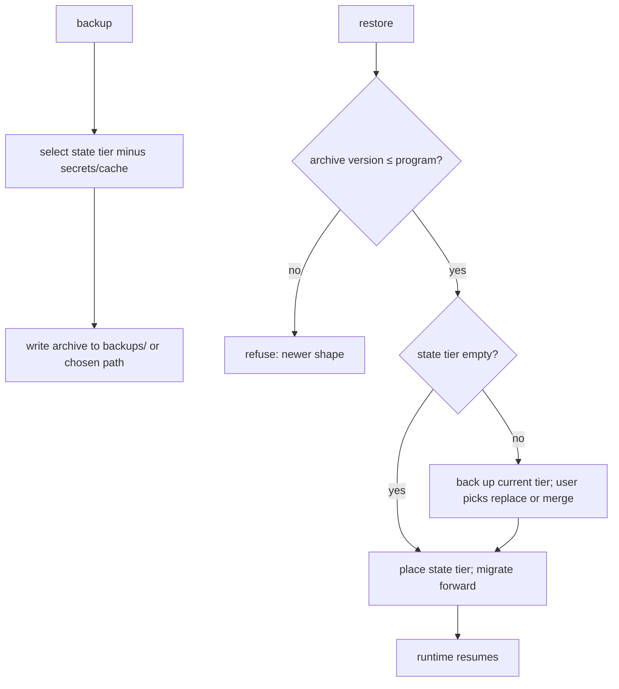

# Backup & Restore

**Version:** 1.1.1
**Status:** Stable
**Layer:** implementation
**Implements:** l1-storage-model.md

## Overview

The concrete backup/restore realization of the storage model's restore-by-copy invariant: back up the mutable state tier — minus secrets and regenerable cache — restore it elsewhere, and optionally schedule it. "Nothing extra": small, self-contained, recoverable.

## Related Specifications

- [l1-storage-model.md](l1-storage-model.md) - Restore-by-copy, secret isolation, durability, versioned state (STO-1…STO-9).
- [l2-memory-encryption.md](l2-memory-encryption.md) - Why encrypted memory restores only under its original workspace identity and with the user's password.
- [l2-filesystem-layout.md](l2-filesystem-layout.md) - What is in the state tier; cache/log locations excluded.
- [l2-security.md](l2-security.md) - Secrets excluded from backups.
- [l2-scheduler.md](l2-scheduler.md) - Optional scheduled backups.

## 1. Motivation

The storage model guarantees the state tier is restorable by copying it. This spec makes that an explicit, scheduled, secret-safe operation so a user never loses offices, memory, or learning.

## 2. Constraints & Assumptions

- A backup excludes `.env`/secrets and regenerable cache.
- A backup is self-contained: restoring it reconstitutes a working state tier.
- Backups land under the state tier's `backups/` or a user-chosen location.

## 3. Invariant Compliance (Layer 2 only)

| L1 Invariant | Implementation |
| --- | --- |
| STO-1 Two-tier separation | Only the state tier is backed up; the program tier is reinstalled, never backed up. |
| STO-2 Durable, restartable | A restored backup yields a state tier the runtime resumes from. |
| STO-3 Catalog vs instance | Only instances are captured (hired roles, offices, custom skills and archetypes); catalog blueprints come back with the program, so a restore never writes into the program tier. |
| STO-4 Multi-level memory | All four memory scopes are captured at their own paths — global, workspace, employee, session — so a restore returns each fact to the scope it was written to. |
| STO-5 Scope lifecycle | Per-scope contents (offices, roles, memory) are captured as they are on disk. |
| STO-6 Secret isolation | `.env`/secrets are excluded from every backup. |
| STO-7 Restore-by-copy | A backup is a copy of the state tier (minus secrets/cache); restore drops it back into an empty state tier, and over an existing one only through the guarded path of §4.2. |
| STO-8 Human-inspectable state | The archive is a plain container of the state tier's own files and database snapshots — inspectable with ordinary tools, not a proprietary blob. |
| STO-9 Versioned state with forward migration | Every archive records the program and state-schema version it was taken from. Restoring an archive from an older version migrates it forward on load; one from a **newer** version is refused rather than loaded into a shape the program does not understand. Restoring over an existing state tier is a destructive rewrite, so it is preceded by a timestamped backup of the current state, and a cross-installation transfer merges by record identity instead of overwriting blindly (§4.2). |

## 4. Detailed Design

### 4.1 What is included / excluded

| Included | Excluded |
| --- | --- |
| config (non-secret), AGENTS.md | `.env` / secrets |
| memory, graph, skills | cache (regenerable) |
| workspaces (offices): board, sessions, schedules, snapshots, office layout | logs (optional) |
| hired employees (config, memory, skills, skins) | — |

### 4.2 Flow

<!-- [ADDED] v1.1.0 -->
**Non-blocking, consistent capture.** A backup runs as a background job on the durable scheduled tier — it never blocks the engine's hot path or a frontend thread, and it emits progress events (started / files / bytes / done) observable from any surface. Live SQLite databases are captured through the engine's online-backup path (snapshot semantics: `VACUUM INTO` or the SQLite Online Backup API), never by raw-copying a database file with active writers — a raw copy of a live WAL database can yield a torn, unrestorable archive. Plain files are copied after the database snapshots; the archive records a capture timestamp per entry. Backup I/O is rate-capped (configurable) so a large state tier does not starve foreground work.

Optional: a scheduled `routine` runs periodic backups (retention configurable). <!-- TBD: default retention/rotation policy -->

**Restoring safely.** Into an empty state tier, a restore simply places the archive's contents (after the version check of STO-9). Over an existing state tier it is never silent:

1. The current state tier is itself backed up first, with a timestamp, so the restore can be undone.
2. The user chooses, on a human surface, between **replace** (the archive becomes the state tier) and **merge** (records are imported by identity; a record present on both sides keeps the newer copy and the conflict is reported, never dropped).
3. Offices with work in flight are paused first (drain and checkpoint), so nothing writes into a tier being replaced.

A restore keeps workspace identities exactly: encrypted memory is bound to its workspace's identity (`l2-memory-encryption` §4.1/§4.3), so a restore that would have to rename a workspace to avoid a collision stops and asks instead of silently leaving that memory undecryptable. Encrypted memory comes back with the user's password — the key is never in the archive (SEC-1) and is re-derived on first unlock.

### 4.3 Command surface

| Action | CLI | TUI | Library (no code) |
| --- | --- | --- | --- |
| back up state | `cronus backup [--to <path>]` | `/backup …` | `backup.create(path?) -> BackupRef` |
| list backups | `cronus backup list` | `/backup list` | `backup.list() -> BackupRef[]` |
| restore | `cronus restore <backup>` | `/restore <backup>` | `backup.restore(ref) -> void` |

## 5. Drawbacks & Alternatives

- **Large state over time:** mitigated by excluding cache and by retention/rotation.
- **Secrets not in backup:** intentional (STO-6); the user re-supplies secrets on restore.
- **Alternative — full-tier backup incl. program:** rejected; the program is reinstallable (STO-1).

## Canonical References

| Alias | Path | Purpose |
| --- | --- | --- |
| `[STORAGE]` | `.design/main/specifications/l1-storage-model.md` | Invariants this implements |
| `[LAYOUT]` | `.design/main/specifications/l2-filesystem-layout.md` | What the state tier contains |

## Document History

| Version | Date | Notes |
| --- | --- | --- |
| 1.1.1 | 2026-09-23 | Consistency pass (2026-09-23): STO-3, STO-4, STO-8 and STO-9 were unmapped. Restore "placed the state tier back" — a blind overwrite of current state that STO-9 forbids, with no version check: archives now carry their version (a newer archive is refused, an older one migrated forward), and restoring over existing state first backs it up and asks replace-or-merge-by-identity; offices are paused first. A restore that would rename a workspace is stopped, since encrypted memory is bound to workspace identity; encrypted memory returns with the user's password. |
| 1.1.0 | 2026-07-04 | Non-blocking consistent capture (§4.2): backup runs on the durable background tier with progress events; live SQLite captured via online-backup snapshot semantics (never raw-copied under active writers); rate-capped I/O. |
| 1.0.0 | 2026-06-24 | Initial spec — include/exclude sets, flow, command surface. |
