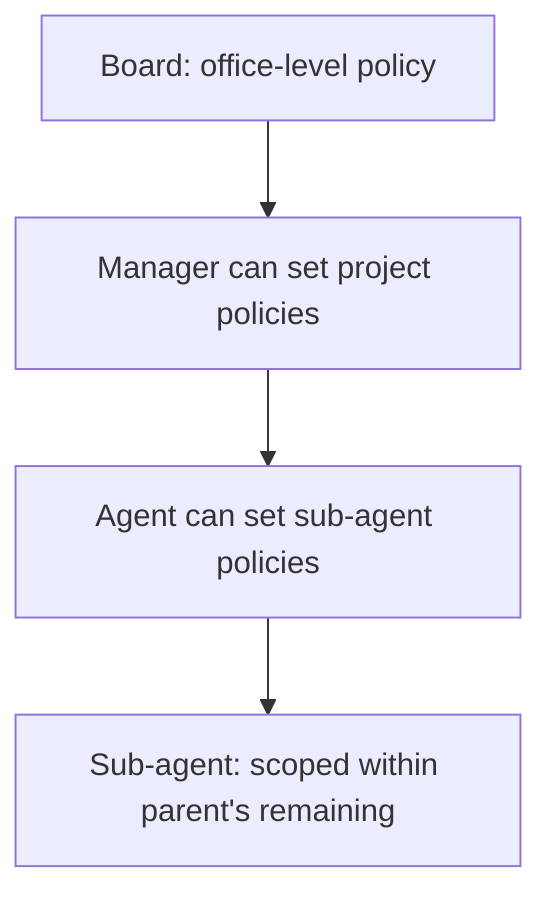

# Budget Engine

**Version:** 1.0.1
**Status:** Stable
**Layer:** implementation
**Implements:** l1-orchestration.md

## Overview

The concrete cost-tracking and budget-enforcement system: hierarchical budget policies scoped to any level (office / project / agent), cost event ingestion and roll-up, warn/hard-stop thresholds, and the monthly-UTC reset window. When an agent exhausts its budget, it is paused automatically; dependent tasks transition to `blocked` until the budget resets or is raised.

## Related Specifications

- [l1-orchestration.md](l1-orchestration.md) - ORC-7 budget circuit-breaker that this spec concretizes.
- [l2-orchestration.md](l2-orchestration.md) - Per-run and per-agent budget enforcement during goal execution.
- [l2-role-catalog.md](l2-role-catalog.md) - Agent instances that carry `budgetMonthlyCents`, `spentMonthlyCents`, and `pauseReason`.
- [l2-kanban-board.md](l2-kanban-board.md) - Cards transition to `blocked` when agent budget is exhausted.
- [l2-security.md](l2-security.md) - Budget incidents are written to the audit log.
- [l2-agent-session.md](l2-agent-session.md) - The turn loop that reports a cost event per model call and checks the budget before the next one.
- [l1-office-control.md](l1-office-control.md) - Checkpoint-before-freeze (OC-1) and automatic wake on top-up (OC-4) that a hard stop and a raise follow.

## 1. Motivation

Autonomous agents can produce runaway costs if nothing constrains them. A budget engine with hard-stop enforcement means "the worst-case spend is bounded" — a property that makes autonomous operation safe to delegate to business stakeholders. Warn thresholds give visibility before the limit is hit; cascade scoping lets each level of the org control its own budget envelope.

## 2. Constraints & Assumptions

- Budget periods are calendar-aligned UTC windows (monthly by default); the engine resets spent counters at the start of each new period.
- Budget policies use a polymorphic scope: any budget can apply to an office, a project, or an agent.
- A child's budget cannot exceed its parent's remaining budget (cascade invariant).
- The board (human operator) can read and override any budget at any level at any time.
- Cost events are append-only; they are never deleted (audit requirement).

## 3. Invariant Compliance (Layer 2 only)

| L1 Invariant | Implementation |
| --- | --- |
| ORC-7 Budget circuit-breaker | `hardStopEnabled = true` auto-pauses an agent when `spent >= amount`; an in-progress run receives a stop signal. |
| SEC-7 Auditable | Every budget incident (warn/hard_stop) and policy change is appended to the audit log. |

## 4. Detailed Design

### 4.1 Budget policy

A budget policy is an entity separate from the object it governs. This allows a policy to be applied, revised, or removed without changing the agent or project definition.

```text
[REFERENCE]
BudgetPolicy {
  id,
  scopeType: "office" | "project" | "agent",
  scopeId,                      // workspace id, project id, or agent id
  metric: "billed_cents" | "input_tokens" | "output_tokens" | "total_tokens",
  windowKind: "monthly_utc" | "weekly_utc" | "daily_utc" | "lifetime",
  amount: u64,                  // limit in the metric's unit (e.g. cents, tokens)
  warnPercent: u8,              // default 80 — alert when spent >= amount * warnPercent / 100
  hardStopEnabled: bool,        // default true — auto-pause on exhaustion
  notifyEnabled: bool,          // default true — send alert on warn/hard_stop
  isActive: bool,
  createdByUserId?, updatedByUserId?
}
```

**Cascade invariant:** a policy cannot set `amount` higher than the parent scope's remaining budget for the same metric and window. The engine enforces this at write time; a policy creation that would violate the invariant is rejected with a validation error.

The write-time check bounds each child alone, not their sum: several children may each be granted up to the parent's remaining amount. The parent's limit therefore holds because it is **also enforced at spend time** — a cost event is checked against every active policy on the path from the agent through its project to the office, and the first one exhausted stops the run (§4.3).

### 4.2 Cost events

Every LLM or compute call that incurs a cost produces a cost event, which the agent runtime reports to the budget engine:

```text
[REFERENCE]
CostEvent {
  agentId,
  runId,
  issueId?,
  projectId?,
  metric: "billed_cents" | ...,
  amount: u64,
  model,
  provider,
  timestamp
}
```

Cost events are append-only and written to the audit log. They are then rolled up into:

- `agent.spentMonthlyCents` — per-agent running total for the current window
- `project.spentMonthlyCents` — per-project running total
- `office.spentMonthlyCents` — office-level aggregate

The `spentMonthlyCents` fields are the rollups for the default monthly `billed_cents` window; a policy with another metric or window keeps its own running total for that metric and window, and is checked against it.

Rollups are eventually consistent; the hard-stop check reads the fresh per-event total, not the cached rollup, to avoid races. The runtime reports each cost event when the call completes and checks the remaining budget before the next call (`l2-agent-session` §4.7) — not at the end of a turn, which would let a long turn overrun the cap. A cost event that cannot be recorded stops further autonomous calls rather than letting spend go uncounted.

### 4.3 Budget incidents

When spending crosses a threshold, the engine creates a `BudgetIncident` record and optionally notifies the board:

```text
[REFERENCE]
BudgetIncident {
  id,
  policyId,
  scopeType, scopeId,
  kind: "warn" | "hard_stop",
  spentAmount,                  // amount at incident time
  policyAmount,                 // policy limit
  triggeredAt
}
```

`warn` — spending crossed `warnPercent` of `amount`. Notification only; agent continues.

`hard_stop` — spending reached `amount`. If `hardStopEnabled = true`:

1. The current run receives a `BudgetExhausted` stop signal; it stops at its next atomic-step boundary after writing a checkpoint (`l1-office-control` OC-1) and ends with status `budget_paused` — resumable, not discarded.
2. The agent's `status` is set to `paused` with `pauseReason = "budget_exhausted"`.
3. Cards assigned to this agent that are in `running` state transition to `blocked` with reason `"budget_exhausted"`.
4. Future heartbeat runs for this agent are rejected until the budget is reset or raised. Raising a policy's `amount` above its spend unpauses exactly as a window reset does (§4.5) — a top-up wakes the work without further action (OC-4).

An exhausted policy at project or office scope applies the same steps to every agent in that scope; an exhausted office-scope policy is the office's budget hibernation.

With `hardStopEnabled = false` a policy is advisory — incidents and notifications only. Runs stay bounded by their per-turn iteration and token budgets (`l2-agent-session` §4.2) and the run budget of a goal (`l2-orchestration`), so ORC-7 never rests on this flag alone.

### 4.4 Budget delegation cascade



Hierarchy rules:

- A manager can set a budget policy for any agent in its reporting subtree — never its own policy or an ancestor's. An agent cannot raise the budget it spends against; only a scope above it, ultimately the board, can (a grant is narrowable, never self-widening — `l1-consent-binding` CB-11).
- A policy's `amount` cannot exceed the parent scope's `(policy.amount - spentToDate)` at the time of creation.
- The board can override any policy regardless of hierarchy.
- Budget delegation does not automatically transfer unspent budget; each scope starts fresh each window.

### 4.5 Window reset

At the start of each policy's new window (midnight UTC on the first of the month for `monthly_utc`; the week or day boundary for `weekly_utc` / `daily_utc`), the engine:

1. Resets that policy's running total to zero (for the monthly `billed_cents` window, the `spentMonthlyCents` rollups of its agents and projects).
2. Unpauses agents whose `pauseReason = "budget_exhausted"` — provided no other active policy on their path is still exhausted (budget is fresh again).
3. Transitions their `blocked` cards back to `ready` (unless blocked for another reason).

A `lifetime` policy never resets; only raising its `amount` unpauses its agents. The reset is a scheduled task run by the core service.

### 4.6 Command surface

| Action | CLI | TUI | Library (no code) |
| --- | --- | --- | --- |
| list policies | `cronus budget list [--scope office\|project\|agent] [--id <id>]` | `/budget list …` | `budget.listPolicies(scope?) -> BudgetPolicy[]` |
| show policy | `cronus budget show <policy-id>` | `/budget show <id>` | `budget.getPolicy(id) -> BudgetPolicy` |
| set policy | `cronus budget set --scope <type> --id <id> --amount <n> [--warn 80] [--metric billed_cents]` | `/budget set …` | `budget.setPolicy(scope, id, spec) -> BudgetPolicy` |
| list incidents | `cronus budget incidents [--scope <type>] [--kind warn\|hard_stop]` | `/budget incidents …` | `budget.listIncidents(filter?) -> BudgetIncident[]` |
| show spent | `cronus budget spent [--scope <type>] [--id <id>]` | `/budget spent …` | `budget.getSpent(scope?, id?) -> SpentSummary` |

## 5. Drawbacks & Alternatives

- **Eventual consistency on rollups:** the hard-stop check reads fresh totals, but UI displays rolled-up values which may lag by seconds. This is acceptable; the control-plane guarantee is the hard-stop, not the display.
- **Bounded overshoot:** the check runs before each call, so spend can exceed a cap by at most the cost of the calls already in flight when it is reached (parallel subagents included). The guarantee is "no call starts once the cap is reached", stated as such rather than as an exact ceiling.
- **Monthly UTC window may not align with billing periods:** operators using a provider with a calendar-month billing cycle that differs from UTC midnight may see slight mismatches. Mitigation: window reset timing is configurable.
- **No automatic budget re-distribution:** unspent budget in a child scope does not roll up to the parent. By design — over-allocation at parent level requires a human decision.
- **Alternative — token-only budgets:** rejected; cents are a universal unit across providers (some charge differently per token). The `metric` field supports token budgets for operators who prefer them.

## Canonical References

| Alias | Path | Purpose |
| --- | --- | --- |
| `[ORC]` | `.design/main/specifications/l1-orchestration.md` | ORC-7 budget circuit-breaker invariant |
| `[L2ORC]` | `.design/main/specifications/l2-orchestration.md` | Run and agent budget enforcement |
| `[ROLES]` | `.design/main/specifications/l2-role-catalog.md` | Agent budget fields |
| `[CLI]` | `.design/main/specifications/l2-cli.md` | Command grammar standard |

## Document History

| Version | Date | Author | Notes |
| --- | --- | --- | --- |
| 1.0.1 | 2026-09-23 | Core Team | Consistency pass (2026-09-23): The write-time cascade check bounds each child, not their sum — spend is now checked against every active policy from agent to office. A hard stop now stops at an atomic-step boundary after a checkpoint (OC-1) and a raise wakes the work (OC-4); an office-scope stop is the office's budget hibernation; an advisory policy (`hardStopEnabled=false`) is stated not to carry ORC-7 alone. A manager could set its own or an ancestor's policy (self-widening) — excluded. Per-call cost reporting (not turn-end) and fail-closed on an unrecordable cost event. Rollups and reset covered only the monthly window although policies declare weekly/daily/lifetime windows — reset is per policy window and lifetime never resets. Bounded overshoot from in-flight calls is stated. |
| 1.0.0 | — | Core Team | Last version before this section was added; earlier revisions are recorded in version control. |
