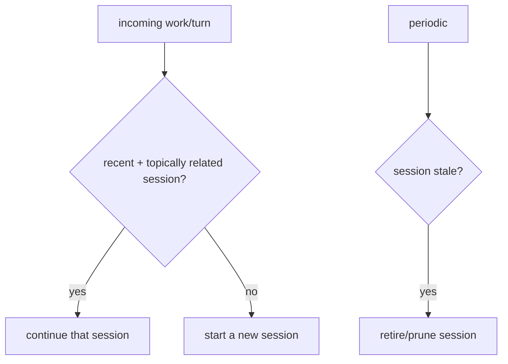

# Context Router

**Version:** 1.0.1
**Status:** Stable
**Layer:** implementation
**Implements:** l1-routing.md

## Overview

The concrete realization of the three context routers under one roof: **memory routing** (which memories to recall, where to write), **rules routing** (which rules apply to a context), and **session routing** (continue vs new, retire stale). Each applies the smart-router pattern with most-specific-first resolution.

## Related Specifications

- [l1-routing.md](l1-routing.md) - The router pattern this implements.
- [l2-memory-store.md](l2-memory-store.md) - Memory routing refines the store's recall/write path.
- [l1-storage-model.md](l1-storage-model.md) - Scope levels these routers resolve over.
- [l2-cli.md](l2-cli.md) - Command grammar standard.

## 1. Motivation

Memory, rules, and sessions all need "pick the right scope/target for this context." Consolidating them keeps the scope-resolution logic consistent (most-specific-first) and avoids three near-identical thin specs.

## 2. Constraints & Assumptions

- All three run on the hot path and resolve quickly.
- Scope resolution is most-specific-first (employee/role -> workspace -> global).
- Routers read existing state; they introduce no new authoritative store.

## 3. Invariant Compliance (Layer 2 only)

| L1 Invariant | Implementation |
| --- | --- |
| RTG-1 Multi-signal | Memory routing fuses similarity + tags + utility; session routing uses recency + topic match. |
| RTG-2 Fallback | If no specific match, fall back to the next-broader scope (then a safe default). |
| RTG-3 Short-circuit | Recently-resolved context (same query/scope) may be reused within a turn. |
| RTG-4 Most-specific-first | Memory and rules resolve role -> workspace -> global; specific overrides general. |
| RTG-5 Configurable | Thresholds (similarity floor, staleness window) live in config. |
| RTG-6 Privacy | Routers operate on local state; no client data leaves the device. |
| RTG-7 Bounded & traceable | Recall is token-budgeted; routing choices are recorded. |
| RTG-8 Lifecycle | Session routing decides continue/new and retires stale sessions (MEM-5). |
| RTG-9 Function-scoped model roles | Context routing makes no model call on the hot path; where a routing step is ever model-assisted (e.g. a topic match beyond embeddings), it resolves through its auxiliary role, never the user-facing route. |
| RTG-10 Credential-lane routing | Not applicable: context routers select scopes and sessions over local state and reach no provider, so they hold no credential lane. |
| RTG-11 User-adjustable effort | Not applicable: context routing has no reasoning-effort dimension; the effort envelope applies to the model calls the routed context later feeds. |

## 4. Detailed Design

### 4.1 Memory routing

Refines the memory store: on **recall**, fuse semantic + lexical + tags across scopes and resolve most-specific-first (role -> workspace -> global), token-budgeted. On **write**, classify the fact's scope and route it to the owning store. (Defers to `l2-memory-store.md` for the store mechanics.)

### 4.2 Rules routing

Given a context (which office, which role, which task), select the applicable rules by scope, most-specific-first: role rules override workspace rules override global rules. Conflicts resolve by specificity; equal-scope conflicts are surfaced, not guessed — there is deliberately no automatic tie-break (a silent pick is a guess). Until the conflict is resolved neither rule is applied as settled, except that where one of the two is a restriction (a *never*/*must not*), the more restrictive holds in the meantime, so an unresolved conflict can only make the office more careful, never less.

### 4.3 Session routing

Continue a session when it is recent and on-topic; otherwise start fresh; retire stale sessions (consistent with MEM-5 prune and the office model's removal of sessions that are no longer needed).

### 4.4 Command surface

Context routing is mostly automatic (no dedicated client commands); its behavior is observable via memory and status commands. Routing decisions are recorded for tracing (RTG-7).

## 5. Drawbacks & Alternatives

- **Wrong session continuation:** a bad topic match resumes the wrong thread; mitigated by a conservative match threshold (favor new on doubt).
- **Rule conflict ambiguity:** equal-scope conflicts are surfaced rather than tie-broken (§4.2); the cost is an occasional question, the benefit is that no rule is ever overridden by an arbitrary pick.
- **Alternative — separate specs per router:** rejected for v0.1.0 to avoid fragmentation; can be split later if any router grows large.

## Canonical References

| Alias | Path | Purpose |
| --- | --- | --- |
| `[ROUTING]` | `.design/main/specifications/l1-routing.md` | Invariants this implements |
| `[MEMORY]` | `.design/main/specifications/l2-memory-store.md` | Memory store mechanics this routes over |
| `[STORAGE]` | `.design/main/specifications/l1-storage-model.md` | Scope levels resolved |

## Document History

| Version | Date | Author | Notes |
| --- | --- | --- | --- |
| 1.0.1 | 2026-09-23 | Core Team | Consistency pass (2026-09-23): RTG-9…RTG-11 rows added (RTG-9 via auxiliary roles if ever model-assisted; RTG-10/11 not applicable to scope and session selection). §4.2 TBD resolved: equal-scope rule conflicts are surfaced with no automatic tie-break, and while unresolved the more restrictive rule holds. §4.3 carried a non-English phrase; restated in English (language policy for technical content). |
| 1.0.0 | — | Core Team | Last version before this section was added; earlier revisions are recorded in version control. |
