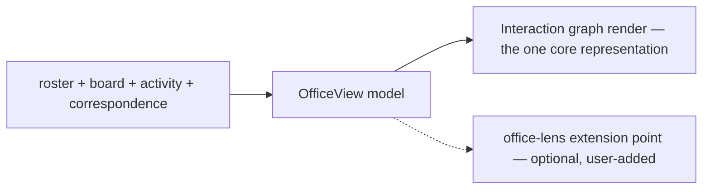

# Office View

**Version:** 1.0.2
**Status:** Stable
**Layer:** implementation
**Implements:** l1-office-visualization.md

## Overview

The concrete office visualization: the data it projects from (roster, board, activity, correspondence), the single canonical representation (the interaction graph), where its cosmetic layout is persisted, the home-only building overview, drill-down inspection of nodes and edges, the `office` command surface, and the extension point through which a user may add another representation.

## Related Specifications

- [l1-office-visualization.md](l1-office-visualization.md) - The model this implements.
- [l2-workspace-management.md](l2-workspace-management.md) - Roster (`config.json` manager/team) feeding nodes.
- [l2-kanban-board.md](l2-kanban-board.md) - Cards and assignment feeding task nodes/edges.
- [l2-filesystem-layout.md](l2-filesystem-layout.md) - The `office/` location for persisted layout.
- [l2-cli.md](l2-cli.md) - Command grammar standard the `office` commands follow.
- [l2-deliberation.md](l2-deliberation.md) · [l2-inner-monologue.md](l2-inner-monologue.md) - The correspondence and reasoning records edge and node drill-downs project (OVZ-8).
- [l1-extension-points.md](l1-extension-points.md) - The office-lens extension point through which a user may add another representation (OVZ-9).

## 1. Motivation

The model wants a live, projection-only office picture with one canonical representation. Binding it to concrete sources and a layout store makes it consistent by construction and stable across sessions.

## 2. Constraints & Assumptions

- The view is rebuilt from sources on demand/refresh; it stores only cosmetic layout.
- The core renders exactly one representation, the interaction graph. Any other representation is a user-added extension over the same projected model (OVZ-9), never shipped or started by the core.
- The building overview reads across workspaces but never writes to them.
- The frontend renders; projection and aggregation are core calls (INV-2).

## 3. Invariant Compliance (Layer 2 only)

| L1 Invariant | Implementation |
| --- | --- |
| OVZ-1 Projection, not source | The view model is computed from roster + board + activity; nothing authoritative is stored except cosmetic layout. |
| OVZ-2 Live | The core emits office state changes; the view refreshes on roster/board/activity events. |
| OVZ-3 Single canonical representation | The core renders one representation of the `OfficeView` model: the interaction graph (block diagram) of agents and tasks with reporting, collaboration, and assignment edges (§4.2). No second built-in renderer exists. |
| OVZ-4 Observational + inspect | Default is view-only; `office inspect` drills into a node or an edge (OVZ-8); no client operation is required. |
| OVZ-5 Per-office + building | `office show` renders the current office; `office building` (home only) aggregates all offices. |
| OVZ-6 Isolation | `office show` reads only the active workspace; the building view reads across `<state>/workspaces/*` read-only. |
| OVZ-7 Cosmetic, persistent graph layout | Node positions and collapsed/expanded groups persist in `<ws>/office/layout.json`; they feed rendering only, never behavior. |
| OVZ-8 Clickable drill-down | Selecting a node shows that agent's activity, its reasoning and monologue records, and its tasks; selecting an edge between two agents shows the correspondence it carries — deliberation threads, briefings, hand-offs (§4.5). Every drill-down is a projection of existing records, filtered to what the viewer may already see. |
| OVZ-9 Other representations are extensions | The core ships no spatial, immersive, or 3D representation. One may exist only as a user-enabled extension contributed through the office-lens extension point, reading the same projected model (§4.6). |

## 4. Detailed Design

### 4.1 Data sources (projection)

| View element | Source |
| --- | --- |
| agent nodes | workspace roster: `<ws>/config.json` (`manager`, `team`) + `<state>/employees/<role>/` |
| reporting edges | `reportsTo` relationships in roster |
| task nodes | board cards: `<ws>/kanban/` |
| assignment edges | card → assignee |
| activity (who's running) | `<ws>/sessions/` (live) |
| collaboration edges + edge drill-down | correspondence records: deliberation threads (`l2-deliberation`), briefings, hand-offs |
| node drill-down | the agent's activity, its reasoning and monologue records (the Pulse log, `l2-inner-monologue`), and its cards |

### 4.2 Representation



- **Interaction graph:** nodes + edges (block diagram) — the single canonical representation, always available.
- **Anything else** (a spatial floor, an immersive scene) is not part of the core; see §4.6.

### 4.3 Layout storage

```plaintext
<ws>/office/
└── layout.json   # cosmetic graph layout (node positions, collapsed/expanded groups); presentation only
```

Layout is the only thing the view writes; deleting it loses placement but not office data (it re-lays-out from the model).

### 4.4 Building overview (home only)

In the home workspace, `office building` aggregates a read-only map: each project workspace as a floor (its office summarized) plus the building boss. It never mutates project offices (OVZ-6).

### 4.5 Command surface

Office operations conform to the CLI grammar standard (see `l2-cli.md` §4.4).

| Action | CLI | TUI | Library (no code) |
| --- | --- | --- | --- |
| show office | `cronus office show` | `/office show` | `office.show() -> OfficeView` |
| building overview (home) | `cronus office building` | `/office building` | `office.building() -> BuildingView` |
| inspect a node or edge | `cronus office inspect <node-id\|edge-id>` | `/office inspect <id>` | `office.inspect(id) -> NodeDetail \| EdgeDetail` |

The view is primarily `show`/`building`; `inspect` drills into an agent (role, current task, activity, reasoning records), a task (card detail), or an edge (the correspondence between two agents). What a drill-down shows is filtered by the viewer's access scope — inspection never reveals a record the viewer could not already read (OVZ-8). Layout edits happen via the app's drag interactions, persisted to `layout.json`.

### 4.6 Extension-provided representations (OVZ-9)

The core ships no representation other than the interaction graph, and it starts no renderer process. A spatial floor, an immersive or 3D scene, or any other view of the office exists only as a **user-added extension** contributed through the office-lens extension point (`l1-extension-points`, a *provide* contribution), absent until the user enables it. The contract such an extension receives:

- **Input:** the same projected `OfficeView` model and its change events, read-only — plus drill-down records only through `office.inspect`, under the viewer's access scope (OVZ-8). The extension never reads the office's stores directly, so it cannot become a second source of truth (OVZ-1).
- **Output:** pixels. It writes nothing back except its own cosmetic layout, kept in its own extension state.
- **Confinement:** an extension that runs its own renderer process does so under the extension sandbox with the permissions its installation granted (`l2-sandbox-policy`), like any extension code. Any local server it opens binds to loopback. Its dependencies are part of the vetted, pinned bundle it was installed with (`l1-component-scanning`) — the host never fetches or installs packages for it at first use.
- **Remote offices:** for a workspace on a remote host, the extension receives the same model over the host's own authenticated connection; it does not probe or connect to arbitrary endpoints on that host itself.

Disabling or removing the extension removes the representation and nothing else; the interaction graph is unaffected.

## 5. Drawbacks & Alternatives

- **Refresh cost on busy offices:** mitigated by event-driven incremental updates rather than full rebuilds.
- **One representation in core:** users who want a spatial or immersive picture depend on an extension. Accepted — a second built-in renderer is a second rendering stack to keep consistent with the model, and it would carry its own runtime into every install (OVZ-3, OVZ-9).
- **Alternative — store the view model:** rejected; storing a derived model risks drift (OVZ-1). Only cosmetic layout is persisted.

## Canonical References

| Alias | Path | Purpose |
| --- | --- | --- |
| `[MODEL]` | `.design/main/specifications/l1-office-visualization.md` | Invariants this view satisfies |
| `[BOARD]` | `.design/main/specifications/l2-kanban-board.md` | Task/assignment source |
| `[CLI]` | `.design/main/specifications/l2-cli.md` | Command grammar standard |

## Document History

| Version | Date | Author | Notes |
| --- | --- | --- | --- |
| 1.0.2 | 2026-09-24 | Core Team | Consistency pass (2026-09-24): This spec still implemented the pre-2.0.0 L1 — two built-in representations and an in-core 3D renderer started as subprocesses (fetching packages at first use, probing remote hosts over plain HTTP) — while `l1-office-visualization` 2.0.0 makes the interaction graph the single canonical representation (OVZ-3) and forbids a spatial or 3D view in core (OVZ-9). The graph is now the one core representation, the §4.6 subprocess architecture is replaced by the office-lens extension contract (read-only model, sandboxed, loopback-only, no install-at-first-use), graph layout covers collapsed groups (OVZ-7), and OVZ-8 (node and edge drill-down into correspondence, scoped to what the viewer may see) and OVZ-9 are mapped. |
| 1.0.1 | — | Core Team | Last version before this section was added; earlier revisions are recorded in version control. |
