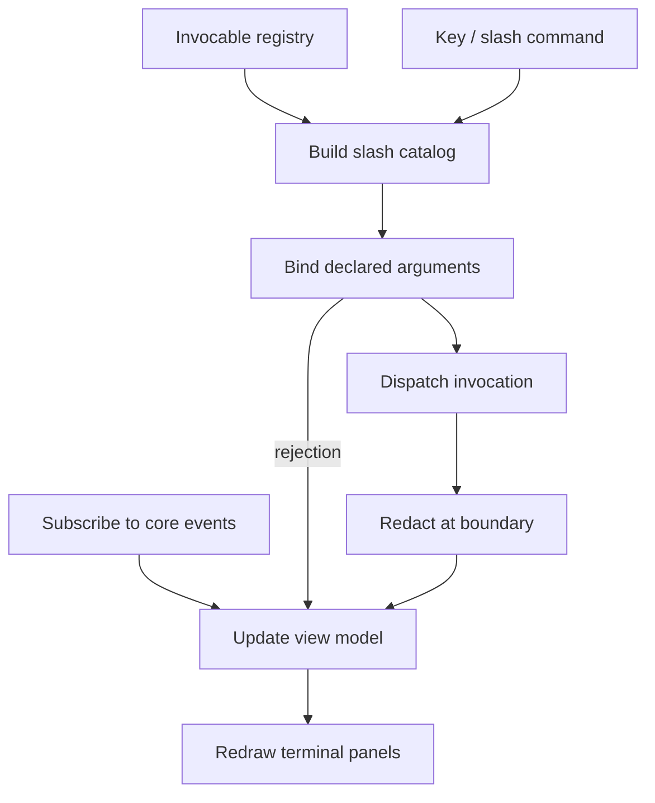

# TUI Frontend

**Version:** 1.6.0
**Status:** Stable
**Layer:** implementation
**Implements:** l1-architecture.md

## Overview

Architectural layer 3: the **terminal user-interface frontend**. It renders core state interactively in the terminal (boards, status, sessions, agent activity) and accepts slash-style commands with parity to the CLI and application surfaces.

Its slash catalog is not declared here. It is a **projection of the core's invocable registry** — the same catalog the CLI and the desktop shell project — so the three surfaces share one vocabulary by construction rather than by maintenance.

## Related Specifications

- [l1-launch-handoff.md](l1-launch-handoff.md) — `[ADDED v1.2.0]` LH-4 makes this frontend the default composition while keeping it addressable by name; LH-10 is why it is a composition of the one binary rather than a second entry procedure.
- [l1-architecture.md](l1-architecture.md) - Concept this layer implements.
- [l2-core-library.md](l2-core-library.md) - The core this TUI drives.
- [l2-cli.md](l2-cli.md) - Sibling frontend (non-interactive).
- [l2-app-ui.md](l2-app-ui.md) - Sibling frontend (graphical).
- [l2-application-shell.md](l2-application-shell.md) - Sibling frontend (desktop shell); the third consumer of the same registry. `[ADDED v1.1.0]`
- [l2-invocable-registry.md](l2-invocable-registry.md) - The catalog and dispatch this frontend projects. `[ADDED v1.1.0]`
- [l2-surface-conformance.md](l2-surface-conformance.md) - The corpus this frontend registers against. `[ADDED v1.1.0]`
- [l1-surface-parity.md](l1-surface-parity.md) - Why the catalog is derived rather than mirrored. `[ADDED v1.1.0]`
- [l2-surface-driver.md](l2-surface-driver.md) - Drives this frontend turn by turn through a dev-only host built on the seams §4.6 keeps. `[ADDED v1.4.0]`
- [l1-action-gating.md](l1-action-gating.md) · [l1-consent-binding.md](l1-consent-binding.md) - `[ADDED v1.5.0]` The friction an installation verb passes here and what the consent this frontend collects covers (§4.7).
- [l2-office-control.md](l2-office-control.md) - `[ADDED v1.5.0]` The drain-and-checkpoint path a refused `Recompose` installation verb points to (§4.7).

## 1. Motivation

The TUI gives an interactive, keyboard-driven view of the autonomous office without a graphical environment — ideal over SSH and on servers/hubs. It surfaces live state (Kanban, agent activity, logs) that the plain CLI cannot render well.

`[ADDED v1.1.0]` This frontend is also where the project learned what a mirrored catalog costs. Its parity was asserted against a hand-copied list of the CLI's verbs, held inside this crate specifically so the check would not need a dependency on the crate it was checking. The reasoning was sound; the result was an oracle comparing a copy against itself. The CLI grew to twenty-nine groups, the copy stayed at twenty-one, and the assertion remained green while the two surfaces diverged by eight verbs. The amendment replaces the copy with a projection and the self-comparison with a corpus.

## 2. Constraints & Assumptions

- Implemented in **Rust**, linking the core crate; runs in any ANSI terminal.
- Event-driven render loop reflecting core state changes; never blocks on long core operations — they run off the render thread (the core is synchronous, `l2-core-library` §2).
- Slash-command input mirrors the CLI command set (INV-3 parity).
- No domain logic in the TUI layer (INV-2).
- **The slash catalog is generated, not written.** `[ADDED v1.1.0]` It is built from the registry's descriptors, as is the discovery listing. A hand-maintained catalog is forbidden as a source of truth, and a hand-copied restatement of another surface's verbs is forbidden as an oracle.
- **This frontend is reached through the single binary.** `[ADDED v1.1.0]` The terminal UI is a verb of the one entry point rather than a separately named second executable, so a user meets one product with one command surface.
- **Panels render from a core-supplied projection.** `[ADDED v1.1.0]` Board, office, and session views are read models the core provides. A panel that has no projection renders as *unavailable*, never as empty — the two are different states and must remain distinguishable.
- **Installation verbs are reachable here, and the CLI stays their guaranteed path.** `[ADDED v1.5.0]` This frontend projects the `Installation` locus alongside `Semantic` and `ClientLocal` (§4.7), under the command line's names and flags. It answers them only once it is composed; when composition is what failed, the command line still answers them, so this frontend never becomes the only path to one.

## 3. Invariant Compliance (Layer 2 only)

| L1 Invariant | Implementation |
| --- | --- |
| INV-1 Embeddable core | TUI links the core library; pure consumer. |
| INV-2 Logic in core only | TUI handles rendering + key/command input; behavior delegates to the core. `[MODIFIED v1.1.0]` Domain facts the panels need — locations, orderings, defaults, board contents — arrive as core projections; the frontend derives none of them. |
| INV-3 Command parity | `[MODIFIED v1.1.0]` Parity is **structural, not asserted**. The slash catalog is a projection of the invocable registry shared with the CLI and desktop shell, leaving no place to hold a verb the registry lacks and no way to miss one it has. The prior hand-copied verb mirror is deleted and tombstoned (finding F-2). Residual behavioral agreement is proven by the conformance corpus, which this frontend registers against from its own test target (SP-6/SP-7). `[MODIFIED v1.5.0]` The projected loci are `Semantic` + `ClientLocal` + `Installation`; the installation verbs are the command line's own set, minus the exclusions §4.7 declares. |
| INV-4 Hub-and-spoke autonomy | Runs on a hub (incl. over SSH) to observe/drive the autonomous engine; on a spoke acts as a client view. `[MODIFIED v1.5.0]` As a client view, its installation verbs act on the machine it runs on and say so; they never travel to the hub (§4.7). |
| INV-5 Durable, restartable state | TUI holds only view state; reconnecting reflects the core's durable state. |
| INV-6 Graceful capability scaling | Panels for unsupported capabilities are hidden/disabled, never behaviorally divergent. `[MODIFIED v1.1.0]` *Unsupported* and *empty* are distinct rendered states; a panel whose projection is unavailable says so rather than displaying empty columns. |
| INV-7 Security of client data | `[MODIFIED v1.1.0]` Secrets are never rendered. Masking is applied by the **dispatch boundary** rather than re-implemented here; this frontend's local redaction call is removed in favor of the shared one, and the separate obligation that the core supply a non-empty secret list is tracked as a residual in `l2-surface-conformance` §4.7. |
| INV-8 Single-deployable modular monolith | The TUI is a frontend over the sanctioned frontend↔core boundary: it renders one in-process core, or attaches to a hub as a client view — never a distributed tier. It introduces no service and no orchestration dependency; its interaction with the core is an in-process contract/event stream. |
| INV-9 Shipped-surface honesty | `[MODIFIED v1.1.0]` Enforced at the projection. Only shipped invocables enter the catalog and the discovery listing, so an unbound slash verb is unrepresentable rather than discouraged — which also retires the placeholder response this frontend returned for every verb but one. Retirement follows the same declared path as the CLI (l1-architecture v1.4.0). |
| INV-10 Representation isolation at the inward seam | The inward seam INV-10 governs lives inside the core; the TUI stands outward and binds core contract types only, naming no adapter representation (no store row, no keychain handle). Per `l2-crate-topology` §4.8 the TUI may even link the pure-domain tier and still touches no storage or keychain type — the inward leak INV-10 forbids is structurally absent from this surface. |

## 4. Detailed Design

### 4.1 Views

| View | Content |
| --- | --- |
| Board | Kanban columns `triage → todo → ready → running → blocked → done` with live task movement; archived cards leave the board (archival is automatic, not a column — KAN-3) |
| Office | Graphical-in-text schema of agents and their current tasks |
| Status | Current position, progress, blockers (mirrors `status` capability) |
| Sessions/Log | Live agent activity, decisions, and tool output stream |
| Command bar | Slash-command input with discovery, rendered from the catalog `[MODIFIED v1.1.0]` |

`[ADDED v1.1.0]` Each panel is a pure function of a core-supplied projection plus terminal-local view state. Until a projection exists for a panel, that panel renders **unavailable with its reason** — the state it must not do is render an empty, successful-looking view of data it could not obtain, which is the panel-level form of the same defect the CLI exhibits when a store error prints an empty listing.

### 4.2 Render loop

### 4.3 Parity with CLI

`[MODIFIED v1.1.0]` **This section deliberately restates no command set.**

Both frontends project the same registry, so a slash verb and its shell counterpart are two renderings of one descriptor. The difference is presentation — interactive panels versus text output, and slash form versus verb-first flags — never behavior, and never membership (INV-3).

What remains checkable after derivation is behavioral agreement between two projections of the same descriptor: a rejection surfaced by one and swallowed by the other, or an unavailable projection that one distinguishes from empty and the other does not. That class is proven by the conformance corpus, which this frontend drives through its **real** projection from its own test target — not through a restatement of it, which is precisely what the deleted mirror was.

`[ADDED v1.2.0]` **The two surfaces do not project the same loci, and that is not a parity failure.** `[MODIFIED v1.5.0]` This frontend projects `Semantic` + `ClientLocal` + `Installation`; the command line projects `Semantic` + `Installation`. Parity is required and proven on both shared sets: `Semantic` as before, and `Installation` as a subset relation — every installation verb offered here is the command line's verb, under its name and flags, while the command line may offer verbs this frontend declares excluded (§4.7). The one remaining difference is `ClientLocal`, and it is *declared*, not omitted: a pane-focus action has no meaning as a one-shot process. This is SP-8 applied to the surface boundary — the difference is named with its reason rather than tolerated, so the next reader neither unifies it wrongly nor reads it as licence for the next divergence.

`[ADDED v1.2.0]` **A slash-like line that names no invocable is not an error.** Resolution answers `Unknown` separately from any outcome (SP-13), and this frontend's response to it is to treat the line as **ordinary input** rather than to render a failure. Folding that answer into a failure outcome would make every message beginning with a slash-shaped token an error — which is wrong for a surface whose primary input is free text. The command line, projecting the same registry, answers the identical resolution with a usage error, because for a one-shot invocation there is nothing to fall through to. One resolution result, two correct and opposite renderings; a single merged outcome could not have produced both.

### 4.4 Entry point

`[ADDED v1.1.0]` The terminal UI is launched as a verb of the single `cronus` binary. A separately named executable presents the same engine as two products, splits discovery (`--help` would not mention it), and gives a user two things to install and remember for one capability. The binary that previously shipped standalone is retired under the declared-retirement rule rather than deleted silently.

`[ADDED v1.2.0]` It is additionally the **default composition** (LH-4): `cronus` with no verb brings up this frontend, and `cronus tui` names it explicitly. Both spellings are required. The default is what lets a user meet the product by typing its name; the explicit verb is what lets a script, a test, or a desktop shortcut state what it wants, so that its meaning does not change on the day the default does.

`[ADDED v1.2.0]` **This frontend's own actions are registry entries, not a private table.** Pane focus, panel toggles, and every other action that exists only here register as `ClientLocal` invocables through the same door a core or contributed verb uses. Keeping them in a local table beside the projection would rebuild, at a smaller scale, exactly the hand-maintained catalog v1.1.0 deleted — and the second such table is where the verb no other surface ever learns about will live.

### 4.5 Keyboard interaction model

`[ADDED v1.3.0]` Two disjoint key layers, checked in a fixed order: a small set of **global keys** answerable from any panel, and **panel-local keys** answerable only while that panel holds focus. A key event is offered to the global layer first; only a miss there reaches the focused panel's own handling.

**Global keys (answerable from every panel, in every focus state):**

| Key | Action |
| --- | --- |
| `Tab` / `Shift+Tab` | Cycle focus forward / backward through the panels, command bar included. |
| `/` | Focus the command bar directly, from any other panel — one keystroke to the same destination `Tab`-cycling also reaches. While the command bar already holds focus, `/` is ordinary text entry (inserts a literal `/`), not a repeat of this action. |
| `Esc` (outside the command bar) | Quit. |

**Command-bar-local keys (answerable only while it holds focus):**

| Key | Action |
| --- | --- |
| Printable character | Append to the in-progress line. |
| `Backspace` | Delete the last character of the in-progress line. |
| `Enter` | Submit the line for resolution and dispatch (§4.3). |
| `Esc` | Cancel and clear the in-progress line — never quits; distinct from the global `Esc` above. |

**Why a direct key, not `Tab`-cycling alone.** The command bar is the one panel a user reaches to *type into*, not to *read from* — every other panel is passive. `Tab`-cycling alone makes the one interactive element of the frame reachable only after an unsignposted number of key presses, even though the bar is rendered as a live `/`-prefixed prompt on every frame regardless of which panel currently holds focus — a control a user can see and expects to be able to type into directly. The global `/` key closes that gap without removing `Tab`-cycling, which remains how a user moves between the read-only panels (Board, Office, Status, Sessions) to change what they are observing, not what they are commanding.

### 4.6 Seams a driver relies on

`[ADDED v1.4.0]` This frontend is the one surface whose live composition a development driver can replace piece by piece, because its loop is generic over its parts. Four properties keep that true, and `l2-surface-driver.md` §4.6 builds on all four. Each is a requirement on this crate, not on the driver, and none changes what a user sees.

1. **The backend and the renderer stay injectable.** The loop takes its terminal backend, its snapshot source and its renderer as parameters, and no path inside the loop names the production backend or the production renderer. (Already so.)
2. **The render function stays a pure function of the view-model**, callable against an off-screen buffer of any size, so a frame can be produced without a terminal. (Already so.)
3. **There is one composition function.** The registry, dispatcher and catalog the product entry builds — core bootstrap, this surface's own actions registered through the shared door (§4.4), and the catalog built from the result — come from a single function that the product entry and any other host both call. Today the product entry holds that wiring inline; a second host that copied it would be the hand-maintained table §2 forbids, one level up, and it would drift for the same reason.
4. **The native-event fold is one function.** The mapping from the terminal library's native event to this surface's input vocabulary — including the rule that only a key *press* is acted on and that release, focus, mouse and paste events are not consumed — is a function both the production backend and a driven backend call, so injected input reaches the same fold a device's input does and a class the fold drops stays dropped under test.

The driven host itself is a dev-only example target of this crate. It is never part of the shipped binary, and nothing in this crate names it (`l2-surface-driver.md` §4.1).

### 4.7 Installation verbs in the terminal UI

`[ADDED v1.5.0]` The person who lives in this frontend should be able to diagnose it, back it up and repair its extensions without leaving it. The verbs that do that act on the product rather than on the work (`l2-invocable-registry` §4.8), so this section fixes how they run here: **beside the work, never inside it**.

**What is offered.** The registry's `Installation` descriptors, projected under the command line's own names and flags — `cronus doctor` is `/doctor`, `cronus backup create --to <path>` is `/backup create --to <path>`. They are listed in discovery, help and the palette under their own *Installation* heading, so they are never mistaken for agent commands, and appear in the menu's building-level group. Nothing about them is declared in this crate; this frontend renders the shared declaration (`l2-invocable-registry` §4.7.1).

**Where the line goes.** A prompt line that resolves to an installation verb is not addressed to any agent. The prompt's addressee label reads *Installation* while such a line is being typed; the line never enters an agent's context, never becomes a conversation message, and its result is shown as an installation block in the current view — visibly distinct from a conversation turn — and journaled as a dispatch like any other (`l2-invocable-registry` §4.13). It is meant to run off the render thread, like every core operation. `[ADDED v1.6.0]` Known residual: this frontend dispatches a submitted line inside its tick, as it does for every ordinary command, so a slow installation read (an operating-system query) holds the render loop for its duration; moving dispatch off the render thread is owed to both kinds of line together.

`[ADDED v1.6.0]` **The result block.** An installation line's answer is a bordered overlay above the command bar: as tall as its lines need and no taller than the space leaves, long lines wrapped rather than clipped, overflow ending in a count of the rows left out, dismissed by the next keystroke in the bar. The discovery listing uses the same block, with the installation verbs under their own heading, so the two are never mistaken for one another.

**What it may do to the running office** depends on the verb's live-effect class (`l2-invocable-registry` §4.8.1):

| Class | Here |
| --- | --- |
| `Inspect` | Runs immediately, even while agents are mid-turn; nothing to confirm. |
| `Install` | Shows the exact action and asks for the friction its consequence requires (`l1-action-gating`); runs; refreshes the catalog. An outcome such as *installed, not yet active* is shown as that, not as success. |
| `Recompose` | Asks for consent naming the exact resolved invocation (`l1-consent-binding`). If any work it would alter is running — an agent turn, a scheduled job, an automation run — it is refused with the reason and an offer to pause the office first (drain and checkpoint, `l2-office-control`); it is never queued silently. Applied in place where possible, otherwise by relaunching this frontend onto the same floor and view; a failed apply leaves the office as it was. |

`[ADDED v1.6.0]` **What is carried out here today.** `Inspect` verbs run. A line whose resolved class is `Install` or `Recompose` is shown the class it resolved to and is **refused before dispatch**, with the command-line invocation that carries it out — the outcome this section prescribes for an effect this process cannot carry out, here because the two things those classes need do not exist in this frontend yet: a confirmation control naming the exact resolved invocation, and knowledge of whether work the verb would alter is running. Neither is approximated (no unconditional confirm, no assumed idleness). The core also registers a handler for every one of these verbs that answers with the same command-line invocation, so a surface that dispatches one it did not gate still gets the invocation and never a missing handler or an effect. One consequence is stated rather than hidden: raising a class by target (`workspace delete` of the running workspace) needs this frontend to know which workspace the composition runs around, which it does not yet; both classes above `Inspect` are refused, so the omission cannot let a disturbing verb run, and it must be closed before `Install` is carried out here.

The class shown and acted on is that of the resolved invocation — `/doctor` inspects, `/doctor --fix` recomposes. Where a verb needs a privilege this frontend's process does not hold, the result names the `cronus …` invocation to run from an adequately privileged shell; this frontend never tries to elevate itself.

**Consent is collected here, not borrowed from a terminal prompt.** Where the command line asks its own question only when attached to a terminal, this frontend asks with its own confirmation control and passes the acknowledgement that verb's non-interactive form requires; the question and the acknowledgement name the same resolved invocation.

**Declared exclusions** (SP-8/SP-11 — named, never silent):

| Verb | Why not here |
| --- | --- |
| `tui` | Brings up this composition; inside it there is nothing to bring up. |
| `completion` `[ADDED v1.6.0]` | The script is generated from the command line's own grammar, which this frontend does not hold, and it cannot hand a script to the parent shell; `cronus completion <shell>` answers it. |
| `version` `[ADDED v1.6.0]` | The command line answers it as the `--version` flag, not as a verb; offering it here would be a verb with no command-line counterpart, which the subset rule forbids. |

Every other installation verb is offered. Asking for an excluded verb is answered with its reason, never called unknown. `[MODIFIED v1.6.0]` `completion` was to be offered as text to copy or save; it is excluded instead, because producing the script needs the command line's grammar and offering it anyway would put a second copy of that grammar in this frontend.

**Names.** An action of this frontend never takes the name of an installation verb; the installation verb keeps the command line's name. Switching the visible floor is this frontend's own action and is not `/workspace switch`, which keeps its installation meaning — the workspace the next launch starts in — and says so in its result.

**On a spoke.** Attached to a hub as a client view (INV-4), installation verbs act on the machine this frontend runs on, are labelled with that machine, and never reach the hub.

**When this frontend cannot start.** The failure report names the command-line verb that answers the problem — `cronus doctor` above all (LH-7). This frontend is a second door to these verbs, never the only one.

## 5. Drawbacks & Alternatives

- **Terminal rendering limits:** complex office visualizations are richer in the graphical app (INV-6 allows the subset).
- **A generated catalog gives up compile-time exhaustiveness** over the verb set. `[ADDED v1.1.0]` Accepted for the same forced reason as the CLI: a build-time catalog cannot carry a contributed verb.
- **Alternative — TUI only, no GUI:** rejected; non-technical clients need the full graphical surface (layer 4).
- **Installation verbs add a second rendering of one behavior.** `[ADDED v1.5.0]` The command line renders an installation outcome as an exit code and printed text; this frontend renders it as an inline block. The behavior behind both is one handler, and the corpus holds the two renderings to the same outcome. A `Recompose` verb can also end in a relaunch, which interrupts what the person was looking at; returning to the same floor and view is what keeps that cost to a blink. The behavior ships with a usage-simulation scenario in the same change (RULES C30). `[MODIFIED v1.6.0]` The scenario that ships covers what is carried out today — find the installation commands, inspect the installation, be refused with the shell command that makes a change — and the journey it was first described as (finding why an extension will not load and repairing it without leaving) waits for `Recompose` to be carried out here.
- **Alternative — keep installation verbs on the command line only:** `[ADDED v1.5.0]` rejected; the previous position. It sent the person out of the surface they work in to repair the surface itself, and the safety it bought is obtained more precisely by the live-effect class (§4.7).
- **Alternative — regenerate the mirrored verb list instead of deleting it:** `[ADDED v1.1.0]` rejected. A generated copy is still a copy; it fails as a stale artifact rather than as a disagreement between the things that actually run, which is the failure the corpus must produce.

## Canonical References

| Alias | Path | Purpose |
| --- | --- | --- |
| `[ARCH]` | `.design/main/specifications/l1-architecture.md` | Invariants (esp. INV-3 parity, INV-9 honesty) |
| `[CORE]` | `.design/main/specifications/l2-core-library.md` | The contract the TUI binds to |
| `[REGISTRY]` | `.design/main/specifications/l2-invocable-registry.md` | The catalog and dispatch this surface projects |
| `[CORPUS]` | `.design/main/specifications/l2-surface-conformance.md` | The corpus this surface registers against |

## Document History

| Version | Date | Notes |
| --- | --- | --- |
| 1.6.0 | 2026-10-08 | The installation projection is built, to the extent §4.7 now states. `Inspect` verbs run through the shared dispatcher and show their answer in a result block (new, §4.7); `Install` and `Recompose` verbs are refused before dispatch with their resolved class and the command-line invocation, until consent naming the exact invocation and detection of in-flight work exist here. Declared exclusions grow from `tui` to `tui`, `completion` (the script needs the command line's grammar; excluded rather than offered as text, which contradicted the subset rule's reason) and `version` (a flag on the command line, not a verb); asking for one is answered with its reason. The discovery listing sets installation verbs under their own heading. Known residual stated: dispatch runs inside the tick, not off the render thread. The usage-simulation scenario ships, scoped to what is carried out. |
| 1.5.0 | 2026-10-08 | This frontend projects the `Installation` locus: §2 states that the command line stays the guaranteed path; INV-3 and §4.3 restate parity as two shared sets (`Semantic`, and `Installation` as a subset of the command line's), leaving `ClientLocal` as the one declared difference; INV-4 confines installation verbs on a spoke to the local machine. New §4.7: installation verbs under the command line's names and flags, listed under their own heading; a line resolving to one is addressed to no agent, enters no agent context and is shown as an installation block; behavior by live-effect class (`Inspect` immediate, `Install` gated then catalog refresh with partial success shown as such, `Recompose` consent-bound, refused while any work it would alter runs — turn, scheduled job or automation run — with the office pause offered, applied in place or by relaunch onto the same floor and view); the class acted on is that of the resolved invocation; a privilege this process lacks yields an outcome naming the command-line invocation instead of an attempt to elevate; consent collected by this frontend rather than through a terminal-only prompt branch; one declared exclusion (`tui`); `completion` offered as text to copy or save; no name collisions with installation verbs (`/workspace switch` keeps its installation meaning); the failure report names the command-line verb when this frontend cannot start. Drawbacks: the second rendering and the relaunch cost, with the usage-simulation scenario owed by RULES C30. |
| 1.4.0 | 2026-10-03 | Adds §4.6 Seams a driver relies on: the four properties of this crate that let a development driver replace the terminal backend and renderer and run the real loop turn by turn (`l2-surface-driver` §4.6) — injectable backend and renderer (present), a pure render function (present), **one composition function** shared by the product entry and any other host (today the wiring is inline in the entry), and **one native-event fold** shared by the production and any driven backend (today it lives inside the production backend). The last two are refactors with no user-visible change and no behavior change; the existing tests stay green unchanged. The driven host is a dev-only example target, never part of the shipped binary. Post-Update Review PASS. |
| 1.3.1 | 2026-09-24 | Consistency pass (2026-09-24): The board listed `archive` as a column although archival is automatic and not a column (KAN-3); "(async)" contradicted the synchronous core — long calls run off the render thread. |
| 1.3.0 | 2026-09-17 | Adds §4.5 Keyboard interaction model: the command bar's only prior entry point was `Tab`-cycling focus onto it, with no direct key, even though it renders as a live `/`-prefixed prompt on every frame regardless of focus — a real defect reported by manual use (every keystroke typed against the rendered prompt before reaching it via `Tab` was silently swallowed by the panel dispatch's catch-all). Names two disjoint key layers (global vs. command-bar-local) and adds a global `/` key that focuses the command bar directly from any panel, while `Tab`-cycling remains how a user moves between the read-only panels. No visual/rendering change — behavior only, per this amendment's own scope. |
| 1.2.0 | 2026-09-06 | Surface-boundary amendment. §4.3 states that this frontend and the command line project **different locus sets** (`Semantic`+`ClientLocal` here, `Semantic`+`Installation` there) and that the difference is a declared one rather than a parity failure — the shared semantic set is where INV-3 binds, and the differing halves are named with their reason per SP-8. §4.3 also fixes the response to an unresolved slash line: resolution answers `Unknown` separately from any outcome (SP-13), and this surface treats it as **ordinary input**, where the command line treats the identical answer as a usage error — one resolution result, two correct opposite renderings, which a single merged failure outcome could not have produced. §4.4 adds that this is the **default composition** reached by a bare invocation and also addressable as `cronus tui` (LH-4), and that this frontend's own pane and panel actions register as `ClientLocal` invocables through the shared door rather than living in a private table — the smaller rebuild of exactly the catalog v1.1.0 deleted. |
| 1.0.1 | 2026-07-29 | Extended §3 Invariant-Compliance to INV-8/9/10 (frontend boundary; honest slash-command surface; binds contract types only) — completeness fix. |
| 1.1.0 | 2026-09-05 | The slash catalog becomes a **projection of the invocable registry** rather than a hand-maintained list, and the **hand-copied verb mirror is deleted and tombstoned** (finding F-2) — the check-that-cannot-fail this frontend carried, green while the two surfaces differed by eight verbs. INV-3 parity is restated as structural, with residual behavioral agreement proven by the conformance corpus driven through this surface's **real** projection from its own test target. INV-9 moves to representability: only shipped invocables enter the catalog, retiring the placeholder response returned for every verb but one. INV-7 masking moves to the dispatch boundary and the local redaction call is removed; the inert-empty-secret-list half is recorded as a residual. INV-6 gains the *unsupported ≠ empty* distinction, and §4.1 makes it explicit for panels: a view whose projection is unavailable says so rather than rendering empty columns — the panel-level form of the defect the sibling frontend shows when a store error prints an empty listing. Adds §4.4: the terminal UI becomes a **verb of the single binary** rather than a separately named executable, with the standalone binary retired under the declared-retirement rule. |
