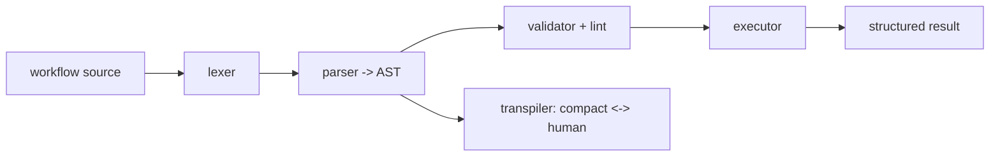
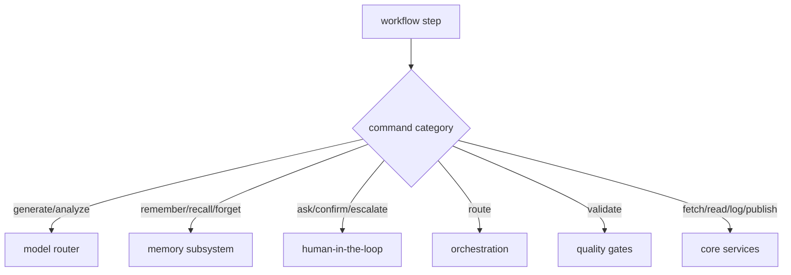
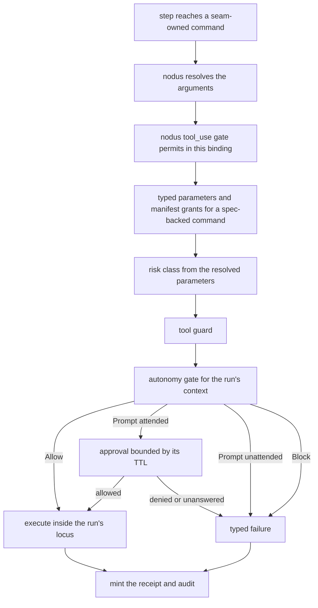

# Workflow Runtime

**Version:** 1.4.0
**Status:** Stable
**Layer:** implementation
**Implements:** l1-workflow-language.md

## Overview

The concrete realization of the workflow language: a Rust runtime **crate inside the Cronus monorepo** (`crates/nodus`) — lexer, parser, validator (lint), executor, and transpiler — that the core depends on and links **in-process**, so it runs everywhere the core runs (desktop and mobile) with no external language process. It is kept as a self-contained crate (not fused into the core) so it can be **extracted to a standalone crate later** if it outgrows Cronus; for now it is vendored in-tree because no other consumer needs it. The core wires its step handlers to Cronus subsystems. Execution is schema-driven, validated, and bounded.

## Related Specifications

- [l1-workflow-language.md](l1-workflow-language.md) - The language model this runtime implements.
- [l2-core-library.md](l2-core-library.md) - The core depends on this runtime crate and binds its steps.
- [l2-source-layout.md](l2-source-layout.md) - Where this in-monorepo crate sits in the Cronus workspace.
- [l2-orchestration.md](l2-orchestration.md) - Delegated work / `/goal` loops execute workflows.
- [l2-model-router.md](l2-model-router.md) - Generation/analysis steps route models here.
- [l2-cli.md](l2-cli.md) - Command grammar standard for `workflow` commands.
- [../../nodus/specifications/l2-nodus-commands.md](../../nodus/specifications/l2-nodus-commands.md) - [ADDED v1.4.0] The nodus-side command-execution seam that §4.2's command bridge implements.
- [l2-model-runtime.md](l2-model-runtime.md) - [ADDED v1.4.0] The model bridge — the placement precedent for the command bridge and the `GEN`/`ANALYZE` binding (§4.2.1).
- [l2-tool-receipts.md](l2-tool-receipts.md) - [ADDED v1.4.0] The dispatch seam the command bridge executes through, and the decision path §4.2.4 composes into it.
- [l2-agent-autonomy.md](l2-agent-autonomy.md) - [ADDED v1.4.0] Risk classes and the gate for interactive, background and cron contexts (§4.2.4).
- [l2-tool-security.md](l2-tool-security.md) - [ADDED v1.4.0] The tool guard, path containment and hard blocks that sit in the decision path.
- [l2-skill-system.md](l2-skill-system.md) - [ADDED v1.4.0] The skill command surface (`CommandSpec`, grants) the command bridge also answers.
- [l1-execution-locus.md](l1-execution-locus.md) - [ADDED v1.4.0] LOC-1/LOC-2: why one command bridge per run is one world.

## 1. Motivation

The language must run on every Cronus target — including the mobile thin client and the always-on hub — without a heavy external interpreter. Implementing the runtime in the Rust core (rather than embedding a separate language runtime) keeps it embeddable, fast, and dependency-free, satisfying the hub-and-spoke and mobile constraints.

## 2. Constraints & Assumptions

- The runtime is an in-monorepo Rust crate the core depends on; it links in-process (no external language runtime is bundled, no separate process).
- A formal grammar drives the parser; a schema is loaded before execution.
- The port preserves behavior parity with the upstream language specification (same sample workflows produce equivalent validation, execution, and transpilation results). The crate currently implements the **v0.4.6** vocabulary generation; the upstream specification has advanced to **v0.7**, and the outstanding parity surface is the implementation target tracked in §4.9.
- Steps call core subsystems through internal interfaces; the runtime owns no domain logic of its own beyond control flow.

## 3. Invariant Compliance (Layer 2 only)

| L1 Invariant | Implementation |
| --- | --- |
| WFL-1 Dual representation | The transpiler converts compact ↔ human losslessly; both parse to the same AST. |
| WFL-2 Schema contract | The validator loads the schema first; unknown vocabulary fails validation. |
| WFL-3 Hard constraints | The executor enforces declared hard constraints; a violation halts and escalates, regardless of caller. |
| WFL-4 Preferences soft | Preferences are advisory inputs to steps; never override hard constraints. |
| WFL-5 Validate before run | `run` invokes the validator (lint rules) first; parse/undefined-var errors halt. |
| WFL-6 Bounded execution | The executor enforces max-iteration/budget limits and honors halt/pause. |
| WFL-7 Subsystem-bound | Command handlers dispatch to memory, HITL, orchestration, quality, and the model router. The binding is made through the nodus provider seams (§4.2.1–§4.2.5): the model bridge for generation, the command bridge for every other command — each calling the subsystem that owns the capability and inheriting its gates, never restating them. |
| WFL-8 Result contract | Every run returns a structured result (success/failure) and runs the declared error handler. |
| WFL-9 Human view | The client surface renders the human form via the transpiler. |

## 4. Detailed Design

### 4.1 Pipeline (all in the Rust core)



A formal grammar specification drives the parser; porting from the reference implementation's grammar is the starting point. Lint rules (errors/warnings/info) run in the validator.

### 4.2 Step binding



The runtime is the scripting layer; each command handler calls the owning subsystem (WFL-7), so workflows compose existing capabilities rather than duplicating them.

`[ADDED v1.4.0]` The diagram says *what* binds to *whom*; the rest of this section says *how*, now that the nodus crate has a seam a host can bind through (`l2-nodus-commands.md` in the nodus workspace — specified there, not yet built). A host implements a small number of provider traits and installs them through the composed entry point (`run_with_options`). Nothing below moves logic into nodus, and nothing below restates an owning subsystem's rules: each binding calls the subsystem that owns the capability and inherits its gates.

#### 4.2.1 Which seam each step class reaches

| Step class | nodus seam | Bound to | State |
| --- | --- | --- | --- |
| `GEN`, `ANALYZE` | `ModelProvider` | The model bridge over `contract::InferenceBackend` (`l2-model-runtime` §4.1–§4.2) | Bridge built; the `workflow run` verb does not install it yet (§4.8) |
| `ASK`, `CONFIRM` | `DialogProvider` | The interactive surface's question and approval channel. A run with no surface that can answer keeps nodus's built-in resolution — the step's `+default`, otherwise a pause — and is never auto-answered (AG-9) | Not wired |
| `SETTLE` | `SettlementRail` | None: no settlement rail exists and `l1-value-settlement` VS-8 makes one opt-in, so the built-in rail, which settles nothing, stays | By design |
| every other command | `CommandProvider` | The command bridge (§4.2.2–§4.2.5) | Specified here, not built |
| `^validator` rules the core does not evaluate | `CommandProvider::validate` | Quality (WFL-7). A rule with no evaluator is *unavailable* and fails closed — the product never assumes a check it did not run (INV-9) | Not built |

#### 4.2.2 The command bridge

The command bridge is the host's `CommandProvider`. It follows the placement of the model bridge (`l2-model-runtime` §4.1): the adapter lives in the facade tier, the pure tables it consults — command to owning subsystem, command to risk class, failure to code — live in the domain tier, and nodus gains no dependency (nodus LP-1; tier rules in `l2-crate-topology` §4.1).

- **One bridge per run, and it is one world.** A run's world-touching commands must observe one filesystem, one process table and one identity. The bridge is therefore built for a run and bound to that run's execution locus, resolved as every other world-touching capability resolves it — never "the host the process happens to be on" (`l1-execution-locus` LOC-1, LOC-2, LOC-8; the providers are `l2-execution-workspace` §4.1). `CommandProvider::world()` reports the locus identity, so every step record names where it acted. The bridge is never layered over a simulation.
- **A run context, not only arguments.** Building the bridge takes a run context: who invoked the run (a surface or an agent); which of the three execution contexts the autonomy gate already distinguishes it runs in — *interactive*, where an answering surface exists, or *background* or *cron*, where none does (`l2-agent-autonomy` §4.3) — and an interactive run whose surface cannot answer at that moment counts as unattended (AG-9); its autonomy level — the invoking session's, or for a run with no session behind it the level its owner configured, and `supervised` where none is (the conservative default, AG-4); its locus; its role, when an agent invoked it (the role authority `l2-version-control` §4.3 applies); its run identity (§4.2.5); and, when the workflow is a skill's procedure, that skill's manifest grants (`l2-skill-system` §4.5). A workflow run directly by a person carries no manifest grants: grants scope an *extension* (EXT-6), and a person's authority here is the autonomy level and the guard.
- **No command is bound ahead of its gate.** A command is bound only when its owning subsystem is shipped *and* every stage of the decision path for its class (§4.2.4) is wired into the dispatch gate, with the class computed from resolved parameters as `l2-agent-autonomy` §4.2 requires. Otherwise the bridge answers `Unsupported`, which nodus turns into the typed `NODUS:UNDEFINED_CMD`: the workflow fails naming the command, and nothing is answered with a placeholder. An action the core cannot yet perform has no answer — INV-9's rule, applied at the step (`l2-invocable-registry` §4.2) — so binding proceeds command by command and an unbound command is a visible refusal rather than a silent success.
- **Simulation is a different run.** `workflow test` runs on nodus's built-in simulated provider and labels itself so (HO-12). `workflow run` installs the bridge when a run context and a locus are available and reports `mode: real` only if nothing that answered it was a stand-in; it never mixes the two in one run (LOC-2). Where no bridge can be built, the verb runs on the built-ins exactly as it does today and says `mode: simulated`.

#### 4.2.3 What each command binds to

| nodus commands | Owner | Class (`l2-agent-autonomy` §4.2) | A failure becomes |
| --- | --- | --- | --- |
| `RECALL` | Memory recall (`l2-memory-store` §4.2) | `read` | `MEMORY_FAILED` — a store error is never an empty recall |
| `REMEMBER` | The memory write path (`l2-memory-store` §4.3) | `write` | `MEMORY_FAILED` |
| `FORGET` | The memory forget operation (`l2-memory-store` §4.13) | `destructive` (a data purge) | `MEMORY_FAILED` |
| `QUERY_KB` | Knowledge retrieval (`l2-knowledge-store` §4.3) | `read` | `KB_UNAVAILABLE` — unavailable is not "no results" |
| `READ_FILE`, `FILE_EXISTS`, `SCAN_DIR` | Files inside the run's locus, path containment per `l2-tool-security` §4.2 | `read` | `COMMAND_FAILED` |
| `WRITE`, `MKDIR`, `COPY`, `MOVE` | The same, under `l2-execution-workspace` | `write`; `destructive` when the resolved parameters replace or remove | `COMMAND_FAILED` |
| `GIT`, `QUERY_GIT`, `VERSION_BUMP` | The version-control layer, under the run's role authority (`l2-version-control` §4.3): a workflow never holds more git authority than the role it runs under | by the resolved operation | `GIT_UNAVAILABLE` |
| `NOTIFY` | The inbox (`l2-inbox`): a workflow writing to another actor | `write` | `COMMAND_FAILED` |
| `ROUTE` | Orchestration (`l2-orchestration`) | `write` | `ROUTE_NOT_FOUND` for a target that resolves to nothing |
| `ESCALATE` | The same interactive channel as `ASK` and `CONFIRM` | — | `ESCALATION_FAILED` when no surface can answer (AG-9) |
| `EXECUTE`, `EXECUTE_TEST` | Confined execution (`l2-execution-sandbox`) | by the resolved invocation | `COMMAND_FAILED` |
| `TRANSPILE` | The runtime's own transpiler, in process | `read` | `COMMAND_FAILED` |

**Host-declared commands.** The skill command surface (`l2-skill-system` §4.3) is the second source of commands. Each `CommandSpec` registers into the nodus vocabulary as a host-declared command (`SchemaProvider`, nodus LP-4), and the bridge answers it through that spec — typed parameters validated first, then the caller's grants — as one more stage of the decision path (§4.2.4). The nodus name is derived once, deterministically, when the surface is registered: the spec id upper-cased with each separator replaced by an underscore (`fs.read_file` becomes `FS_READ_FILE`). A derived name that collides with a builtin is discarded by the vocabulary, so the derivation is never left to each skill.

**The commands not in the table have no owner design in this workspace and stay unbacked**, each failing typed until it names one: `FETCH` (the only fetcher that exists is scoped to knowledge ingestion, not a capability a workflow can reach; when a general one is named it passes the egress gate, SEC-3, and is `read` or `network` by its resolved parameters), `PUBLISH` (no publishing owner exists), `STORE` and `LOAD` (reserved for the durable-state seam, nodus LP-15), `ENV` (environment values may be secrets, SEC-1, so it needs an allowlist first), `DATE`, `COUNTER`, `HASH`, `WAIT`, `DEBUG`, `APPEND`, `SIMULATE`, and the model-shaped `REFINE`, `TRANSLATE`, `SUMMARIZE`, `FILL`, `GENERATE_DOC`, `SCORE`, `COMPARE`, `EXTRACT`, `FILTER`, `PARSE`, `PARSE_MD_HEADER` and `PARSE_INDEX`, which need a prompt composed per command — a nodus-side design (`l2-nodus-commands.md` §4.12).

#### 4.2.4 The decision path

Every command the bridge answers passes one decision path, once, and a refusal at any stage names the stage:



- **The decision is made where the receipt is minted.** `l2-tool-receipts` §4.4 already says the gate in front of `ReceiptedDispatch::invoke` stands for the *whole* decision path and that the guard and the autonomy gate join it when they are realized over real tool execution. The command bridge is that realization for workflow commands, so the decision runs once, inside dispatch, and its verdict is bound into the receipt as an input (TR-7). nodus's own `tool_use` gate therefore *permits* in this binding: a second decision in front of the first would either raise an approval twice or leave a refusal without a receipt, and a blocked call is receipted too (TR-1). The host's policy for the other effect classes is unchanged.
- **The permit is safe only because the bridge has no other way to act.** With nodus's gate permitting, the dispatch gate is the only check between a step and its effect. The bridge therefore holds no execution path of its own: every effect goes through `ReceiptedDispatch::invoke`, the only public execution path (TR-1), and a command whose class has an unwired stage is not bound at all (§4.2.2) — so the permit is only ever given for a command whose decision path is complete.
- **A refusal is typed, short and content-free.** A refused command returns `Failed` with `NODUS:POLICY_DENIED` and a reason naming the stage — `policy`, `hard_block`, `guard`, `grant`, `needs_approval_unattended` or `approval_denied` — and never the arguments (SEC-1).
- **Unattended means refused, never assumed.** In an unattended run — background, cron, or an interactive run whose surface cannot answer — every `Prompt` cell resolves to a visible refusal, and nothing is auto-allowed to keep the run moving (`l2-agent-autonomy` §4.3, §4.6; AG-4, AG-9). In an interactive run the bridge blocks in `execute` for the approval — nodus imposes no timeout on a provider (`l2-nodus-commands.md` §4.12), and the approval's own TTL is the bound. An approval that is not answered in time fails the command as `COMMAND_FAILED` with the reason *not answered in time*, not as a refusal: an unanswered prompt is not a policy decision.
- **A failing guard fails toward approval, never through** (`l2-tool-security` §4.2), and an approval binds the resolved invocation the run presented (CB-1) — the values nodus resolved are what an allow-rule freezes.

#### 4.2.5 Identity, receipts and the record

- **Run identity.** The verb gives every run a durable `run_id`. A resumed run — nodus resumes by re-invocation from the top (`l2-nodus-dialog.md` §3, DG-4) — passes the same `run_id`, so the effect keys nodus presents (`l2-nodus-commands.md` §4.6) repeat exactly.
- **A durable effect record.** The bridge honours nodus's at-most-once-per-key obligation with a durable, workspace-scoped record in the state tier: effect key, state, and — once complete — the outcome value when it is bounded and redacted, otherwise its digest. For a command that changes something the record is written as *in flight* **before** the effect runs and completed after; reads keep none. A repeated presentation returns the recorded outcome, or `COMMAND_FAILED` with *already applied, result not retained* when only a digest survives. A presentation that finds a record still in flight — a crash between the two writes — fails as `COMMAND_FAILED` with *outcome unknown*, and never acts again: that is nodus's `attempt` above 1 made concrete. The receipt ledger cannot serve here: its key rotates on restart and it verifies only within the live session (`l2-tool-receipts` TR-5).
- **Receipts and world.** The receipt token `ReceiptedDispatch` mints (safe to log, TR-9) rides the answer's `receipt` onto the step's `StepEnd` (nodus HO-9): nodus stores and echoes, and never mints (`l2-tool-receipts` §4.8). The step also names its locus. Neither carries argument or result content.
- **What the verb reports.** `mode` is read from the run's own manifest (HO-12): `simulated` if any stand-in answered, `real` otherwise. A run in which a command failed as unbacked ends `partial` with the command named, and the outcome that reaches a surface passes the boundary redaction (INV-7, `l2-invocable-registry` §4.12).

#### 4.2.6 Conformance

Each statement is verifiable without a real subsystem, against a scripted subsystem double:

- A command whose class has an unwired decision stage is answered `Unsupported`, and the run's step error is `NODUS:UNDEFINED_CMD` naming it.
- A refused command mints exactly one receipt, tagged blocked, appends exactly one audit entry, never runs its action, and reaches nodus as `Failed` with `NODUS:POLICY_DENIED` and a stage-naming reason that carries no argument.
- In an unattended run a `Prompt` outcome is a refusal and nothing runs; in an interactive run it waits for the approval and an unanswered one fails as *not answered in time*, not as a refusal.
- Re-invoking a run with the same `run_id` after a committing command completed returns the recorded outcome without running the action again; a record left in flight fails as *outcome unknown*.
- A run in which any command was answered by a stand-in reports `mode: simulated`; a run answered only by the bridge reports `mode: real`.
- Two commands of one run resolve their locus to the same value, and the value equals what `world()` reports.

#### 4.2.7 What this section does not settle

- **Per-run context must reach the verb.** The `workflow.run` handler receives arguments only; the invoking surface (and so the interactive, background or cron context), the locus and the grants must reach it. The smallest change is a context parameter on the handler, which `l2-invocable-registry` §4.5 owns; it is recorded here and not amended there.
- **The decision path is a dependency.** The guard and the autonomy gate joining the dispatch gate is `l2-tool-receipts` §4.4's own forward statement; until it lands, no command whose class needs those stages is bound (§4.2.2).
- **The interactive question channel.** `ASK`, `CONFIRM` and `ESCALATE` bind to an interactive surface's channel, whose owning specification is not named in this workspace beyond OFF-6; it needs its own binding.
- **The unbacked commands** each need an owner design (§4.2.3); the model-shaped ones need a nodus-side prompt design first.
- **Long-lived approvals.** An approval that outlives the call — a durable allow-rule — is `l2-agent-autonomy` §4.6's; this section only carries the resolved invocation to it.

### 4.3 Embeddability

Because the runtime is a Rust crate the core links in-process, it executes on desktop and mobile alike — there is no separate language process on any target. The always-on hub runs workflows for autonomous routines/goals; the mobile thin client can validate/preview and run foreground workflows. Keeping it a self-contained crate (not fused into the core) preserves a clean seam for later extraction while still linking statically into the core build.

### 4.4 Command surface

Workflow operations conform to the CLI grammar standard (see `l2-cli.md` §4.4).

| Action | CLI | TUI | Library (no code) |
| --- | --- | --- | --- |
| scaffold | `cronus workflow new <name>` | `/workflow new <name>` | `workflows.scaffold(name) -> Workflow` |
| validate | `cronus workflow validate <file>` | `/workflow validate <file>` | `workflows.validate(ref) -> Report` |
| run | `cronus workflow run <file>` | `/workflow run <file>` | `workflows.run(ref, input) -> Result` |
| transpile | `cronus workflow transpile <file> --to <compact\|human>` | `/workflow transpile …` | `workflows.transpile(ref, mode) -> string` |
| test | `cronus workflow test [<file>]` | `/workflow test …` | `workflows.test(ref?) -> Report` |

### 4.5 Port architecture & strategy

The crate is a behavior-preserving port of the reference implementation (~5k lines across six modules) into Rust. Modules and their responsibilities:

| Module | Responsibility | Reference scope |
| --- | --- | --- |
| `lexer` | tokenize the compact form | ~tokens + symbols/operators |
| `parser` → `ast` | build the AST per the formal grammar | grammar-driven; largest module |
| `validator` | structure + lint rules (errors/warnings/info) | the lint catalog |
| `executor` | step dispatch, control flow, bounded execution | command handlers + control keywords |
| `transpiler` | compact ↔ human, lossless | rendering both forms |

Schema and grammar are **data, not code**: the vocabulary schema and the formal grammar ship as resources the crate loads (so updating the language does not require recompiling logic).

**Incremental order (vertical slice first):**

1. `lexer` + `parser` + `ast` — parse a sample workflow to an AST.
2. `transpiler` — compact ↔ human round-trip on that AST (proves WFL-1).
3. minimal `executor` — a couple of commands (`log`, `generate`) end-to-end (proves WFL-7/8).
4. `validator` + full lint rules (proves WFL-5).
5. full command set + control flow (`?if`/`?switch`/`~retry`/`~map`/`!halt`/`!pause`).

**Parity testing:** the reference implementation's sample workflows + lint cases form a golden corpus; the Rust crate must produce equivalent validation verdicts, execution results, and transpilation output. The corpus lives in `crates/nodus/tests/fixtures/` as the normative fixture set every parity and round-trip test reads.

### 4.6 Step-file architecture for disciplined workflow execution

Long multi-phase workflows are decomposed into step files — small, self-contained instruction documents, one per execution step. This architecture prevents context overflow, enforces sequential discipline, and keeps the executing agent focused on one unit of work at a time.

#### JIT (just-in-time) loading

Only the current step file is loaded into the agent's context at any moment. The full workflow is not pre-loaded:

```text
[REFERENCE]
JIT loading rules:
  - Load step N only when the agent is ready to begin step N.
  - Unload (or deprioritize) step N-1 once step N begins.
  - Never load step N+1 while step N is in progress.
  - This keeps context token cost proportional to one step, not the whole workflow.
```

Loading the entire workflow upfront risks context saturation on long workflows and tempts the agent to "skip ahead" to later steps — both are failure modes this pattern prevents.

#### Sequential enforcement

Steps are executed in strict declared order. No skipping is allowed, even when a step appears to be a no-op for the current situation:

```text
[REFERENCE]
Sequential enforcement rules:
  - The agent must complete (or explicitly mark as skipped with a reason) each step
    before loading the next.
  - A step cannot be deferred — if it cannot be completed, the workflow HALTs.
  - Workflow order is the author's intent; unilateral reordering is an error.
```

The rationale: steps often have side effects or populate context that later steps depend on implicitly. Skipping breaks the append-only chain.

#### State tracking in frontmatter

Workflow state (which steps have completed) is tracked in a YAML frontmatter header on the primary output document, not in conversation history:

```text
[REFERENCE]
Frontmatter state block (on the workflow's primary output document):

---
stepsCompleted:
  - step-01-init
  - step-02-domain-analysis
currentStep: step-03-competitive-landscape
status: in-progress   # draft | in-progress | complete
---
```

The authoritative state is the executor's own durable step journal: a step is recorded complete when its result is accepted, and the frontmatter mirrors that journal so a reader — or an agent resuming after compaction — can see where the run stands without the conversation history, which is not reliable for this purpose. A `stepsCompleted` entry the executing agent writes itself is a claim, not a completion; on resume the executor trusts its journal.

#### Append-only document building

Workflow output documents are built incrementally. Each step appends its section to the document; earlier sections are never overwritten:

```text
[REFERENCE]
Append-only rules:
  - Each step writes exactly the section(s) it owns.
  - Completed sections are read-only; the agent never edits them in a later step.
  - The final document is the accumulation of all appended sections.
  - [ASSUMPTION] tags mark content the agent generated without explicit input —
    flagged for user review, not silently removed.
```

This rule makes partial output recoverable: if the workflow is interrupted mid-run, completed sections are already written and correct.

#### HALT at menus and decision points

When a step requires a choice the agent cannot make unilaterally, execution halts and the agent surfaces the decision to the user:

```text
[REFERENCE]
HALT conditions:
  - User choice required: multiple valid paths exist and the choice is not deterministic.
  - Ambiguous input: a required input is missing or contradictory.
  - External dependency not met: a prerequisite artifact does not exist yet.
  - Constraint conflict: the work would violate a declared constraint.

At a HALT point:
  - The agent states the specific decision or information needed.
  - The agent offers options if there are a small fixed set (≤4 recommended choices).
  - The agent does NOT improvise past the HALT — it waits for the user to respond.
```

A HALT is not a failure — it is the workflow correctly recognizing that the next step needs human intent. The agent should be specific about what it needs, not ask an open-ended question.

### 4.7 Platform-native capability lookup

Before a workflow step generates new code or recommends installing a dependency, the runtime checks a platform-native capability table. If the platform already ships a solution, the step uses it instead of generating custom code or adding a dependency.

#### Lookup principle

The lookup is applied at code-generation time using the decision ladder (see l2-quality-pipeline.md §4.13): standard library and platform-native capabilities are preferred over third-party dependencies, which are preferred over custom implementation. The lookup table makes this concrete — it maps common "thing I think I need" patterns to "what the platform already ships."

#### Lookup table (selected entries by domain)

```text
[REFERENCE]
Platform-native capability table (non-exhaustive; extend per project ecosystem):

HTML elements:
  You think you need: date picker widget library
  Platform ships: <input type="date">

  You think you need: accessible modal dialog library
  Platform ships: <dialog> element (built-in open/close, focus trap, ::backdrop)

  You think you need: lazy image loading library
  Platform ships: 

CSS capabilities:
  You think you need: responsive typography library
  Platform ships: clamp() (e.g. font-size: clamp(1rem, 2.5vw, 2rem))

  You think you need: dark-mode detection library
  Platform ships: @media (prefers-color-scheme: dark) CSS media query

JavaScript / Browser APIs:
  You think you need: uuid library
  Platform ships: crypto.randomUUID()

  You think you need: deep-clone utility
  Platform ships: structuredClone()

  You think you need: custom event bus
  Platform ships: EventTarget + addEventListener/dispatchEvent

Node.js stdlib:
  You think you need: mkdirp (recursive mkdir)
  Platform ships: fs.mkdirSync(path, { recursive: true })

  You think you need: rimraf (recursive delete)
  Platform ships: fs.rmSync(path, { recursive: true, force: true })

  You think you need: dotenv for loading .env
  Platform ships: --env-file flag (Node ≥ 20.6)

Python stdlib:
  You think you need: requests for simple GET
  Platform ships: urllib.request.urlopen() or http.client

  You think you need: dateutil for ISO date parsing
  Platform ships: datetime.fromisoformat()

  You think you need: path manipulation library
  Platform ships: pathlib.Path

Rust stdlib / ecosystem:
  You think you need: an error-derive crate for error type boilerplate
  Platform ships: std::error::Error + Display impls (Cronus is std-first; no error-derive
                  crate is a dependency)

  You think you need: custom serialization
  Platform ships: serde (already a workspace dependency)

  You think you need: an async runtime
  Platform ships: std::thread with bounded worker threads — the core is synchronous by
                  design and carries no async runtime (l2-core-library §2)

SQL / Database:
  You think you need: manual pagination loop
  Platform ships: LIMIT n OFFSET m

  You think you need: running totals via application code
  Platform ships: SUM() OVER (ORDER BY ...) window function

  You think you need: deduplication via application Set
  Platform ships: SELECT DISTINCT or GROUP BY
```

#### Lookup gate in workflow execution

When a workflow step would install a new dependency or generate more than 20 lines of new code:

```text
[REFERENCE]
Pre-generation check:
  1. Identify the capability being requested (from the step's action field).
  2. Check the platform-native table for the current project's ecosystem.
  3. If a native match is found:
     → Use the native solution. Log: "native: used <feature> instead of custom code."
  4. If no native match, check existing project dependencies.
     → If an installed dependency handles it: use it. Log: "dep: used <pkg>.<method>."
  5. Only if neither check finds a match: generate new code or recommend a new dependency.

The check is advisory — it logs the recommendation but does not block execution.
Workflow authors can mark a step `skip-native-check: true` when a custom implementation
is intentional (e.g., performance-critical hot path with benchmarks to justify it).
```

### 4.8 Nodus language syntax and built-in vocabulary

The nodus crate (`crates/nodus`) is the concrete runtime. A `.nodus` file carries a typed header, a schema-loading runtime block, reactive triggers, hard constraints, soft preferences, I/O declarations, a sequential step body, and optional test and macro blocks. The schema version embedded in the crate is **v0.4.6** (`BUILTIN_SCHEMA_VERSION`). The upstream language specification has since advanced to **v0.7**; this section documents the surface the crate implements today, and §4.9 enumerates the v0.5–v0.7 parity gaps that remain the implementation target.

#### File type sigils

| Sigil | Kind |
| --- | --- |
| `§wf:name vX.Y` | Workflow — the primary executable file type |
| `§schema:name vX.Y` | Vocabulary + rule schema |
| `§config:name vX.Y` | Runtime configuration overlay |

#### Section declarations

| Keyword | Purpose |
| --- | --- |
| `§runtime: { core: … }` | Loads the named schema; `extends:` for overlays; `@needs:` for selective section loading (target — see §4.9d); `agents:` for named model bindings |
| `@ON: cond → action` | Reactive trigger — workflow activates when condition holds |
| `!!NEVER: …` / `!!ALWAYS: …` | Absolute hard constraints; executor halts on violation |
| `!PREF: X OVER Y IF cond` | Soft preference — advisory; never overrides `!!` rules |
| `@in: { field: type }` | Input declaration; `?` suffix marks optional; `= default` provides a fallback |
| `@out: $var` | Output variable |
| `@ctx: [a, b]` | Required context keys |
| `@err: HANDLER` | Error handler invoked for uncaught step errors |
| `@steps:` | Sequential numbered step body |
| `@test: name { … }` | Inline test block with `input:` / `expected:` / `tags:` fields |
| `@macro: name` | Reusable step-sequence macro |

#### Step-line syntax

```text
N. COMMAND(args) +modifier=value ^validator ~flag → $pipeline_target
```

- `+key=value` — named modifier passed to the command
- `^name` — output-validator rule attached to the step result
- `~name` — flag extractor; populates a named sub-variable from the result
- `→ $target` — pipeline target: step output stored as `$target` for downstream steps

#### Control flow

| Construct | Syntax |
| --- | --- |
| Conditional | `?IF cond → action` / `?ELIF cond → action` / `?ELSE → action` |
| Iterator loop | `~FOR $var IN $collection … ~END` |
| Bounded loop | `~UNTIL cond \| MAX:n … ~END` |
| Parallel block | `~PARALLEL … ~JOIN → $target` |

Conditional branches accept `!BREAK` (exit the enclosing loop), `!SKIP` (skip the current iteration), and `!OVERRIDE` (suppress a soft preference for this branch only).

#### Built-in command vocabulary (schema v0.4.6, current crate surface)

| Category | Commands |
| --- | --- |
| Memory & knowledge | `REMEMBER`, `RECALL`, `FORGET`, `QUERY_KB` |
| Generation | `GEN`, `REFINE`, `TRANSLATE`, `SUMMARIZE`, `FILL`, `GENERATE_DOC` |
| Analysis | `ANALYZE`, `SCORE`, `COMPARE`, `EXTRACT`, `FILTER`, `PARSE`, `PARSE_MD_HEADER`, `PARSE_INDEX` |
| I/O & messaging | `FETCH`, `STORE`, `LOAD`, `APPEND`, `MERGE`, `PUBLISH`, `NOTIFY`, `LOG` |
| Routing & control | `VALIDATE`, `ROUTE`, `ESCALATE`, `WAIT`, `TONE`, `DEBUG` |
| Execution | `EXECUTE`, `SIMULATE`, `EXECUTE_TEST`, `TRANSPILE` |
| Filesystem | `WRITE`, `READ_FILE`, `MKDIR`, `FILE_EXISTS`, `SCAN_DIR`, `MOVE`, `COPY` |
| System & meta | `ENV`, `DATE`, `COUNTER`, `GIT`, `QUERY_GIT`, `HASH`, `VERSION_BUMP` |

#### Reserved variables

`$in`, `$out`, `$error`, `$meta`, `$raw`, `$draft`, `$ctx`, `$user`, `$session`, `$log`, `$flags`, `$quality`, `$sentiment`, `$confidence`, `$memory`, `$kb_results`

User-defined step pipeline targets (`→ $name`) must not shadow reserved names.

#### Tone values (`+tone=` modifier)

`warm` · `neutral` · `formal` · `casual` · `urgent` · `empathetic` · `brand`

#### Runtime value types

The executor represents all step results with a closed `Value` enum:

| Variant | Rust type | Notes |
| --- | --- | --- |
| `Null` | — | Unset or absent |
| `Bool` | `bool` | |
| `Int` | `i64` | |
| `Float` | `f64` | |
| `Text` | `String` | |
| `List` | `Vec<Value>` | Ordered, heterogeneous |
| `Map` | `Vec<(String, Value)>` | Preserves insertion order (not `HashMap`) |

`Map` uses a `Vec` of key-value pairs rather than `HashMap` to preserve declaration order across round-trips.

#### Runtime error codes

| Code | Meaning |
| --- | --- |
| `NODUS:RULE_VIOLATION` | An `!!` absolute rule was violated at run time |
| `NODUS:PARSE_ERROR` | Source file failed to parse |
| `NODUS:MAX_REACHED` | A `~UNTIL` loop exhausted its `MAX:n` bound |
| `NODUS:EXECUTION_FAILED` | A step failed during execution |
| `NODUS:UNDEFINED_VAR` | A variable was referenced before assignment |
| `NODUS:ROUTE_NOT_FOUND` | A `ROUTE(wf:name)` target does not exist |
| `NODUS:RULE_CONFLICT` | Two `!!` rules contradict each other |
| `NODUS:SCHEMA_MISMATCH` | Schema version does not match the workflow header |
| `NODUS:NO_SCHEMA` | Workflow executed without a loaded schema |
| `NODUS:NO_TRIGGER` | No `@ON:` trigger matched the current input |
| `NODUS:UNHANDLED_ERROR` | A step error reached no `@err:` handler |

These 11 codes are the current crate surface. The upstream **v0.7** registry defines 24 severity- and category-tagged codes; the 13 not yet implemented — and the non-canonical `NODUS:EXECUTION_FAILED` they supersede — are listed in §4.9e.

#### Library API (public surface)

| Function | Signature | Purpose |
| --- | --- | --- |
| `scaffold` | `(name: &str) -> WorkflowFile` | Return a minimal valid AST with one `GEN` step |
| `validate` | `(source, filename) -> Result<ValidationReport>` | Parse + lint; all diagnostics regardless of severity |
| `run` | `(source, filename, input?) -> Result<RunResult, Diagnostics>` | Validate then execute with the stub provider — a test and development entry point; fast-fail on block errors (WFL-5) |
| `transpile` | `(source, mode: TranspileMode) -> Result<String>` | `Compact` = lossless round-trip · `Human` = one-way prose |
| `test` | `(source, filename) -> Result<TestReport>` | Validate, then execute all `@test:` blocks and aggregate pass/fail; a block passes only when its assertions hold and the run ended `Ok` |
| `run_with_provider` | `(source, filename, input?, provider) -> Result<RunResult, …>` | Like `run` but with a custom `ModelProvider` |
| `run_with_options` | `(source, filename, input?, RunOptions) -> Result<RunResult, …>` | Every seam at once — model, audit, dialog, policy, settlement, vocabulary, capability manifest — with the built-ins as defaults; the same validation and input gate as `run`. The entry point a host uses to run a real model under its policy gate |

The `ModelProvider` trait is the extension point for real model integration; the built-in `StubProvider` is used for tests and early development. The product's `workflow run` is to go through `run_with_provider` with the host's inference bridge (`l2-model-runtime` §4.1–§4.2), and stub output is to be labelled as stub output in the run's result and in its manifest's execution mode (`l1-nodus-observability` HO-12) — never presented as a model's answer (INV-9). **Partial:** `workflow run` goes through the composed entry point (`run_with_options`), so it passes the same validation and input gate as every other run — a workflow with a required `@in:` field and no `--input` is reported `failed` with `E022` and exits non-zero — and the result says what answered it: `mode` is `simulated` when the model behind the run is the built-in stub and `real` otherwise, read from the run's own manifest (HO-12), and a run that finished with recorded step errors is reported `partial`, not `ok`. What remains: no inference backend is wired to the verb yet, so every model step still returns stub text — now labelled as such (the fallible bridge to the inference backend exists and reports a failed call as a step error, `l2-model-runtime` §4.2) — and the verb supplies no policy gate, though `run_with_options` accepts one (`l2-nodus-runtime` §4.5). The wiring that closes both — the model bridge, the command bridge and the decision path in front of it — is §4.2.

#### Executor boot sequence

When `run` or `run_with_provider` fires, the executor performs these steps in order:

1. Load schema (from `§runtime.core`).
2. Internalize `!!` absolute rules (violations halt immediately).
3. Note `!PREF` soft preferences (advisory; yielded to `!!` rules — nothing consumes them yet).
4. Register `@in` defaults and overlay the caller's input.
5. `@ON` trigger matching belongs to the host; the executor performs none.
6. Execute `@steps` sequentially; thread `→` pipeline targets between steps.

The authoritative sequence is `l2-nodus-runtime.md` §4.4, which also records what step 4 does not yet do: it neither checks that a required input was supplied nor reads a field's declared type, and it copies every input key — runtime-owned names included — into the environment. A host that feeds trigger payloads or channel messages into `input` therefore filters them to the declared `@in` fields itself until the runtime does (`l2-nodus-runtime.md` §3, NL-8/NL-9).

### 4.9 Upstream parity gaps (schema v0.4.6 → v0.7)

<!-- [ADDED] v1.3.0 · [MODIFIED] v1.3.1 -->

> **Authoritative ownership:** the language/crate parity gap is owned by the **nodus workspace** — `l1-nodus-language.md` §4.6 (language design) and `l2-nodus-runtime.md` §4.7 (crate implementation). This integration spec mirrors it for `main`-workspace readers (consistent with the §4.8 vocabulary mirror); the host-binding consequences (HITL, lifecycle, scheduler) are this spec's contribution.

The crate implements the **v0.4** vocabulary generation; the upstream language specification has advanced through **v0.5–v0.7**. Each item below is **unimplemented in the current crate** and is the implementation target required to honor WFL-2/WFL-6/WFL-7 against the upstream surface. Most are already declared at the concept level (see `l1-workflow-language.md` §4.1/§4.2 and WFL-6/WFL-7), so closing them realigns the runtime with its own L1 parent.

#### (a) Control constructs

| Construct | Semantics | What to add |
| --- | --- | --- |
| `?SWITCH $v:` with `arm → action` lines and an optional `* → default` | multi-branch dispatch on a scalar; top-to-bottom, first match wins, no fallthrough; no match and no `*` → `NODUS:SWITCH_NO_MATCH` (warn, continue) | lexer token, AST node, executor branch |
| `~MAP $coll: CMD($it) → $out` | single-line collection transform; implicit `$it`; empty collection → `[]`, never errors | lexer keyword, AST node, executor |
| `~RETRY:n` (+`backoff=int`, +`retry_on=error\|null\|both`) | step-level retry up to `n` (mandatory, max 10); after `n` failures → triggers `@err` normally | step modifier on the command call |
| `!HALT` | fatal stop; status `FAILED`; requires `ESCALATE()` in the same step; no auto-resume | control keyword + status |
| `!PAUSE` | suspend; status `PAUSED`; resumes only on explicit human re-trigger; emits `NODUS:PAUSED` | control keyword + `Status::Paused` |

#### (b) Operators & expressions

| Element | Semantics |
| --- | --- |
| `MATCHES` | deterministic PCRE-regex operator in conditions (runtime-evaluated, not via model); `(?i)` prefix for case-insensitive |
| `?.` optional chaining | null-safe path access; short-circuits to `null`; does **not** raise `NODUS:UNDEFINED_VAR` |
| `??` null-coalescing | fallback value when the left side is `null` (e.g. `$user?.tier ?? "free"`) |
| `WHERE` / `FIRST` / `LAST` | inline collection filter/access with implicit `$it`; no match → `[]` (WHERE) or `null` (FIRST/LAST), never errors |
| String interpolation | `$var` / `$obj.field` expand inside string literals before the step runs (runtime-resolved, not by the model); `\$` suppresses; applies in `+msg`, `+hint`, `NOTIFY()`, `ASK()`, `CONFIRM()`, `GEN()` string params |

#### (c) Human-in-the-loop dialog commands

| Command | Semantics |
| --- | --- |
| `ASK(prompt)` | blocking typed question that auto-resumes on answer; `+type=str\|bool\|confirm\|choice\|multi_choice`, `+options`, `+hint`, `+default`, `+validate=<pcre>`, `+timeout` (→ `NODUS:DIALOG_TIMEOUT`) |
| `CONFIRM(content)` | approval decision; `+msg`, `+actions` (returns chosen label), `+default`, `+strict` (reject → `NODUS:DIALOG_REJECTED`) |

Both bind to the HITL subsystem (WFL-7) and realize the "Human interaction" command class of `l1-workflow-language.md` §4.2. Note: the §4.2 step-binding diagram already routes `ask/confirm` to HITL — the commands themselves are simply absent from the crate vocabulary.

#### (d) Selective schema loading — `@needs:`

A `@needs:` directive inside `§runtime:` declares which sections of an `extends:` schema to load — flat (`@needs: [§commands_x, §macros_x]`) or keyed (`@needs: { "x.schema.nodus": [§commands_x] }`). Omit to load the full extension; a schema's `§meta` and `!!` rules always load regardless. Requires a `needs` field on the runtime block plus load-time section filtering — this reduces schema context per execution.

#### (e) Error-code registry — extend 11 → 24

Add the upstream registry's missing codes, each carrying a severity (error/warn/info) and category (parse/runtime/validation/routing/memory/test/control/dialog):

`UNDEFINED_CMD`, `UNDEFINED_MACRO`, `VALIDATION_FAILED`, `ESCALATION_FAILED`, `CONFIDENCE_LOW`, `KB_UNAVAILABLE`, `MEMORY_FAILED`, `TEST_FAILED`, `SWITCH_NO_MATCH`, `PAUSED`, `COUNTER_OVERFLOW`, `GIT_UNAVAILABLE`, `DIALOG_TIMEOUT`, `DIALOG_REJECTED`.

The current catch-all `NODUS:EXECUTION_FAILED` is non-canonical and is superseded by these specific codes.

#### (f) Closed vocabulary registries (model and validate)

The schema declares closed registries the crate currently treats as free-form (so unknown entries pass silently, weakening WFL-2). Load each as data and validate `~flag` / `^validator` / `@in` field types against it:

- **Analysis flags** (`~`): `sentiment`, `intent`, `entities`, `topics`, `lang`, `toxicity`, `urgency`, `formality`, `clarity`, `relevance`, `pii`, `keywords`.
- **Validators** (`^`): `len:n`, `min_len:n`, `no_pii`, `no_toxic`, `lang:code`, `format:type`, `required:keys`, `sentiment:op:n`, `confidence:n`, `no_links`, `brand_voice`, `approved`.
- **Primitive types**: `str`, `int`, `float`, `bool`, `list`, `obj`, `url`, `ts`, `null`, `any` (plus extended object types).

#### (g) Execution semantics

- **Macro execution.** `@macro:` bodies must be parsed structurally and **executed** on `RUN(@macro:name)` — caller params bind as `$in`, the last assigned variable is the implicit return. The current crate parses the body and audits enter/exit but does not run it.
- **`Status` taxonomy.** Add `Paused` (for `!PAUSE`) to the existing `Ok / Partial / Failed / Aborted` set.
- **`@ON` priority.** Support optional `@ON(priority=N):` — lower `N` = higher priority; default is declaration order.

#### (h) Minor lexer parity

Single-character `;` inline comments (the crate recognizes only `;;`) and the `\$` interpolation escape are small lexer items to align with the upstream grammar.

## 5. Drawbacks & Alternatives

- **Porting effort:** re-implementing lexer/parser/validator/executor/transpiler in Rust is real work; mitigated by an existing formal grammar and lint catalog to port from.
- **Schema drift vs runtime:** the runtime must track the schema version it supports. The crate is at **v0.4.6** while the upstream spec is **v0.7**; §4.9 is the authoritative gap list, and a schema-version compatibility check (header `compatible:` range vs crate `BUILTIN_SCHEMA_VERSION`) gates execution, surfacing `NODUS:SCHEMA_MISMATCH` on divergence.
- **Alternative — embed an external interpreter:** rejected; it breaks the embeddable/mobile constraint (no heavy runtime on device).
- **Alternative — standalone crate in its own repository:** deferred; vendored in-tree for now since no other consumer needs it. The self-contained crate boundary keeps later extraction cheap if that changes.

## Document History

| Version | Date | Change |
| --- | --- | --- |
| 1.4.0 | 2026-09-24 | Design pass (2026-09-24): §4.2 gains the Cronus-side binding of the nodus command-execution seam (`l2-nodus-commands.md`), specified there and not built. §4.2.1 names the nodus seam each step class reaches. §4.2.2 specifies the command bridge: one per run and bound to the run's execution locus (LOC-2), built from a run context rather than arguments alone, with no command bound ahead of its gate, and simulation kept a different run. §4.2.3 binds each command to the owning subsystem with its risk class and failure code, and lists the commands that stay unbacked until an owner is named. §4.2.4 composes the decision path into the receipt-minting dispatch so one decision yields one receipt, refusals are typed and content-free, and unattended runs refuse rather than assume. §4.2.5 fixes run identity, a durable effect record for at-most-once, and the receipt and world the record carries. §4.2.6 states what a conforming bridge must satisfy against a scripted subsystem double, and §4.2.7 lists what stays open, including that the verb's handler cannot yet see per-run context. The Post-Update Review moved `FETCH` to the unbacked commands (no general fetch capability exists for a workflow to reach), added the autonomy level and the unattended-interactive case to the run context, made the effect record write *in flight* before the effect so a crash window fails as *outcome unknown* instead of acting twice, and required that the bridge hold no execution path outside dispatch, since nodus's `tool_use` gate permits in this binding. WFL-7's row and the Library API paragraph point to it, and Related Specifications gains the seven links it cites. No requirement of the language changed; nothing is built. |
| 1.3.3 | 2026-09-24 | Realization sync (2026-09-24): `workflow run` goes through the composed entry point: it passes the input gate, labels its result `simulated` or `real` from the run's own manifest, and reports a run with step errors as `partial` instead of `ok`. API table gains `run_with_options`. |
| 1.3.2 | 2026-09-24 | Consistency pass (2026-09-24): The platform-capability table told generated code that `tokio` and `thiserror` were already Cronus dependencies; neither is, and the core is synchronous by design — corrected. Step-file frontmatter was the authoritative state though the executing agent writes it — the executor's durable journal is authoritative and an agent-written completion is a claim. The product's `workflow run` uses the inference bridge, and stub output is labelled as such (INV-9, HO-12). Yesterday's normative sentence that `workflow run` uses the inference bridge described intent, not the shipped verb: it calls the stub `run`, reports `Partial` as `ok`, and records a `Real` manifest — now marked Partial, with the nodus limit that no entry point combines a real model with the host's policy gate. The boot-sequence list now matches the executor (no trigger matching, no advisory preference context) and points to `l2-nodus-runtime` §4.4 for what input registration does not yet check. A TBD asking to extract the reference corpus into shared fixtures is resolved — the corpus is `crates/nodus/tests/fixtures/`. |
| 1.3.1 | 2026-06-25 | §4.9: marked the **nodus workspace** (`l1-nodus-language.md` §4.6, `l2-nodus-runtime.md` §4.7) as authoritative owner of the parity gap; this spec retains the integration/host-binding view. |
| 1.3.0 | 2026-06-25 | Recorded the upstream schema **v0.4.6 → v0.7** parity gap as the implementation target — new §4.9 enumerating control constructs (`?SWITCH`/`~MAP`/`~RETRY`/`!HALT`/`!PAUSE`), operators/expressions (`MATCHES`, `?.`, `??`, `WHERE`/`FIRST`/`LAST`, string interpolation), HITL dialog commands (`ASK`/`CONFIRM`), `@needs:` selective schema loading, the 24-code error registry, closed flag/validator/type registries, macro execution, `Status::Paused`, and `@ON` priority. Corrected the embedded schema version (v0.4.5 → v0.4.6). |

## Canonical References

| Alias | Path | Purpose |
| --- | --- | --- |
| `[LANG]` | `.design/main/specifications/l1-workflow-language.md` | Invariants this runtime implements |
| `[CORE]` | `.design/main/specifications/l2-core-library.md` | The core that hosts the runtime |
| `[CLI]` | `.design/main/specifications/l2-cli.md` | Command grammar standard |
