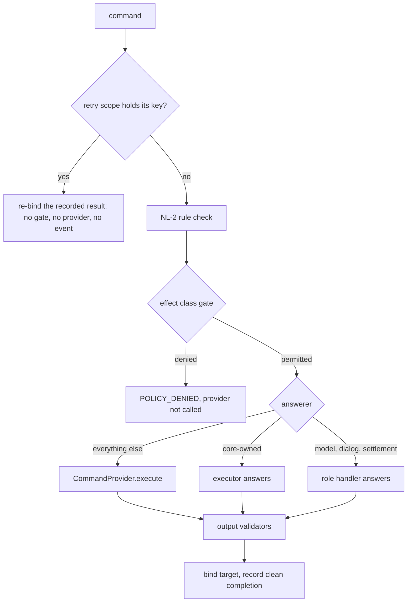

# Nodus Command Execution Seam (Rust)

**Version:** 1.0.0
**Status:** Stable
**Layer:** implementation
**Implements:** l1-nodus-portability.md

## Overview

Concrete Rust realization of the seam through which a host executes the commands the crate cannot execute itself. `l2-nodus-runtime.md` §4.5 records it as the open item behind the stub interpreter, and `l2-nodus-portability.md` §4.9.1 names it as the missing prerequisite for the third LP-11 effect class: `tool_use` is "deliberately not realized" until "a generic host-tool extension point is introduced". This spec introduces that extension point — one new role, `CommandProvider` — and settles the four questions a seam of this kind cannot leave to each host: which commands it answers (§4.1), how the LP-11 gate covers them (§4.2), what an answer that was not real is called (§4.3, §4.9), and what a command that runs a second time may do to a world it already changed (§4.6, §4.7).

Today three groups of commands reach a host — `GEN`/`ANALYZE`, `ASK`/`CONFIRM` and `SETTLE`. Every other command is answered by a table of stubs inside the executor: `VALIDATE`, `PUBLISH`, `NOTIFY`, `STORE` and `REMEMBER` report success having done nothing, a host-declared command dispatches to a no-op, and a step's `^validator`s are never evaluated. A run that pairs a real model with that table is recorded as `Real`. This spec turns the table into a labelled simulation behind the seam and gives a host the means to replace it.

The seam is a trait, not a feature: the crate still performs no file, network, process or memory operation of its own (LP-1, LP-2). What it contributes is the ordering decide → effect → observe, the meaning of an answer, and the identity of an effect. What world the commands act in, how that world is confined, and how an effect is undone stay the host's.

## Related Specifications

- [l1-nodus-portability.md](l1-nodus-portability.md) — the parent: LP-2 (abstract interfaces), LP-3 (two-host rule, answered in §4.11), LP-8 (manifest), LP-11 (the `decide → effect → observe` gate whose third class this realizes), LP-16 (consequence descriptors); §4.1's role registry gains the `Command` row
- [l1-nodus-language.md](l1-nodus-language.md) — NL-1 (an unknown command fails before the run), NL-2 (the `WITHOUT` clause), NL-9 (a typed failure surface), NL-22 (compensation), NL-23 (restart)
- [l2-nodus-runtime.md](l2-nodus-runtime.md) — §4.5's "the dispatcher is a stub interpreter" is the open item this spec closes; the step loop (§4.4) it attaches to
- [l2-nodus-portability.md](l2-nodus-portability.md) — owns `EffectClass`, `ExtensionRole`, `CapabilityManifest` and the LP-11 call site (§4.9); §4.9.1's vacuous `ToolUse` is realized here
- [l2-nodus-errors.md](l2-nodus-errors.md) — owns the `NODUS:*` registry `COMMAND_FAILED` joins, and the emission-site tables (§4.4, §4.5) this seam makes real
- [l2-nodus-error-dispatch.md](l2-nodus-error-dispatch.md) — every failure here is a `Signal`-free `RuntimeError`, so it reaches `@err:` dispatch with no code in this spec
- [l2-nodus-control-flow.md](l2-nodus-control-flow.md) — §4.4's recorded retry hazard is closed by §4.7
- [l2-nodus-dialog.md](l2-nodus-dialog.md) — DG-4's "replay re-performs effects" row gains its mechanism (§4.6)
- [l2-nodus-compensation.md](l2-nodus-compensation.md) — a compensation is an ordinary command, so it reaches the provider through this seam
- [l2-nodus-observability.md](l2-nodus-observability.md) — HO-12 (execution mode), HO-20 (determinism statement) and the `EventAnnotations` carrier (§4.9)
- [l2-nodus-registries.md](l2-nodus-registries.md) — owns which `^validator` names exist; this spec owns what they mean at run time (§4.5)
- [l2-nodus-settlement.md](l2-nodus-settlement.md) — the sibling seam for `SETTLE`, whose command this seam does not answer
- [../../main/specifications/l1-execution-locus.md](../../main/specifications/l1-execution-locus.md) — LOC-2/LOC-4: why one provider is one world, and half of the LP-3 record (§4.11)
- [../../main/specifications/l2-workflow-runtime.md](../../main/specifications/l2-workflow-runtime.md) — the Cronus-side consumer: §4.2's step binding is what stands behind a real provider; the product's `workflow run` verb waits on this seam

## 1. Motivation

Six defects trace to the same absence, and one governance hole waits on it.

1. **A stub reports success.** `VALIDATE` answers `true`, `PUBLISH` and `NOTIFY` answer `true`, `STORE`, `REMEMBER` and `FORGET` answer `true`, `SCORE` answers a constant. Nothing is validated, published or stored. A run that pairs a real model with these answers is recorded `Real`, because only a stub *model* makes a run `Simulated` today (`l2-nodus-observability.md` HO-12): the manifest states a mode the run did not have.
2. **A validator proves nothing.** `^validator`s are parsed, linted for their name, and never evaluated, so `!!NEVER: publish WITHOUT validate` proves that `VALIDATE` ran — not that anything passed. Making `VALIDATE` able to fail is not enough on its own: the rule check reads the step log, which records a step whether or not it failed, so a `VALIDATE` that failed would still unlock `PUBLISH`.
3. **A tool effect is ungated.** LP-11's `tool_use` class has no realization, so a host policy is never asked whether a `WRITE`, `GIT` or `PUBLISH` may run (`l2-nodus-portability.md` §4.9.1).
4. **A host can extend the vocabulary but not the behaviour.** A host-declared command validates and then dispatches to a no-op that raises an `UNKNOWN_COMMAND:<name>` flag; there is nothing for a host to implement.
5. **Seventeen of the twenty-four canonical error codes have no emission site.** Nine of them belong to a command that actually runs: `KB_UNAVAILABLE`, `MEMORY_FAILED`, `GIT_UNAVAILABLE`, `ESCALATION_FAILED`, `ROUTE_NOT_FOUND`, `COUNTER_OVERFLOW`, `CONFIDENCE_LOW`, `UNDEFINED_CMD` and `VALIDATION_FAILED` (`l2-nodus-errors.md` §4.4 names most of them as the replacement for a retired catch-all site).
6. **A command that runs twice acts twice.** `~RETRY` re-runs the whole step, so a command that succeeded before a later one failed runs again (`l2-nodus-control-flow.md` §4.4); a resume is a re-invocation from the top, so every pre-pause effect runs again and "nothing in the core checks" that its provider recognizes it (`l2-nodus-dialog.md` §3, DG-4).

The governance hole: the product's `workflow run` verb runs workflows on the stub model because the seam that would let it do more does not exist (`l2-nodus-runtime.md` §4.5). The host-side command surface that is waiting to be bound — typed parameters, grants checked before dispatch — cannot bind to anything.

## 2. Constraints & Assumptions

- No new dependency and no I/O in the crate (LP-1, LP-2). Exactly one built-in implementation ships: `SimulatedCommands`, which fabricates labelled answers and performs no effect.
- The seam is **synchronous**: a command resolves inside one call. A step that must outlive one call is NL-12's deferred execution, which is not realized; nothing here pretends otherwise (§4.12).
- **One provider per run, and it is one world.** A run's world-touching commands — a file read and a process the next step starts — must observe the same filesystem and process table. The host's own contract makes the locus, not the individual capability, the unit of substitution (`l1-execution-locus.md` LOC-2), so the crate offers no combinator that routes some commands to one provider and the rest to another.
- The core evaluates only what a value alone defines identically on every host (§4.5). Everything that is a judgment stays the host's.
- No new event variant (HO-6) and no new `Value` kind (NL-7). What this spec records rides `EventAnnotations`.
- A provider's failure reason is short and secret-free — never an argument, a credential or a raw response — exactly as `ModelError` already requires.
- Additive where it can be: a workflow that uses only core-owned and role-owned commands (§4.1), declares no `^validator` and has no `~RETRY` over several commands, run with no provider, behaves exactly as before; a workflow that uses seam-owned commands under the built-in receives the same values as before, plus the labels that say they were simulated. Three changes are not additive and are corrections of recorded defects — a `^validator` that now means something (§4.5), a retry that no longer repeats a command that completed (§4.7), and a `WITHOUT` clause that reads clean completions (§4.5) — each named in §5's list of tests to review.

## 3. Invariant Compliance

The parent is `l1-nodus-portability.md`, and the LP rows are the ones this spec realizes. The NL, DG and HO rows record how the seam meets obligations that the sibling L1s already state, so that no L2 reading this seam has to rediscover them.

| Invariant | Implementation |
| --- | --- |
| LP-2 Extension via abstract interfaces | `CommandProvider` is a named trait (§4.3) and the tenth `ExtensionRole`. Its one built-in, `SimulatedCommands`, performs no I/O. The trait names only `Value`, `&str`, `String` and the request and outcome types this spec defines — no host type. |
| LP-3 Two-host generalisation | **Satisfied** — recorded in §4.11: the operator's own machine and a confined sandbox are two execution worlds whose decision shapes and fail directions the host's own contracts already keep apart. The executor consults the provider on that record. |
| LP-4 Vocabulary isolation | A host-declared command stays a schema artifact (`SchemaProvider`); this spec gives it behaviour without touching `KNOWN_COMMANDS`. The provider answers by command name and nothing host-specific enters the baseline. |
| LP-5 Composable extension | `ExecutorBuilder::commands` and `RunOptions::commands` join the composed entry point (§4.10). There is deliberately no single-seam `run_with_commands*`: it would pair a real provider with the permit-everything policy and leave every tool effect ungated — the defect `l2-nodus-settlement.md` §3 records for `run_with_settlement*`. |
| LP-6 Semantic versioning | Additive: a new trait whose `validate` and `world` methods have defaults, new types and a new module. Three public enums gain a variant — `EffectClass::ToolUse`, `ExtensionRole::Command`, `Determinism::ContainsHostCommands` — recorded here as the semver-relevant change for the next release note, acceptable at the crate's pre-1.0 version (`l1-nodus-portability.md` §4.5). |
| LP-8 Capability manifest | `ExtensionRole::Command` (§4.10). `from_workflow` derives it, beside `Vocabulary`, for every host-declared command; `HostCapabilities::builtin()` does not provide it, so a manifest-gated workflow that calls a host-declared command is rejected before the run on a host with no provider (`NODUS:CAPABILITY_UNMET`) — the `Dialog` and `Settlement` precedent. |
| LP-10 Host-granted authority | A step declares an effect and never authorizes it. The gate (§4.2) runs before the provider; a workflow has no syntax to name a gate, skip one or mark itself permitted; nothing a provider returns widens what the gate allowed. |
| LP-11 Per-effect authorization seam | **Realized for the third class.** `EffectClass::ToolUse` and the default-effectful classification (§4.2): every command that is neither core-owned nor owned by another role is gated as `tool_use` before it executes. A denial is `NODUS:POLICY_DENIED` and the provider is not called — decide → effect → observe. This closes `l2-nodus-portability.md` §4.9.1's "deliberately not realized". |
| LP-16 Effect risk-class declaration | Unchanged: `+reversible`, `+external` and `+value` ride the gate `context` when declared and are omitted, never defaulted, otherwise (§4.2). For `tool_use` the resolved argument values are added beside the raw ones. |
| LP-18 Environment-liveness seam | Rule (a) gains a path it lacked for command steps: a provider whose world has vanished returns `Failed` with a typed code and a reason naming the world, and the step fails at once, routed to `@err:`, never hanging. This spec adds no environment code and does not close LP-18: (b) and the `EnvironmentProvider::open` signature are unchanged (`l2-nodus-portability.md` §3.1). |
| NL-1 Schema-first | An unknown command is still `E021` before the run. A *known* command no provider can answer is the run-time `NODUS:UNDEFINED_CMD` (§4.8) — the canonical code for "unknown command dispatched" that `l2-nodus-errors.md` §4.4 assigned and no site emitted. |
| NL-2 Hard constraints absolute | The rule check still runs first and still bypasses the seam. The `WITHOUT` clause is satisfied only by a step of the named command that *completed cleanly* (§4.5); read from the step log, which records failed steps too, a `VALIDATE` that failed would still unlock `PUBLISH`. |
| NL-7 Closed value types | A provider answers with a `Value`; no kind is added. The request's `args` are resolved `Value`s. |
| NL-9 Typed failure surface | Every failure is a typed `NODUS:*` `RuntimeError` with no `Signal` (§4.8), so it reaches the declared `@err:` handler, arms the compensation unwind and ends an unhandled sequence as `NODUS:UNHANDLED_ERROR`, with no code here to wire that up. |
| NL-11 Provenance-safe interpolation | **Pending, unchanged** (`l2-nodus-runtime.md` §3.1). This seam is the one place a host-produced value enters a run, so when crate-wide provenance tagging lands every seam answer can be tagged untrusted at a single site (§4.4 step 7). This spec adds no tag. |
| NL-22 Compensation seam | A compensation is an ordinary command: through `execute_command` it now reaches the provider — gated, in its own key namespace (§4.6) — so a real undo can run. It is never memoized (§4.7). |
| NL-23 Bounded whole-run self-restart | The restart count is part of the effect key (§4.6): a restart's effects are new effects, matching NL-23(e) — a restart re-runs and does not undo. |
| DG-4 Suspend/resume | Resume-by-replay re-performs pre-pause effects; the stable key (§4.6) is the mechanism that lets a provider recognize them as already done — the "recognized as already done by its own provider" that `l2-nodus-dialog.md` §3 names but the core could not check. |
| HO-6 Closed event taxonomy | No variant is added. A seam-executed step emits `StepStart`, `StepEnd` and, on failure, `StepError`; what it adds rides `EventAnnotations` (§4.9). |
| HO-9 Execution receipt | A provider may return a receipt with its answer; it rides the step's `StepEnd` annotations beside a dialog's provenance (§4.9). |
| HO-12 Execution mode | A run is recorded `Real` only if nothing that answered it was a stand-in. The rule that made a stub *model* simulate the run now also covers a simulated command answer and an assumed validator verdict (§4.9). |
| HO-20 Reproduction recipe | `Determinism` gains `ContainsHostCommands`: a run whose commands a real provider answered is not stated deterministic (§4.9). |

## 4. Detailed Design

### 4.1 Who answers which command

Every command the executor dispatches has exactly one answerer. The partition is exhaustive and exclusive:

| Answerer | Commands | Gated as |
| --- | --- | --- |
| The executor (core-owned) | `LOG`, `ASSIGN` (the internal form of the `$x = …` shorthand), `MERGE`, `TONE`, `RUN`, `VALIDATE` | not gated — they read and write the run's own value environment and touch nothing outside it; `VALIDATE`'s evaluation is §4.5 |
| `ModelProvider` | `GEN`, `ANALYZE` | `model_call` |
| `DialogProvider` | `ASK`, `CONFIRM` | `deferred` |
| `SettlementRail` | `SETTLE` | `settlement` |
| `CommandProvider` | every other command — the forty-four builtin commands below and every host-declared command | `tool_use` |

The forty-four builtin commands the seam answers: memory and knowledge (`REMEMBER`, `RECALL`, `FORGET`, `QUERY_KB`); generation other than `GEN` (`REFINE`, `TRANSLATE`, `SUMMARIZE`, `FILL`, `GENERATE_DOC`); analysis other than `ANALYZE` (`SCORE`, `COMPARE`, `EXTRACT`, `FILTER`, `PARSE`, `PARSE_MD_HEADER`, `PARSE_INDEX`); I/O and messaging other than `LOG` and `MERGE` (`FETCH`, `STORE`, `LOAD`, `APPEND`, `PUBLISH`, `NOTIFY`); routing and control other than `VALIDATE` and `TONE` (`ROUTE`, `ESCALATE`, `WAIT`, `DEBUG`); execution (`EXECUTE`, `SIMULATE`, `EXECUTE_TEST`, `TRANSPILE`); filesystem (`WRITE`, `READ_FILE`, `MKDIR`, `FILE_EXISTS`, `SCAN_DIR`, `MOVE`, `COPY`); system and meta (`ENV`, `DATE`, `COUNTER`, `GIT`, `QUERY_GIT`, `HASH`, `VERSION_BUMP`).

Three decisions sit inside the table:

- **The core-owned set is closed and small.** A command is core-owned only if the run's own state fully determines its answer. `APPEND` and `HASH` are computable in the crate and are still seam-owned here: today `APPEND` is a stub that answers an empty list, and replacing a stub with a real pure implementation is a separate change that this seam does not need and must not wait on.
- **The model-shaped commands beyond `GEN` and `ANALYZE` reach the seam, not `ModelProvider`.** `TRANSLATE` answers `[Translated content]` and `SUMMARIZE` answers `[Summary]` today. Routing them through `ModelProvider` would need a prompt the crate composes per command, which is NL-15's territory and a different design; until then a host that wants them real backs them through `CommandProvider` with its own model client (§4.12).
- **`STORE` and `LOAD` are reserved for LP-15.** Durable state is reached through `StorageProvider`, whose executor wiring is held by its LP-3 record (`l2-nodus-portability.md` §4.8.2). Until that wiring lands the two commands reach the provider like any other; when it lands, the executor claims them ahead of this seam, which changes nothing for a provider that never implemented them.

### 4.2 The tool-use effect class and the gate

`l2-nodus-portability.md` §4.9.1 realized two of L1 §4.7's three classes and left `tool_use` out because "every `tool`-shaped builtin command is a fixed stub … there is no host-swappable seam behind it". The seam now exists, so the class is realized — and realized *fail-safe*:

```text
[REFERENCE]
pub enum EffectClass { ModelCall, Deferred, Settlement, ToolUse }   // gate string "tool_use"

const CORE_COMMANDS: &[&str] = &["LOG", "ASSIGN", "MERGE", "TONE", "RUN", "VALIDATE"];

pub fn effect_class_of(command: &str) -> Option<EffectClass> {
    if CORE_COMMANDS.contains(&command)             { None }
    else if MODEL_COMMANDS.contains(&command)       { Some(EffectClass::ModelCall) }
    else if DIALOG_COMMANDS.contains(&command)      { Some(EffectClass::Deferred) }
    else if SETTLEMENT_COMMANDS.contains(&command)  { Some(EffectClass::Settlement) }
    else                                            { Some(EffectClass::ToolUse) }   // builtin tool-shaped AND host-declared
}
```

The function used to return `None` for every name it did not list, which made an unknown command *ungated* by default. It now returns `None` only for the six core-owned names, so an unclassified command is gated, not waved through — the same direction LP-16 takes for an unclassified effect ("fail-safe-to-friction"). A host-declared command is therefore `tool_use` without any declaration of its own.

The gate call site is the existing one (`l2-nodus-portability.md` §4.9.3), unchanged in shape and position. Two things differ for `tool_use`:

- **`context` also carries the resolved values.** For `model_call`, `deferred` and `settlement` the raw argument strings are enough; a decision over a path, a URL or a branch name is not. `context` for `tool_use` is the existing map — `command`, the raw `args`, and the LP-16 descriptors when declared — plus `values`, the arguments resolved exactly as the provider will receive them. The raw `args` stay so a host that keys on the written form keeps working. Resolution is a pure read of the run's variables and happens before the gate.
- **The order is resolve, decide, execute.** A denial is `NODUS:POLICY_DENIED` (unchanged), returns `None` without a `Signal`, and the provider is not called.

The default `NoopPolicyProvider` permits everything, so a host that supplies no policy sees no difference. A host whose policy denies a gate it does not recognize will, from the first run after this lands, deny every seam-owned command until its policy names `tool_use` — which is the fail-closed behaviour LP-11 asks of it.

### 4.3 The provider interface

```text
[REFERENCE]
pub trait CommandProvider {
    /// Execute one command the executor does not answer itself (§4.1).
    fn execute(&self, request: &CommandRequest<'_>) -> CommandOutcome;

    /// Judge `subject` against a `^validator` the core does not define (§4.5).
    /// The default fails closed: a provider that never overrides this cannot
    /// vouch for a rule, and an unvouched rule never reads as satisfied.
    fn validate(&self, _validator: &ValidatorRef<'_>, _subject: &Value) -> ValidatorVerdict {
        ValidatorVerdict::Unavailable
    }

    /// An opaque, host-declared name for the world these commands act in
    /// (a machine, a sandbox, a workspace). `None` when the host declares none.
    fn world(&self) -> Option<String> { None }
}

pub struct CommandRequest<'a> {
    pub command: &'a str,                    // the command name as written
    pub args: Vec<Value>,                    // resolved: a `$var` is its value, a literal stays Text
    pub modifiers: &'a [(String, String)],   // `+name=value` exactly as `CommandCall.modifiers` holds them
    pub flags: &'a [String],                 // `~flag` extractors as written
    pub effect_key: &'a str,                 // §4.6 — the same on retry and on replay
    pub attempt: u32,                        // 1 the first time this key is presented; +1 each time again
}

pub enum CommandOutcome {
    Done(CommandAnswer),         // the command ran, in the host's world
    Simulated(CommandAnswer),    // a stand-in: nothing outside the run changed
    Failed(CommandFailure),      // it was attempted and did not succeed
    Unsupported,                 // this provider has no executor for it
}

pub struct CommandAnswer {
    pub value: Value,            // bound to the step's pipeline target
    pub flags: Vec<String>,      // advisory run flags to raise on `RunResult.flags`
    pub receipt: Option<String>, // opaque, secret-free execution receipt (HO-9)
}

pub struct CommandFailure {
    pub code: String,            // a `NODUS:*` code (§4.8)
    pub reason: String,          // short and secret-free
}

pub struct ValidatorRef<'a> {
    pub name: &'a str,           // the segment before the first `:` — `len` in `^len:280`
    pub arg: Option<&'a str>,    // the remainder, if any — `280`
    pub raw: &'a str,            // the rule as the AST holds it — `^len:280`
}
pub enum ValidatorVerdict { Pass, Assumed, Fail(String), Unavailable }

pub struct SimulatedCommands;   // the one built-in
```

What each part means:

- **`args` are resolved values.** The executor resolves a `$var` reference to the value bound to it (an unbound name resolves to `Null`, as everywhere else in the crate) and leaves a literal as `Text`, because a host cannot read the run's variables. `modifiers` and `flags` pass through untouched; the crate reads none of them except the LP-16 descriptors at the gate.
- **The seam can grow without breaking a provider.** `CommandRequest`, `CommandAnswer` and `CommandFailure` are `#[non_exhaustive]`. A provider builds an answer with `CommandAnswer::new(value)` and its chained `flag` and `receipt` setters, and a failure with `CommandFailure::new(code, reason)` — the `ModelError::new` shape — so a later field (a retry hint, a finer world stamp) is a minor change (LP-6) rather than a break. A provider only ever *receives* a request, so it never constructs one.
- **The four outcomes are the four things a command can be.** `Done` is a real effect. `Simulated` says the answer is a stand-in and nothing outside the run changed — a host that wires a modeled provider for a simulation returns it, and the built-in always does. `Failed` is an attempt that did not succeed. `Unsupported` says this provider cannot execute the command at all; it is how a provider that backs only some commands refuses the rest **without pretending** — the executor turns it into a typed error (§4.8) and never into a silent answer.
- **A flag rides the answer.** `RunResult.flags` is the run's advisory channel (`ESCALATE:<target>`, `tone:<name>`, `MAP_SOURCE_NOT_A_LIST:<name>`), and an escalation adapter is the natural producer of `ESCALATE:<target>`. Letting an answer raise flags keeps that channel open to a real provider instead of hard-wiring it to the stub.
- **`SimulatedCommands` answers every request and answers none of them for real.** A builtin command answers what the executor's stub table answered before it moved here — `true` for `PUBLISH`, `NOTIFY`, `STORE`, `REMEMBER` and `FORGET`; `Null` for `LOAD`, `RECALL`, `WAIT` and `DEBUG`; an empty list for `QUERY_KB` and `APPEND`; the stub map for `FETCH`; the constant score for `SCORE`; and so on — with `ESCALATE` and `ROUTE` still raising `ESCALATE:<target>` and `ROUTE:<target>` through the answer's flags. An entry that used to read run state the request does not carry (`REFINE` answered whatever `$draft` held) answers from its resolved arguments instead. A host-declared command answers `Null`, what the no-op answered. Every answer is `Simulated`; its `validate` returns `Assumed` for every rule it is asked about (§4.5).

There is no combinator that layers one provider over another. A real provider that backs some commands and returns `Unsupported` for the rest is honest and incremental: a workflow that reaches an unbacked command fails typed, and the host backs it next. Mixing a real filesystem with simulated writes would let a run read back a file it never wrote — the split-world failure LOC-2 exists to prevent — so a host that wants a mixture builds it, and owns its coherence.

### 4.4 Dispatch through the seam

`execute_command` keeps its existing order and gains the seam as its last owner:



```text
[REFERENCE]
fn execute_command(&self, ctx, cmd, step_num) -> Option<Signal> {
    // 1. retry scope (§4.7): a key already committed in this step's earlier attempt is
    //    re-bound and skipped — no rule check, gate, provider call or event.
    // 2. NL-2 rule check                       — unchanged, and still first for anything that executes.
    // 3. LP-11 gate over effect_class_of(&cmd.name)   — §4.2.
    // 4. answerer: core-owned commands, then the ASK/CONFIRM and SETTLE handlers, then GEN/ANALYZE,
    //    then the seam (below).
    // 5. the seam:
    emit(StepStart)
    key      := effect_key(ctx, cmd)                     // §4.6
    request  := CommandRequest { args: resolve(cmd.args), effect_key: key,
                                 attempt: ctx.presented(key), .. }
    outcome  := self.commands.execute(&request)
    match outcome {
        Done(a)      => { value := a.value; raise(a.flags); provenance := Executed }
        Simulated(a) => { value := a.value; raise(a.flags); provenance := Simulated; ctx.mark_simulated() }
        Failed(f)    => { record(code_for(f), f.reason);        value := none }
        Unsupported  => { record(UNDEFINED_CMD, cmd.name);      value := none }
    }
    // 6. output validators over `value` (§4.5) — a failure records VALIDATION_FAILED and drops the value.
    // 7. a surviving value is logged, bound to cmd.pipeline_target, and noted as a clean completion.
    //    (This is the single site where a host-produced value enters the run — NL-11's future tag point.)
    emit(StepEnd { annotations.command := CommandRecord { .. } })   // §4.9
    None                                                 // Signal-free, always
}
```

Validators (step 6) and the clean-completion note (step 7) apply to every answerer's value, not only the seam's: a `GEN(…) ^len:280` is judged exactly as a `FETCH(…) ^required:id` is, and the dialog and settlement handlers call the same evaluation before they bind.

### 4.5 Output validators

A `^validator` is an output rule on the command that carries it. It judges the value the command produced, after the answer and before the value is bound to the step's pipeline target. `VALIDATE(subject)` is the explicit form: its subject is its first argument, resolved, and its result is `true`. In `VALIDATE($draft) ^brand_voice ^len:280 → $valid` the rules judge `$draft`; in `GEN(…) ^len:280 → $draft` they judge the generated text.

**Evaluation.** Rules run in declared order and the first one that does not pass ends the evaluation. Each rule is judged by exactly one party.

- **Three rules are the core's**, because their meaning is fixed by the value alone. The executor evaluates them itself and no provider can override them, so `^len:280` means the same on every host. Their meanings are realization decisions that fill in the argument shapes `l2-nodus-runtime.md` §4.7(f) already lists (`len:n`, `min_len:n`, `required:keys`); they add no requirement to the language.

| Rule | Passes when | Fails when |
| --- | --- | --- |
| `len:n` | the subject's length is at most `n` | it is longer; the subject has no length (`Null`, `Bool`, `Int`, `Float`); `n` is not a non-negative integer |
| `min_len:n` | the subject's length is at least `n` | it is shorter; no length; malformed `n` |
| `required:k1,k2,…` | the subject is a `Map` holding every listed key with a non-`Null` value | anything else; an empty key list |

Length is the count of Unicode scalar values for `Text`, of items for `List` and of entries for `Map`.

- **Every other rule is the provider's** — `no_pii`, `no_toxic`, `lang`, `format`, `sentiment`, `confidence`, `no_links`, `brand_voice`, `approved`, and any name a host-extended vocabulary carries. `no_links`, `format`, `confidence` and `sentiment` are on this side of the line on purpose: what counts as a link, which formats exist, and where a confidence or a sentiment comes from are judgments the crate cannot define identically on every host (LP-2), and a core definition that is only a heuristic would read as a guarantee.

**Verdicts.**

| Verdict | Effect |
| --- | --- |
| `Pass` | the rule is satisfied |
| `Assumed` | treated as satisfied, but the run raises `VALIDATOR_ASSUMED:<rule>` (once per rule) and is recorded simulated (§4.9). The built-in returns it for every rule it does not core-evaluate; whoever returns it is saying the verdict is a stand-in |
| `Fail(reason)` | `NODUS:VALIDATION_FAILED` (§4.8) |
| `Unavailable` | `NODUS:VALIDATION_FAILED` with the reason *the rule cannot be evaluated* — fail-closed. A rule nobody can evaluate never reads as satisfied |

A failed rule is a failed command: the value is dropped, the pipeline target stays as it was, the error is `Signal`-free, and a `~RETRY` on the step re-executes the command with the same key (§4.7). `error_detail` names the command and the rule's name, never the value. A rule judges a *result*, it does not undo an effect: on a command that changes something outside the run, the change has already happened when the rule runs, which is why §4.6 makes a re-presentation safe and §4.7 tells authors where to put a rule.

**`VALIDATE` with no `^validator`** answers `true` and raises `VALIDATE_NO_RULES`. A validation that named no rule validated nothing, and the result must be distinguishable from one that checked something (NL-28's principle at the step grain).

**The `WITHOUT` clause.** The rule check that reads `!!NEVER: publish WITHOUT validate` consults the commands that *completed cleanly* — those that recorded no runtime error and no signal — not every command that ran. A `VALIDATE` whose rule failed therefore no longer unlocks `PUBLISH`. The run log still records every execution, failed or not, as it does today; what changes is the list the `WITHOUT` check reads.

### 4.6 Effect identity

Every command the seam executes carries an identity that is stable exactly where a re-execution should be recognized and different exactly where it should not:

```text
[REFERENCE]
effect_key := run "/" digest "/r" restarts "/" step "/" position [ "/i" iterations ] [ "/" namespace ]

run         — the run's correlation id: the caller's `run_id`, else the process-local fallback
digest      — the workflow's versioned digest (`digest_ast`, the value `ReproRecipe` records)
restarts    — 0, or the NL-23 restart count
step        — the step number
position    — a structural address of the command inside its step, derived from the AST alone
iterations  — the enclosing loop iteration indices, outermost first (~FOR, ~UNTIL, ~MAP); absent outside a loop
namespace   — absent for a step's own commands; `err` for the @err: handler; `comp/<step>` for a compensation
```

The properties a conforming implementation must hold, each verifiable without a provider:

| Property | Statement |
| --- | --- |
| Retry-stable | re-executing a command inside a `~RETRY` presents the same key; only `attempt` changes |
| Distinct | two commands in one step, two iterations of one command, and a step's own command and its compensation never share a key |
| Replay-stable | re-invoking the same source with the same input and the same `run_id` presents the same keys, in the same order, up to the first point the run's own values diverge (DG-4's determinism caveat) |
| Run-scoped | a different `run_id`, a different digest or a different restart count presents different keys |
| Structural | a whitespace or comment edit, which changes no AST, changes no key |
| Content-free | a key carries identifiers only — never an argument, a value or a secret — so it may appear in an event |

`attempt` counts presentations of one key within one invocation: 1 the first time, 2 the next, and so on. It is the number of times the *provider* has been asked, not the step's retry number, so a command that first runs in a step's second attempt still begins at 1.

**What a provider owes.** A provider that performs an effect it cannot take back MUST perform it at most once per `effect_key`: a repeated presentation returns the outcome recorded for the key, or a typed failure, and never performs the effect a second time. `attempt` above 1 tells the provider the workflow does not know how the earlier presentation ended; it does not say the earlier one failed. A provider that cannot keep this promise returns `Failed` on a repeated presentation rather than acting twice. A read needs no record. The core cannot verify any of this (LP-2); what it guarantees is that the key is stable, that a retry never re-presents a command that completed (§4.7), and that the obligation is written down where a host implements it.

**Replay across invocations.** A resume is a host re-invocation from the top (`l2-nodus-dialog.md` §3, DG-4). A host that wants the replay's pre-pause effects recognized re-invokes with the same `run_id`, and a provider that honours the promise above then sees keys it has already committed. A host that generates a fresh `run_id` per invocation gets fresh keys, and every pre-pause effect is a new effect — that is its choice, and this spec records the consequence rather than assuming the opposite. The `run` component is what keeps a *scheduled* workflow, run daily with the same source and input, from being mistaken for one long run whose second day is a duplicate.

### 4.7 Retry is scoped to the failing command

`l2-nodus-control-flow.md` §4.4 recorded that a retry re-runs the whole step, so a command that succeeded before a later one failed runs again. This closes it.

Within one `run_step_with_retry` call for a step that declares `~RETRY`, the executor keeps a **commit memo**; a step without `~RETRY` keeps none and records nothing. Every command that completes cleanly — no runtime error added, no signal — is recorded under its effect key with the value it bound. When a later attempt of the same step reaches a command whose key is in the memo, the executor does not execute it. It does exactly two things: it re-binds the recorded value to the command's pipeline target, and it re-records that value in the run log where later readers look for it (`~JOIN` collects a branch's result from its last log entry). It runs no rule check, no gate and no provider call, and it emits no event. Only the command that failed, and the commands after it, execute again.

- **The failed command re-executes with the same key and `attempt` + 1** (§4.6). A command that failed *after* it changed the world is the provider's to recognize; the memo covers only commands that completed.
- **It applies to every answerer.** A `SETTLE` that paid is not paid again; an `ASK` that was answered is not asked again; a `GEN` that produced text is not regenerated. This is the retry-side twin of what §4.6 gives replay.
- **The memo lives for the step.** It is created when the step's retry loop starts and dropped when the loop ends, by success or by exhaustion. Nothing leaks into a later step, the `@err:` handler or a compensation, all of which execute outside any retry scope.
- **A rule failure is the command's failure.** `GEN(…) ^len:280 ~RETRY:3` regenerates until the text fits, because the command that produced the rejected value did not complete cleanly. A `VALIDATE` in a later sub-step of the same step retries only itself and judges the same `$draft` again. Regenerate-until-valid across several commands is what `~UNTIL … MAX:n` is for, and this section is why an author must not lean on `~RETRY` for it.
- **The compensation ledger is unchanged.** It records a step that completes cleanly. An exhausted step's completed commands are neither retried nor compensated (§4.12).
- **`+backoff` and `+retry_on` remain unrealized**; every runtime error still retries immediately.

### 4.8 Failures

| Cause | Code | Notes |
| --- | --- | --- |
| Provider `Failed(f)`, `f.code` registered in `error_meta` | `f.code` | for example `KB_UNAVAILABLE` from a `QUERY_KB`; `f.reason` becomes `error_detail`, prefixed with the command name |
| Provider `Failed(f)`, `f.code` not registered | `NODUS:COMMAND_FAILED` | the proposed code is named in the reason; a provider cannot mint a code |
| Provider `Unsupported` | `NODUS:UNDEFINED_CMD` | a known command with no executor |
| An output rule fails | `NODUS:VALIDATION_FAILED` | §4.5 |
| The gate denies | `NODUS:POLICY_DENIED` | unchanged (`l2-nodus-portability.md` §4.9.4) |

`COMMAND_FAILED` (category `runtime`, severity `error`) registers beside `MODEL_CALL_FAILED` as the analogous layer code: a command that produced no answer. Every row is a `RuntimeError` with **no `Signal`**, so each reaches `@err:` dispatch, arms the compensation unwind and ends an unhandled step sequence as `NODUS:UNHANDLED_ERROR` through the mechanism that already exists (`l2-nodus-error-dispatch.md`). A failed command's pipeline target stays as it was.

**Emission status.** Two of the seventeen unemitted canonical codes are now emitted by the executor itself — `UNDEFINED_CMD` and `VALIDATION_FAILED` — and seven are emitted on a provider's behalf: `KB_UNAVAILABLE`, `MEMORY_FAILED`, `GIT_UNAVAILABLE`, `ESCALATION_FAILED`, `ROUTE_NOT_FOUND`, `COUNTER_OVERFLOW` and `CONFIDENCE_LOW`. The count with an emission path goes from seven to sixteen. The eight that remain — `PARSE_ERROR`, `UNDEFINED_VAR`, `RULE_CONFLICT`, `SCHEMA_MISMATCH`, `NO_SCHEMA`, `NO_TRIGGER`, `UNDEFINED_MACRO` and `TEST_FAILED` — are not this seam's. `UNDEFINED_CMD` keeps its registry category, `validation`, although it is emitted at run time: the registry row is the contract, and re-categorizing it is `l2-nodus-errors.md`'s call, not a side effect here.

### 4.9 What the record says

```text
[REFERENCE]
// observability.rs — the carrier the crate already has, extended by one field
pub struct EventAnnotations { /* existing fields */ pub command: Option<CommandRecord> }

pub struct CommandRecord {
    pub provenance: Option<CommandProvenance>,   // None when the step got no answer
    pub effect_key: String,                      // §4.6
    pub attempt: u32,
    pub world: Option<String>,                   // CommandProvider::world()
}
pub enum CommandProvenance { Executed, Simulated }
```

`command` rides the `StepEnd` of a step the seam answered, as `dialog_provenance` does for a dialog; the provider's `receipt` fills the existing `receipt` field beside it. A core-owned or role-owned step carries no `command` record. A key, an attempt number, a world label and a receipt are identifiers — no argument or result content enters an event (the DG-7 and HO-4 data-safety boundary).

**The execution mode is written from what happened.** The manifest is written when the run ends, so the mode is decided then, not at the start. A run declared `Real` is recorded `Simulated { fidelity: Structural }` if any of these holds: the model provider is a stub (unchanged); any command answer was `Simulated`; any validator verdict was `Assumed`. A run declared simulated is kept as declared. The consequence for the product: a real model under the built-in provider that reaches a `PUBLISH` is recorded simulated, because the publish was.

**The determinism statement stays honest.** `Determinism` gains `ContainsHostCommands`. The recipe states `ContainsModelCalls` when a `GEN` or `ANALYZE` ran, otherwise `ContainsHostCommands` when any command answer was `Done`, otherwise `Deterministic`. The variant names the first disqualifier in that order, not the full set; the full set is in the event stream. A simulated answer does not disqualify — a stand-in is a pure function of its request.

**Flags.** `SIMULATED:<command>` is raised once per command name whose answer was simulated; `VALIDATOR_ASSUMED:<rule>` and `VALIDATE_NO_RULES` are §4.5's. They are the run-level projection of what the step records say, so a host reading only `RunResult` still sees that something in the run was not real.

### 4.10 Portability surface

`ExtensionRole::Command` is the tenth role:

```text
[REFERENCE]
pub enum ExtensionRole {
    Model, Audit, Storage, Policy, Vocabulary, Dialog, Environment, Config, Settlement,
    Command,   // NEW
}
```

- `CapabilityManifest::from_workflow` inserts `Command` beside `Vocabulary` for every host-declared command, since only the host can answer one. It derives nothing for a builtin seam-owned command: the built-in answers those, simulated and labelled, and a workflow that calls `PUBLISH` should stay runnable in-process.
- `HostCapabilities::builtin()` does **not** provide `Command`: `SimulatedCommands` answers nothing for real, exactly as `NoopSettlementRail` settles nothing. A manifest-gated workflow with a host-declared command is rejected before the first step on a host with no provider, never discovered one unsupported command at a time.
- `ExecutorBuilder::commands(provider)` and `RunOptions::commands(provider)` install a provider. `Executor` and `ExecutorBuilder` each carry one more `Box<dyn CommandProvider>` field, defaulting to `SimulatedCommands`.
- **No single-seam entry point.** There is no `run_with_commands*` and no `Executor::with_commands`: `run_with_options` and the builder are the only way to install a provider, so a real provider cannot be paired with the permit-everything policy by accident. The `@test:` runner uses the built-in.
- The new items are exported from `lib.rs` beside the other seams, and the trait, the request and outcome types and `SimulatedCommands` live in a new module, `commands.rs`.

### 4.11 LP-3 admission record

Recorded per `l1-nodus-portability.md` §4.14, against the interface in §4.3 as it stands.

| Field | Record |
| --- | --- |
| **Context A** | **The operator's own machine as the execution world** — a locus nobody provisioned (`l1-execution-locus.md`). Decides: how much friction a command's consequence warrants with the operator present — the graduated tiers of `l1-action-gating.md` (AG-1/AG-3), applied by the host on the LP-16 descriptors. Fails by asking: the effect waits on, or is refused to, the operator who is there to answer. |
| **Context B** | **A confined sandbox locus** — `l2-execution-sandbox.md` enforcing `l2-sandbox-policy.md`. Decides: whether the command's reach falls inside a deny-by-default boundary — filesystem, process and network egress allowlists per binary. Fails by an access failure classified at the boundary and logged (`AccessFailureClassification`, SEC-7), with no human in the loop. |
| **Independence** | Documented divergence, in the host's own contracts. The two rest on different L1 families — action gating against sandbox confinement (SEC-3, SEC-6) — and `l1-execution-locus.md` LOC-7 declares them **orthogonal**: the sandbox says how confined, the locus says which world, and neither's policy determines the other's. LOC-4 requires exactly what this seam provides: a consumer of a world-touching capability "is written once, against the capability's contract, and works in every locus that supplies it". A command executor is such a consumer, and the two loci fail in opposite directions — asking versus refusing. |
| **Host types the seam must not name** | The skill command surface's `CommandSpec`, `RequiredGrant` and `DispatchError`; `SandboxPolicy` and `AccessFailureClassification`; the tool guard's severity types; `contract::*`. Verified against §4.3: the interface names `Value`, `&str`, `String` and the types this spec defines, so LP-3's second half is satisfied by construction. |
| **Disposition** | **Satisfied.** The seam spans two independent world-executing contexts, with opposite fail directions, without naming a host type. `CommandProvider` may be wired. |

In this record the *operator* is the person running the host, and a *locus* is the world a capability acts in (`l1-execution-locus.md`). The host-side skill command surface (`CommandRegistry::check_dispatch`: typed parameters checked, then grants against the calling skill's manifest) is not a third context for this seam. It is an admission check, which is the LP-11 gate's job (`PolicyProvider`), and it runs *before* a provider would. It is recorded here so the two are not confused.

### 4.12 What this spec does not settle

- **Value provenance (NL-11, NL-17).** Answers enter as plain `Value`s. The seam is the single site where tagging would attach; the tag itself waits on the crate-wide mechanism.
- **Model-shaped commands through `ModelProvider`.** `REFINE`, `TRANSLATE`, `SUMMARIZE` and the rest of §4.1's second bullet are reachable by a host through this seam; giving them a crate-composed prompt and the `model_call` class is a separate design.
- **A durable effect ledger (LP-15).** Replay recognition rests on the provider honouring §4.6. A core-side ledger behind `StorageProvider` waits on that seam's LP-3 record.
- **A partially completed, exhausted step.** Commands that completed in a step whose retries ran out are not compensated, because the ledger records only a step that completes cleanly. Whether a step's declared undo applies to a *part* of the step is an NL-22 question.
- **Asynchronous completion (NL-12).** The seam resolves inside one call, and the crate imposes no timeout on it: it has no clock or thread facility beyond `std`, and a provider bounds its own effects, returning `Failed` when its bound elapses. A command that must outlive one call needs NL-12.
- **The Cronus binding.** What stands behind a real provider — which subsystem answers `QUERY_KB`, how a skill's declared grants become the gate's decision, which locus a run is bound to — is the main workspace's realization (`l2-workflow-runtime.md` §4.2). This spec fixes the seam, not what stands behind it.
- **A world stamp on the reproduction recipe.** A step record names its world (§4.9); `ReproRecipe` does not, so a recipe is still not checkable against the locus it ran in (`l1-execution-locus.md` LOC-5).
- **A per-block identity.** The structural address in §4.6 is per command. NL-24's per-block record still needs an address for the non-command constructs (`l2-nodus-runtime.md` §3.1).

## 5. Implementation Notes

Vertical slices; each leaves the crate green and each carries its own tests:

1. **The seam and the labelled simulation.** `commands.rs` with the trait, the types and `SimulatedCommands`; the executor's stub table moves behind it, and the executor's field and both builders gain the provider. Every existing test that touches a seam-owned command still passes, with the added `SIMULATED:<command>` flag as the only difference.
2. **The class and the role.** `EffectClass::ToolUse`, `CORE_COMMANDS`, the default-effectful `effect_class_of`, `values` in the gate `context`, `ExtensionRole::Command` and its manifest derivation.
3. **Failures.** `COMMAND_FAILED` in `vocab.rs` and its `error_meta` row, `UNDEFINED_CMD` emission, and the lockstep test that keeps the registry honest.
4. **Validators.** The three core rules, the provider hook, the four verdicts, `VALIDATE`'s result and `VALIDATE_NO_RULES`, and the `WITHOUT` clause over clean completions.
5. **Identity and retry scope.** The key, `attempt`, the commit memo and its re-bind.
6. **The record.** `EventAnnotations::command`, the end-of-run mode decision, `Determinism::ContainsHostCommands` and the flags.

Existing tests that will need review rather than a mechanical pass, named so the phase plans for them: any assertion that a tool-shaped command has no effect class (`effect_class_of` returning `None`); the host-vocabulary test that runs a declared command with no provider and expects `Ok` (it still passes, simulated, but must now also assert the label, and a new test covers a real provider that answers it and one that returns `Unsupported`); the retry tests (the existing ones retry single-command steps and should stay green; the multi-command case is new); the manifest tests that build a host for a host-declared command and now also need `.with_role(ExtensionRole::Command)`; and the observability tests that pin the execution mode and the determinism statement. `Cargo.toml` and `Cargo.lock` must not change (LP-1). No `unwrap`, `panic!` or `expect` on a production path.

Conformance obligations, each a test written against the built-in and a scripted test double implemented in `tests/support`:

- a lockstep test that every name in `KNOWN_COMMANDS`, plus `ASSIGN`, has exactly one answerer in §4.1's partition, so a command added to the vocabulary later cannot be left unowned or owned twice, and a golden test pinning each builtin's simulated answer to what the executor's stub table answered before it moved;
- an answer's four outcomes bind, fail and label as §4.3 and §4.8 state, including a registered and an unregistered failure code;
- a `tool_use` denial never calls the provider, and `context.values` carries the resolved arguments;
- the three core rules, each verdict, `VALIDATE`'s result, `VALIDATE_NO_RULES`, and a failed `VALIDATE` leaving a `PUBLISH … WITHOUT validate` blocked;
- every property in §4.6's table, including that a command reached only in a step's second attempt presents `attempt` 1;
- a two-command step whose second command fails once executes the first exactly once and the second twice, and a step containing a `SETTLE` never settles twice;
- the mode, determinism and flag rules of §4.9, including that a real model under the built-in provider that reaches a `PUBLISH` is recorded simulated and that a run of only core-owned commands is unchanged byte for byte.

## 6. Drawbacks & Alternatives

**Costs this design accepts.** The seam adds a role and a handful of public types, so the public surface grows. A host that backs only some commands sees the rest fail typed (`UNDEFINED_CMD`) where they used to succeed emptily — deliberate, and the reason `Unsupported` exists. A real-model run that reaches any seam-owned command under the built-in is now *recorded* simulated, a visible change in what the product reports until a host backs the command. And the commit memo changes what `~RETRY` means for a multi-command step, so an author who leaned on the old behaviour must move a rule onto the command that produces the value (§4.7). Each cost is the price of removing a recorded defect, and none is hidden.

**One trait per command family (memory, filesystem, version control, messaging) instead of one generic provider.** Rejected. The vocabulary is host-extensible, so the families cannot be closed; each family would be another manifest role and another builder method; and a role per family lets a host bind the filesystem to one world and the shell to another, which is the split-world failure `l1-execution-locus.md` LOC-2 forbids. One `execute(command, …)` matches the vocabulary's own openness and makes the provider the locus.

**A layering combinator, so a host can back some commands and simulate the rest.** Rejected (§4.3). It is the incremental-adoption path everyone reaches for and it mixes a real world with a simulated one: a run reads back a file that its simulated write never created. `Unsupported` gives the same incremental path honestly — the workflow fails typed at the first unbacked command instead of succeeding wrongly.

**An `is_simulated()` flag on the provider instead of a per-answer `Simulated` outcome.** Rejected. A provider may answer some commands for real and stand in for others, and the fact the run must record is per answer, not per provider.

**Treating every unbacked command as an error, with no simulation.** Rejected. Structural simulation — a workflow's control flow run over placeholders — is what the `@test:` runner, authoring and a stub run are for. The simulation stays; what changes is that it is labelled, so a stand-in can no longer be mistaken for a result.

**Keeping the stubs unlabelled and fixing only retry.** Rejected: it leaves defect 1 in place, and the mode a manifest records would still be a claim the run did not earn.

**A read-only versus committing classification of commands, so retry re-runs reads and skips writes.** Rejected. The language has no such classification, a host-declared command would default to committing anyway, and the uniform commit memo is both simpler and stricter. The cost is that a two-command step which relied on a retry to *re-read* now re-reads only the command that failed — §4.7 tells authors where the rule belongs and which construct regenerates.

**Whole-step retry with idempotent hosts only (the status quo).** Rejected: it leaves a `SETTLE` in a retried step able to pay twice, and it asks of every host a property the core could simply provide for the commands it has already seen complete.

**Idempotency through a core-side durable ledger.** Deferred, not rejected (§4.12): it needs `StorageProvider` wired, which its LP-3 record holds. The key contract is host-neutral and sufficient in the meantime, and a ledger would consume the same key.

**Evaluating more validators in the core.** Rejected (§4.5). Each addition is a judgment the crate would freeze for every host; the three that are exact stay, the rest stay the host's.

**Extending `PolicyProvider::evaluate` to return a receipt or an execution result.** Rejected for the reason `l2-nodus-settlement.md` §6 gives: deciding whether an effect may run and running it are different questions, and a boolean permit has no channel for an answer.

## Canonical References

| Alias | Path | Purpose |
| --- | --- | --- |
| `[COMMANDS]` | `crates/nodus/src/commands.rs` | the trait, request and outcome types, `SimulatedCommands`, the core validator rules — where §4.3 and §4.5 land |
| `[EXECUTOR]` | `crates/nodus/src/executor.rs` | `execute_command` (the one effect path), the stub table this spec moves out of `dispatch`, `run_step_with_retry` (the commit memo), the end-of-run mode decision |
| `[PORTABILITY]` | `crates/nodus/src/portability.rs` | `EffectClass`, `ExtensionRole`, `effect_class_of`, `CapabilityManifest::from_workflow`, `HostCapabilities` |
| `[OBS]` | `crates/nodus/src/observability.rs` | `EventAnnotations`, `Determinism`, `ExecutionMode` |
| `[VOCAB]` | `crates/nodus/src/vocab.rs` | `KNOWN_COMMANDS`, `KNOWN_VALIDATORS`, `error_code` and `error_meta` — where `COMMAND_FAILED` registers |
| `[API]` | `crates/nodus/src/workflows.rs` | `RunOptions` — where `commands` joins the composed entry point |
| `[LOCUS]` | `.design/main/specifications/l1-execution-locus.md` | the host contract that makes one provider one world (LOC-2, LOC-4) |

## Document History

| Version | Date | Author | Notes |
| --- | --- | --- | --- |
| 1.0.0 | 2026-09-24 | Core Team | Initial spec — the command-execution seam recorded as open at `l2-nodus-runtime.md` §4.5 and named as the missing prerequisite at `l2-nodus-portability.md` §4.9.1. One new role, `CommandProvider` (the tenth `ExtensionRole`), with the executor's stub table moved behind it as the labelled built-in `SimulatedCommands`, so an answer that was not real can no longer be mistaken for one. Decides who answers which command (a closed six-command core-owned set, the three existing role-owned groups, the seam for the other forty-four builtins and every host-declared command); realizes LP-11's `tool_use` class fail-safe (an unclassified command is gated, not waved through); defines what a `^validator` means at run time — three rules the core evaluates itself, the rest the provider's, an unevaluable rule failing closed — and fixes the `WITHOUT` clause to read clean completions; gives every seam-executed command a stable effect key and closes the recorded retry hazard by scoping a retry to the failing command through a per-step commit memo, with replay left to the same key contract; and writes the record honestly (execution mode decided from what answered, `Determinism::ContainsHostCommands`, one `EventAnnotations` field). Carries its own LP-3 admission record: satisfied, on the operator's machine and a confined sandbox. Design only — nothing landed in `crates/nodus` this pass. |
